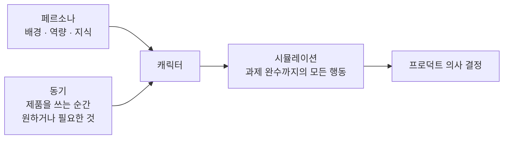

# 프로덕트 사고의 기본

> [AI 시대의 엔지니어링 전략](../README.md)

## 이 책에서 하나만 챙긴다면 시나리오다

**시나리오는 프로덕트 설계에 쓸모 있도록 구조를 갖춘 유저 스토리다.** 왜 이런 이야기가 필요한지는 예를 하나 보면 드러난다.

> 달라Darla는 은퇴한 베이비붐 세대로 마흔다섯 살에 처음 컴퓨터를 만졌다. 지금은 동네 찻집에서 온라인 주문을 하려고 계정을 만드는 중이다. 이메일과 비밀번호를 치라고 하니, 기억하기 쉽도록 딸 생일 뒤에 아들 이름을 붙여 비밀번호를 골랐다. 계정이 서른 개쯤 되는데, 전부 같은 비밀번호를 쓴다. 달리 외울 방법이 없고, 적어두지 말라고 배웠기 때문이다.

다음 장면은 예상이 된다. 찻집에서 데이터 유출 사고가 터지고, 달라가 은행 계좌에도 똑같이 쓰던 비밀번호가 함께 새어 나간다. 다크웹에서 누군가 그 로그인 정보를 사서 달라의 돈을 빼 갈지도 모른다.

> [!IMPORTANT]
> **이 이야기가 말하는 것**
> 이것은 **비밀번호의 문제이지, 찻집 앱 자체의 결함이 아니다.** 회원가입 화면을 잘못 그렸거나, 암호화가 약하거나, 저장소가 허술해서 난 사고가 아니다.
> 찻집 앱만 들여다봐서는 이 문제에 닿지 못한다. 달라 같은 사람이 서른 개 계정을 하나의 비밀번호로 돌려 쓴다는 **현실을 이야기에 담아야 비로소 보이는 문제**다.

시나리오가 하는 일이 바로 이것이다. **인터페이스 안에서는 보이지 않는 진짜 문제를, 사용자의 이야기로 끌어올려 준다.**

## 시나리오는 두 가지로 이뤄진다

큰 틀에서 시나리오는 **캐릭터**와, 그 캐릭터가 움직여 가는 **플롯**으로 이뤄진다.

*시나리오의 구성 요소. 페르소나와 동기가 캐릭터를 만들고, 캐릭터가 시뮬레이션을 통과한다*

이 장은 같은 기능을 **시나리오 없이 만든 밥**과 **시나리오로 이끈 앨리스**를 나란히 놓고, 그 차이에서 시나리오의 구성 요소를 뽑아낸다.

## 목차

- [사례 연구: Tea++](./1-사례-연구-tea-plus-plus.md)
- [시나리오 없이 진행한 첫 시도](./2-시나리오-없이-진행한-첫-시도.md)
- [시나리오를 쓴 두 번째 시도](./3-시나리오를-쓴-두-번째-시도.md)
- [시나리오의 여섯 가지 용도](./4-시나리오의-여섯-가지-용도.md)
- [시나리오의 구성: 동기](./5-시나리오의-구성-동기.md)
- [시나리오의 구성: 페르소나](./6-시나리오의-구성-페르소나.md)
- [시나리오의 구성: 시뮬레이션](./7-시나리오의-구성-시뮬레이션.md)
- [시나리오 활용법과 요약](./8-시나리오-활용법과-요약.md)
- [예제: 위키피디아](./9-예제-위키피디아.md)

## 함께 읽기

- [『아키텍트 첫걸음』 4.2 유스케이스 기술서](../../아키텍트-첫걸음/4-아키텍처-구현/2-개발-프로세스-표준화.md#유스케이스-기술서) — 사용자 목표와 성공·예외·대체 시나리오를 요구사항으로 옮기는 방법
- [『좋은 코드의 기준』 2.4 코드로 도메인 지식 표현하기](../../내-코드가-불안한-개발자를-위한-좋은-코드의-기준/02-움직이는-코드에서-뜻을-전하는-코드로/4-코드로-도메인-지식-표현하기.md) — 시나리오에서 발견한 사용자 현실을 코드의 언어와 객체에 담는 다음 단계
- [B마트 OMS의 동적 출고 예정 시각 시뮬레이션](../../요즘-우아한-백엔드-개발/11-b마트-oms의-물류주문관리를-통한-출고-최적화/4-동적-출고-예정-시각-시뮬레이션으로-검증하기.md) — 시뮬레이션을 실제 제품·운영 의사 결정에 적용한 사례
