# 발견 시나리오 - 프로덕트 발견 매핑

> [제품 내 사용자 안내](./README.md)

## 빠른 복습
- **발견은 엔지니어가 가장 자주 놓치는 대목인데 가장 결정적인 국면일 때가 많다.** **존재 자체를 모르면 제품은 없는 것이나 마찬가지**이기 때문이다.
- **온라인 광고가 거대한 산업이 된 이유**도 여기 있다 — 발견 문제를 풀어주기 때문이다.
- 사용자는 **여러 갈래로 들어온다.** 리본 버튼, 검색창, 온라인 문서, 단축키 목록, 챗봇. **모든 탐색 경로가 그 기능으로 이어져야 한다.**
- **프로덕트 발견 매핑Product Discovery Mapping(PDM)** 은 **사용자가 제품을 익혀 가며 걷게 될 길을 그려 주는 도구**다.
- PDM의 구성은 셋 — **특정 고객 페르소나를 위해 그리는 맵**, **제품의 한 요소인 노드**, **지식을 발견해 가는 경로인 엣지**.
- **정말 중요한 것은 맵을 그리고 함께 검토하면서 나누는 고민과 협업**이다.

## 발견을 놓치면 나머지는 의미가 없다

> 여러분이 만든 **추상화abstraction를 사용자는 어떻게 찾아낼까요?** 엔지니어가 **가장 자주 놓치는 대목**인데 **가장 결정적인 국면**일 때가 많습니다. **존재 자체를 모르면 제품은 없는 것이나 마찬가지**이기 때문입니다.

**"만들면 쓰겠지"라는 가정이 여기서 깨진다.** 기능이 완벽해도 아무도 그 길로 들어오지 않으면 임팩트는 0이다.

## 이브의 시나리오

원서는 페르소나 **이브Yves**로 이야기를 연다. **동네 행사 마케팅 자료를 만들 때 오피스를 가끔 쓰는 가벼운 사용자**다.

> 이브는 자기가 다니는 **교회의 월간 뉴스레터**를 만드는 중입니다. 위쪽 가운데에 뉴스레터 이름을 두고, 아래는 두 단으로 짜고 싶어요. 먼저 홈 탭에서 이름을 입력하고 가운데 정렬을 합니다. 문제는 다음입니다. 레이아웃 탭이 보이고 '단' 위젯이 눈에 들어와요. 클릭해서 두 단을 골랐더니, **뜻하지 않게 제목이 왼쪽 단으로 밀려 내려갑니다.** 실행을 취소하고 다시 살펴보니 눈에 띄는 '나누기' 버튼이 있습니다. **드롭다운 설명을 읽고 연속 구역 나누기의 사용법을 터득**합니다.

**이브는 '단'은 알지만 '구역'은 모른다.** 이 격차가 이 절의 출발점이다.

## PDM — 발견 경로를 그린다

```mermaid
flowchart LR
    START["시작"]
    LAYOUT["레이아웃 탭"]
    COL["단 위젯"]
    DROP["나누기 드롭다운"]
    SECT["연속 구역 나누기"]

    START -- "'레이아웃'이 '단'과 관련됨" --> LAYOUT
    LAYOUT -- "'단'을 이해" --> COL
    COL -- "옆 항목을 보고 살펴봄" --> DROP
    DROP -- "설명 읽음" --> SECT

    %% lint-ok: DEAD-END  목표 기능에 도달하는 경로이므로 마지막 노드에서 나가는 흐름이 없다
    %% lint-ok: NO-INBOUND  시작 노드가 경로의 출발점이다
    classDef core fill:#93ad70,stroke:#5f7a44,color:#121a08
    classDef sys fill:#e9e5a8,stroke:#a99f4d,color:#26240c
    classDef muted fill:#dcdcd2,stroke:#a8a89c,color:#3a3a30
    class SECT core
    class LAYOUT,COL,DROP sys
    class START muted
```

*[그림 2-5] 연속 구역 나누기를 위한 PDM — 이브가 레이아웃 메뉴를 발견하는 여정*

| 구성 요소 | 무엇인가 |
| --- | --- |
| **맵** | **특정 고객 페르소나를 위해** 그린다. 그 사람이 **제품이라는 미로를 헤쳐 가는 길을 보여 주는 지도** |
| **노드node** | **제품을 이루는 하나의 요소** |
| **엣지edge** | **그 페르소나가 지식을 발견해 가는 경로** |

표를 읽는 법. **엣지가 UI 이동이 아니라 "지식의 이동"** 이라는 점이 이 도구의 핵심이다. 화면 전환도가 아니라 **"무엇을 알았기에 다음으로 갈 수 있었는가"** 를 적는다. 그래서 엣지 라벨이 `'레이아웃'이 '단'과 관련됨` 처럼 사용자의 추측으로 쓰인다.

> 이 맵은 **이브가 단은 알지만 구역 나누기는 모른다는 가정에서 출발**합니다. 그래도 **맞는 기능까지 성공적으로 가닿는 길**을 보여 줍니다. 여러 흐름을 맵 하나에 담으면 **제품의 한 조각을 한눈에 빠르게 파악**할 수 있습니다.

## 맵보다 대화가 남는다

> [!IMPORTANT]
> **PDM의 핵심은 협업이다**
>
> 정말 중요한 것은 맵을 그리고 함께 검토하면서 나누는 고민과 협업이다.

원서가 던지라고 한 질문들이다.

- **네이밍이 충분히 친절한가?**
- **사용자에게 요구하는 인지적 도약이 마음에 드는가?**
- **기능에 닿기까지 걸리는 단계 수가 사용 빈도에 비춰 적절한가?**
- **함께 쓰일 가능성이 큰 기능들이 한데 묶여 있나?**

셋째 질문이 특히 실용적이다. **단계 수 자체가 문제가 아니라 "빈도 대비" 단계 수가 문제**라는 뜻이며, 이는 [MS가 사용 빈도 데이터로 메뉴를 짠 것](./1-사례-연구-ms-오피스-리본.md)과 같은 판단 기준이다.

## 함께 읽기
- [다음 절 — 사용자가 이미 아는 말을 쓴다](./3-발견-시나리오-온톨로지와-여러-갈래의-길.md)
- [1.6 페르소나](../01-프로덕트-사고의-기본/6-시나리오의-구성-페르소나.md) — PDM이 "특정 페르소나를 위해" 그려지는 이유
- [4.4 문서 주도 개발](../04-자사-제품-체험/4-문서-주도-개발-문서의-종류.md) — 발견·학습·사용 여정에 맞춰 문서 유형과 이동 경로를 설계하는 방법
