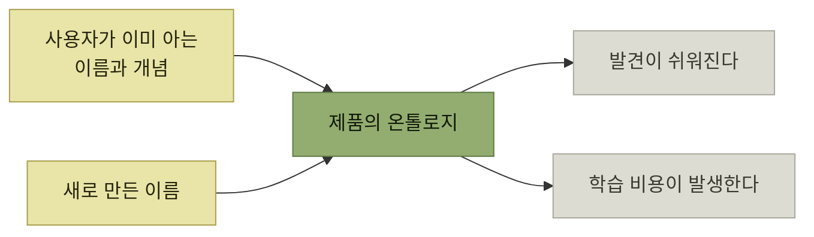
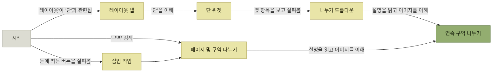

# 발견 시나리오 - 온톨로지와 여러 갈래의 길

> [제품 내 사용자 안내](./README.md)

## 빠른 복습
- **제품이 내미는 이름과 개념, 그리고 그 사이의 연결을 통째로 온톨로지**라 부른다. **일종의 그래프**이며, **사용자가 제품의 온톨로지를 잘 알수록 이해도 깊어지고 실력도 붙는다.**
- **발견을 쉽게 만드는 가장 빠른 길은 사용자의 머릿속에 이미 자리 잡은 이름과 개념을 그대로 쓰는 것**이다.
- **페르소나에 따라 온톨로지 자체가 달라진다.** 스트라이프 API에 '미수금' 같은 회계 용어가 없는 것은 **대상이 일반 프로그래머이기 때문**이었다.
- **언어에는 동의어가 따라붙지만 온톨로지에서는 보통 하나만 골라야 한다.** 그래서 **서로 다른 추측을 가지고 오는 사용자들을 위한 샛길**을 마련해 둔다.
- 리본의 **명령 검색 상자**가 그 샛길이다. **퍼지 매칭**까지 되어 '여백'을 치면 '들여쓰기'가 뜬다.
- 원칙 — **사용자가 들고 오는 역량이 제각각이니, 기능을 찾는 길도 여럿으로 열어 두라.**

## 사용자가 이미 가진 지식을 쓴다

[1장](../01-프로덕트-사고의-기본/6-시나리오의-구성-페르소나.md)에서 **페르소나는 역량을 갖추고 들어온다**고 했다. 그 역량이 발견에서 쓰이는 방식이 온톨로지다.

*같은 온톨로지에 넣더라도, 사용자가 이미 아는 말이면 공짜이고 새 말이면 값을 치른다*

> 이브는 **'단'은 알았지만 '연속 구역 나누기'에 나오는 '구역'이라는 개념은 들고 오지 않았습니다.** [그림 2-4]를 보면 MS가 나누기 기능을 얼마나 조심스레 설계했는지 드러납니다. **낯선 이름을 보충하려고 자세한 설명과 그림까지 얹었습니다.**

**낯선 개념을 쓰기로 했다면 그 값을 다른 기표로 갚아야 한다**는 것이 이 대목의 교훈이다.

### 코딩 실습

> [!WARNING]
> **불투명한 코드네임은 신중하게 쓴다**
>
> 불투명한 이름은 **사용자의 온톨로지에 없다.** 발견 가능성이 줄어드는 비용을 감수할 이유가 있는지 먼저 확인한다.

회사 코드베이스에서 분산 캐시 프레임워크를 찾는 사람은 **'캐시'부터 검색**한다. 그런데 그 프로젝트가 **이전 분산 캐시의 잿더미에서 다시 태어났기 때문에 '피닉스Phoenix'라 불린다는 사실을 그 사람이 알 리가 없다.**

- 브랜드를 살리고 싶다면 **'슈퍼캐시SuperCache' 같은 이름** — **브랜딩과 발견 가능성을 둘 다 조금씩 챙기는 절충안**이다.
- **기밀 유지가 필요하거나, 대상이 너무 독특해서 직관적인 이름이 오히려 오해를 부르는 경우**라면 불투명 코드네임도 쓸 자리가 있다. 다만 **검색 노출 가능성이 줄어든다**는 점을 잊지 말고, **댓글 등을 통해 흔적을 남겨 둬야** 한다.

## 페르소나가 다르면 온톨로지도 다르다

> **스트라이프Stripe에서 일하던 시절**, 회계사이자 코드는 거의 짜지 않으셨던 **아버지에게 한소리 들었습니다.** 스트라이프의 결제·청구 API 문서를 읽으셨는데, **'미수금receivables' 같은 정통 회계 용어가 안 보인다는 불만**이었죠.

> 저는 **의도된 결정**이라고 설명했습니다. 이 API는 **일반 프로그래머가 대상**이고, **회계 수업을 들은 적 없는 사람도 편안히 쓸 수 있는 단어**를 골랐다는 뜻이었습니다. 하지만 이는 **스트라이프가 회계사도 끌어안는 제품을 만들고 싶다면, 별도의 작업이 추가로 필요했다**는 점을 보여줍니다.

**"우리 용어가 맞다"가 아니라 "누구의 용어인가"** 를 묻는 사례다. 두 페르소나를 모두 원한다면 **용어를 하나 고르는 것으로는 부족하고 별도의 입구가 필요하다.**

## 발견에 여러 경로를 열어 둔다

> **언어에는 동의어와 비슷한 개념이 따라붙기 마련이지만, 온톨로지에서는 보통 하나만 골라야 합니다.** **서로 다른 추측을 가지고 오는 사용자들을 위한 샛길을 마련해 두세요.**

리본의 **명령 검색 상자**는 **간단한 퍼지 매칭fuzzy matching**까지 된다. **'여백'을 치면 '들여쓰기'가 들어간 명령이 뜨고**, 메뉴 안에서 바로 실행할 수도 있다.

> **사용자가 들고 오는 역량이 제각각이니, 기능을 찾는 길도 여럿으로 열어 두세요.**

### 리본이 개선한 것

개편 이전 워드의 발견 경험은 엉망이었다. **메뉴·도구 모음·작업창 더미에서 자기 작업에 맞는 항목을 골라내야** 했고, **분류도 자주 자의적으로 느껴졌다.** 원서의 반문이 날카롭다 — **"도구 메뉴와 서식 메뉴는 도대체 무슨 기준으로 갈렸을까? 읽기 동작인 찾기는 왜 편집 메뉴에 들어가 있었을까?"**

| 리본의 개선 | 어떤 사용자를 돕는가 |
| --- | --- |
| **명령이 더 적은 수의 탭으로 묶이고 화면 영역도 넉넉해졌다** | **탭을 훑어보는** 사용자 |
| **자주 쓰이고 권장되는 나누기는 크기가 커지고 관련 명령 가까이 자리 잡았다** | **눈에 띄는 것부터 누르는** 사용자 |
| **나누기와 연속 구역 나누기는 아이콘과 텍스트를 함께 썼다** | **사람마다 어느 쪽이 더 눈에 띄는지가 다르다** |
| **검색 상자** | **'구역'이라는 단어는 알아도 그게 어느 메뉴에 있는지 모를 때.** 기존 메뉴가 본질적으로 가진 한계를 메워주는 장치 |

표를 읽는 법. 네 줄이 **서로 다른 사용자를 위한 서로 다른 입구**다. 마지막 줄이 중요하다 — **계층형 메뉴는 아무리 잘 짜도 "어느 가지에 있는지 모르는 사용자"를 구조적으로 도울 수 없으므로**, 검색이라는 다른 축이 필요하다.

*[그림 2-7] 연속 구역 나누기에 이르는 여러 경로*

사용자가 제품을 발견하는 흔한 방식은 이렇다.

- **검색하기**
- **챗봇에게 묻기**
- **앱을 눈으로 훑거나 여기저기 눌러 이름과 기표 찾기**
- **스크린 리더를 쓰거나(시각 장애 사용자) 음성 메뉴 듣기**
- **사용 설명서나 문서 참고하기**

> **문서 하나에만 기대지는 마세요. 소비자용 앱이라면 문서에 의지할 여지는 거의 없습니다.**

### 코딩 실습

> **주석을 활용해 추상화까지 가는 길을 늘려 주세요.** 기반 클래스 이름이 `Plugin`이라면, **주석에 `Extension` 같은 동의어를 풀어 적어** 두면 좋습니다.

**코드 검색도 발견 문제**라는 관점이다. 클래스 이름은 하나만 고를 수 있지만, **주석은 동의어를 몇 개든 심어둘 수 있는 자리**다.

## 함께 읽기
- [다음 절 — 기능이 늘어날 때 복잡성을 다루는 법](./4-발견-시나리오-점진적-공개와-다중-페르소나.md)
- [『좋은 코드의 기준』 유비쿼터스 언어](../../내-코드가-불안한-개발자를-위한-좋은-코드의-기준/02-움직이는-코드에서-뜻을-전하는-코드로/4-코드로-도메인-지식-표현하기.md#유비쿼터스-언어를-찾는다) — 온톨로지를 팀 안쪽에서 다룬 이야기
