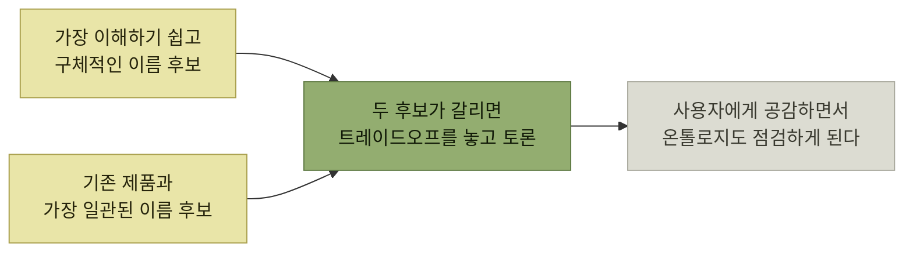

# 이해 시나리오 - 이름 짓기

> [제품 내 사용자 안내](./README.md)

## 빠른 복습
- **이름은 독자의 머릿속에 한두 가지 생각을 심어줄 수 있는 기회**다. **검색 노출을 도울 뿐 아니라 이해를 도와야** 한다.
- 사용자는 **"이 기능이 무엇인가"가 아니라 "내게 어떻게 쓸모가 있는가"** 를 알고 싶어 한다. **프로덕트 중심으로 생각한다는 건 시스템을 기술하는 관점이 아니라 독자에게 미칠 영향의 관점에서 사고한다는 뜻**이다.
- 네이밍에서 가장 중요한 원칙 하나 — **지식의 저주Curse of Knowledge를 피하라.** 벗는 방법은 **입장 바꿔보기**다.
- 원서는 흔한 네이밍 격언 넷을 **사용자 중심으로 다시 쓴다** — 완전한 설명 대신 **모호성 회피**, 일관성 대신 **일관성과 구체성의 트레이드오프**, 약어 금지 대신 **대상 독자 기준의 약어**, 간결함 대신 **필수 정보 중심의 소통**.

## 지식의 저주

> [!NOTE]
> **지식의 저주**
>
> 지식의 저주는 **인지 편향** 중 하나다. **시스템을 만든 사람이 자기 시스템을 처음 만나는 사용자가 겪을 어려움을 헤아리지 못하게** 만든다.

**벗는 방법은 두 가지**다 — **대상 페르소나가 가지고 있을 온톨로지를 떠올려 보거나**, **그 집단의 누군가에게 여러분의 이름을 어떻게 해석할지 직접 물어보는 것**이다.

## ① "완전하게 설명하라" 대신 모호성을 피하라

> [!IMPORTANT]
> **모호함을 피한다**
>
> 이름 짓기 규칙 하나만 고른다면 **"모호함을 피하라"** 를 선택한다.

원서 저자가 직접 겪은 사례가 붙는다. 이브 역할을 하며 교회 뉴스레터를 만들다 **레이아웃 탭의 '정렬' 버튼**에서 막혔다.

> 어떤 기능일 거라고 생각했나요? 저는 **뉴스레터 제목을 가운데로 정렬할 때 쓰는 줄** 알았습니다. 그런데 버튼을 눌러 보니 **쓸 만해 보이는 항목은 다 회색으로 비활성화**돼 있었습니다.

> **정렬이 일반 텍스트, 이미지, 차트가 아닌 다른 것을 가리킨다면 그 사실이 이름에서 드러나야 합니다.**

**모호함은 "틀린 이름"이 아니라 "여러 뜻으로 읽히는 이름"** 이다. 그래서 만든 사람은 알아채지 못한다 — **본인에게는 뜻이 하나뿐이기 때문**이다. 원서의 처방이 **"이름이 가질 수 있는 다른 해석을 브레인스토밍하라"** 인 이유다.

### 코딩 실습

**코드베이스에서 자주 해명이 필요한 모호함** 네 가지다.

| 종류 | 무엇을 조심하나 |
| --- | --- |
| **역할과 관계** | **부모/자식, 발신자/수신자**처럼 서로 다른 역할의 두 객체가 있을 때 **"어느 쪽이지?"** 를 명확히 구분한다 |
| **변수** | 변수가 사용되는 **모든 코드에서 해당 값이 무엇을 나타내는지 분명**해야 한다 |
| **측정값** | **파운드와 뉴턴, 밀리시버트와 시버트**를 혼동해서는 안 된다. **화성 탐사선의 실패나 방사선 피폭 사고**처럼 심각한 결과를 부른다 |
| **품사** | `persist`는 **상태를 디스크에 저장할지를 나타내는 불리언**인가, **실제로 저장을 수행하는 함수**인가. 전자라면 `should_persist`가 낫다 |

표를 읽는 법. 네 줄 모두 **읽는 사람이 두 가지로 읽을 수 있는 지점**이다. 특히 셋째 줄은 **모호한 이름의 대가가 사람 목숨과 우주선까지 간다**는 사례로 놓여 있다.

## ② "일관성을 유지하라" 대신 일관성과 구체성의 트레이드오프

**일관된 네이밍은 사용자에게 도움이 된다** — **한 번 익힌 개념을 온톨로지 안에서 반복해 쓸 수 있기** 때문이다. 그러나 **일관성은 구체성과 자주 부딪힌다.**

- 앞서 본 **'정렬'은 용어로는 완벽하게 일관되지만 충분히 구체적이지 않다.**
- 스트리밍 음악 앱에서 다른 곳은 **'트랙Track'** 으로 통일했더라도, 가사 기능만큼은 **어색한 '트랙 가사' 대신 '노래 가사Song Lyrics'** 를 쓰고 싶어진다.

> **엔지니어 가운데는 일관성을 신념으로 삼는 사람도 있습니다. 사용자 관점을 따져 보지 않고도 일관성만 외칠 수 있거든요.** 여러분의 테크 리드가 이 기능에 깊이 발 담그지 않았다면, **현재 시나리오를 짚어 본 적도 사용자에게 공감해 본 적도 없을 수 있어요. 그래도 일관성에 대해서는 한마디 보태기 쉽죠.**

**이 문장이 이 절에서 가장 실무적**이다. 일관성은 **맥락을 몰라도 주장할 수 있는 논거**이므로 회의에서 과대 대표된다.

원서가 준 처방은 **두 후보를 따로 브레인스토밍하는 것**이다.

*두 후보를 따로 만들어 놓고 비교하면, 논쟁이 신념이 아니라 트레이드오프가 된다*

무게를 가늠하는 휴리스틱은 이렇다.

- **일관성을 깰 납득할 만한 이유가 없다면, 일관성을 지킨다.**
- **지식의 저주를 늘 의심하라.** **제품의 일부만 쓰는 신규 사용자는 일관성을 따질 만큼 충분히 보지 못했을 수도** 있다.
- **사용자층의 상대적 규모를 따져 보라.** 옛 이름이 **파워 유저 몇 명만 쓰던 것이거나 레거시 기능에 묶여 있을 수** 있다.
- **다중 페르소나 앱에서는 페르소나별 경험이 가장 중요하다.** **엑셀이 같은 수식을 회계사용 이름과 소프트웨어 엔지니어용 이름으로 따로 두는 것도 충분히 정당**하다. **iOS와 안드로이드는 각 플랫폼 안에서는 일관성이 중요하지만 플랫폼 사이 일관성은 우선순위가 낮다** — **사용자가 두 플랫폼을 자주 오가지는 않기** 때문이다.

마지막 줄이 일관성의 범위를 정하는 기준을 준다 — **일관성은 "한 사람이 이어서 겪는 범위" 안에서만 값이 있다.**

## ③ "약어를 피하라" 대신 대상 독자 기준의 약어

> **약어는 이해 시나리오에 쥐약**입니다. **글자가 무엇을 뜻하는지 짐작할 사람이 없고, 검색으로 찾기도 까다롭거든요.**

그래도 **대상 페르소나에게 익숙한 약어**는 있다. **소프트웨어 엔지니어가 대상이라면 'HTML'을 풀어 쓸 필요가 없다.** 반면 **'CPU'는 엔지니어 대상으로는 최적이지만 일반 사용자에게는 '프로세서processor' 같은 두루뭉술한 표현이 낫다.**

## ④ "간결하게 쓰라" 대신 필수 정보 중심의 소통

**'간결concise'의 사전적 뜻은 '짧지만 빠짐없이'** 다. 문제는 **무엇에 대해 빠짐없이 담느냐**이며, 저자의 답은 **"독자와 독자에게 도움이 될 정보"** 다.

원서의 예 — **'PHP 디플로메시PHP Diplomacy'** 라는 온라인 게임은 **포팅에 쓴 프로그래밍 언어 이름을 그대로 제목에 붙였다.** **프로그래머가 아니라면 어리둥절할 이름**이며, 실제로 **함께 플레이한 사람들도 다 소프트웨어 엔지니어였다.**

> **이름이 담을 수 있는 정보는 한정돼 있으니, 무관한 요소를 하나 덜어 낼 때마다 의미 있는 표현을 들일 자리가 생깁니다.**

### 예 — 비동기 API의 이름

오래 걸리는 작업을 위한 API를 만든다고 하자. **사용자가 큐에 요청을 넣으면 시스템이 꺼내 처리**하고, **끝날 때까지 블로킹으로 기다리거나 핸들을 받아 나중에 결과를 가져올 수** 있다.

| 후보 | 문제 |
| --- | --- |
| `enqueue_request` | 처음엔 괜찮게 들리는데, **큐에 넣고 결과까지 기다리는 함수는 `enqueue_and_wait_for_request`?** 어색하다 |
| `start_request` / `execute_request` | **가장 본질적인 사실은 비동기라는 것.** `enqueue`는 **필요 이상으로 구체적인 구현 세부 사항**이다 |

표를 읽는 법. 물어야 할 질문은 **"사용자가 제대로 쓰려면 이 이름의 어떤 부분을 꼭 알아야 하는가"** 다. **큐를 쓴다는 사실은 사용자가 몰라도 되고, 응답이 늦어질 수 있다는 사실은 반드시 알아야 한다.** **구현 세부 사항인 'queue'를 걷어 내면 더 단순하고 직관적인 이름이 풀린다.**

### 코딩 실습

이름을 짧게 줄이고 싶을 때 떠올릴 말 — 파이썬 창시자 귀도 반 로섬의 **"코드는 쓰이는 것보다 훨씬 자주 읽힌다."**

> **코드 리뷰, 디버깅, 코드베이스 학습, 편집 지점 찾기가 전부 읽기**예요. **새 기능을 추가하거나 테스트를 짤 때만 타이핑**됩니다. 그마저도 **자동 완성의 도움**을 받습니다.

> **독자는 코드베이스가 살아 있는 동안 계속 찾아옵니다. 오래 쓰일 가치가 있는 것을 짓고 있다면, 이름을 깔끔하게 대접해 주세요.**

## 함께 읽기
- [다음 절 — 이름 하나로 안 될 때](./6-이해-시나리오-중복-설명.md)
- [『좋은 코드의 기준』 2.2 이름 짓기](../../내-코드가-불안한-개발자를-위한-좋은-코드의-기준/02-움직이는-코드에서-뜻을-전하는-코드로/2-이름-짓기.md) — 구문론·의미론으로 나눠 본 같은 주제
