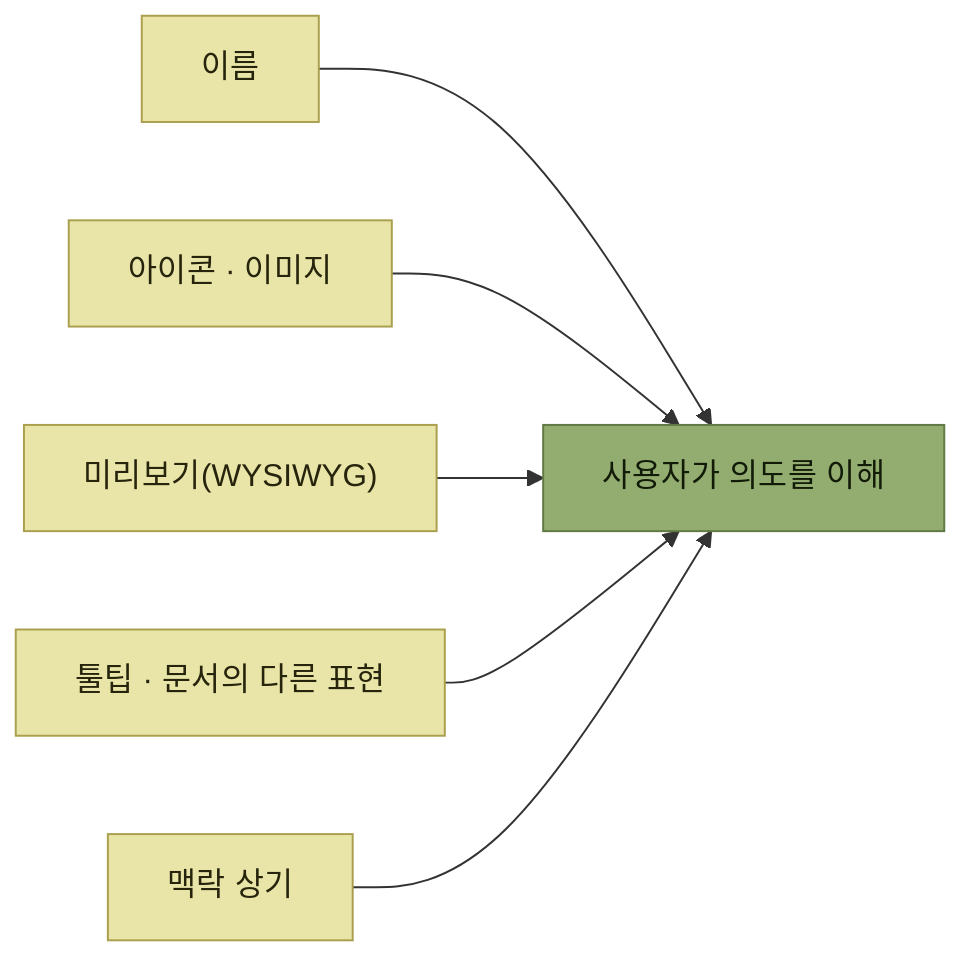

# 이해 시나리오 - 중복 설명

> [제품 내 사용자 안내](./README.md)

## 빠른 복습
- **발견하기 쉽고 동시에 의미를 혼동 없이 이해할 수 있도록 이름을 짓는 일은 쉽지 않다.** **이름 하나에 모든 걸 담아내기 어려운 때도** 있다.
- 그래서 **사용자에게 의도를 전달할 장치를 여러 겹으로 깔아 두는 편이 이득**이다.
- 워드 리본은 **아이콘**으로 그 겹을 보탠다. **'다단계 목록'이나 '단락 맞춤' 같은 단어만으로는 약한 부분을 아이콘이 조심스레 메워 준다.**
- 네 가지 방법 — **이미지와 단어를 함께**, **WYSIWYG**, **표현의 재구성**, **맥락의 지속적 상기**.
- 코드에서도 마찬가지다. **약간의 중복이 버그를 잡는다.**

## 겹을 쌓는 네 가지 방법

| 방법 | 내용 |
| --- | --- |
| **이미지와 단어를 함께 사용** | **이미지는 단어가 전하려는 바를 시각적으로 보여 준다.** 사용자가 **제품 언어의 원어민이 아닐 수도** 있다 — **'Column'은 영어 원어민에게는 기초 단어지만 다른 언어 사용자에게는 낯선 어휘**일 수 있다 |
| **WYSIWYG**(보이는 그대로의 결과) | **사용자가 따로 이해할 필요가 없다. 행동의 결과가 그 자리에서 보이니까.** 윈도우용 오피스는 **스타일을 바꾸면 문서가 어떻게 변할지 미리 보여 주는 실시간 미리보기**까지 제공한다 |
| **표현의 재구성** | **툴팁과 문서에서 동의어나 다른 표현으로 같은 기능을 설명**한다. **같은 개념을 다른 단어로 만나면 사용자는 의도된 의미를 삼각측량하듯 확인하고 자신감을 얻는다** |
| **맥락의 지속적 상기** | **사람의 단기 기억은 꽤 작고 어디 있었는지 잊기 쉽다.** 이커머스라면 **화면마다 무엇을 사고 있는지 다시 알려 준다.** **자리를 떴다가 돌아와도 흐름을 잃지 않는다** |

표를 읽는 법. 네 줄이 **서로 다른 감각과 시점에 붙는다** — 눈(이미지), 결과(미리보기), 다른 표현(언어), 시간(기억). **한 겹이 뚫려도 다른 겹이 받는 구조**이며, 이것이 '중복'이라는 말의 뜻이다.



*이해로 가는 길을 여러 겹으로 깔면 이름 하나가 실패해도 여정이 끊기지 않는다*

## 코딩 실습 — 중복이 버그를 잡는다

> 중복은 **코드와 문서처럼 정보 밀도가 높은 자리**에서도 쓸모가 있습니다. **사용 시나리오와 작업 기억이 빈약한 사람**을 떠올리면 이유가 또렷해집니다.

```python
def email_lunch_invitation(sending_user, recipient_user, message):
    recipient_organization = recipient_user.get_organization()
    title = f"{sending_user.name} from {recipient_organization} " \
            "has sent you an invitation to lunch!"
    send_email(
        sending_user.email_address, recipient_user.email_address, title,
        message)
```

*원서 예시 — `title`을 만들 때 들어간 버그가 보이는가*

**버그는 `recipient_organization`이다.** 문장은 **"보내는 사람이 어느 조직 소속인지"** 를 말하는데, 값은 **받는 사람의 조직**이다. 원서의 질문이 핵심을 찌른다.

> `recipient_organization` 대신 `organization`으로 이름 지었다면, **같은 실수를 잡아낼 수 있었을까요?**

**변수 이름에 `recipient_`라는 중복 정보가 붙어 있었기 때문에** 문장과 나란히 놓였을 때 어긋남이 드러난다. **짧은 이름이었다면 눈에 띄지 않았을 버그**다. [앞 절의 "역할과 관계" 모호함](./5-이해-시나리오-이름-짓기.md#코딩-실습)이 실제로 사고가 된 모습이기도 하다.

약간의 중복이 도움이 되는 상황은 이렇다.

- **독자가 코드를 리뷰하며 품질을 점검하고 있을 때**
- **함수 작성자가 위 예처럼 변수를 잘못 쓸 수 있을 때**
- **프로그래머가 해당 줄에 브레이크포인트, 정의로 이동, 모든 참조 찾기, 디버깅 콜 스택, 린트 규칙으로 도착했고 함수 전체를 읽지 못한 상태일 때**

> [!TIP]
> **중복 정보가 문맥을 지킨다**
>
> 한 줄의 코드에 필요한 정보가 그 줄 위에 다 얹혀 있다면, 함수 한복판에 도착해도 뜻을 파악하기 쉽다.

셋째 줄이 특히 현실적이다. **우리는 함수를 위에서부터 읽지 않는다.** 스택 트레이스나 검색 결과로 **한복판에 착륙**하며, 그때 **그 줄만으로 뜻이 서야** 한다.

## 함께 읽기
- [다음 절 — 이해한 다음에는 안전하게 써야 한다](./7-사용-시나리오-위험을-이름에-드러내기.md)
- [『좋은 코드의 기준』 2.3 주석](../../내-코드가-불안한-개발자를-위한-좋은-코드의-기준/02-움직이는-코드에서-뜻을-전하는-코드로/3-주석.md) — 코드가 말하지 못하는 것을 어디에 적을 것인가
