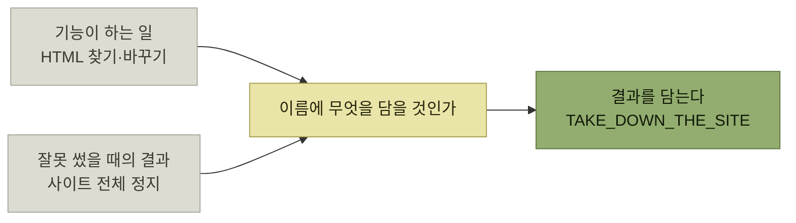

# 사용 시나리오 - 위험을 이름에 드러내기

> [제품 내 사용자 안내](./README.md)

## 빠른 복습
- **여정이 막바지에 닿고 본격적으로 행동에 옮기기 시작하면 위험은 한층 커진다.**
- **다른 보호 장치가 없는 상황에서도, 좋은 이름은 사용자 본인도 모르게 안전한 선로 위를 달리도록** 만들 수 있다.
- 극단적 사례 — 웹 트래픽 전체에 정규식 치환을 거는 설정 변수의 이름이 **`TAKE_DOWN_THE_SITE`** 였다. **원래 의도한 기능이 아니라 잘못 썼을 때 벌어지는 결과를 그대로 박아 둔 이름**이다.
- 덜 극단적인 방법은 **'고급advanced' 메뉴 아래에 두는 것** — **발견 여정이 길어져 그 기능에 닿는 사용자가 줄고, 예상치 못한 결과가 따를 수 있다는 신호도 함께** 보낸다.
- 반대로 **사용자에게 선택을 강제**해 개념에 시선을 끌어당기는 방법도 있다.
- **사용자 안전은 8장에서 어포던스affordance 개념과 함께 더 폭넓게** 다룬다.

## TAKE_DOWN_THE_SITE

> 2010년대 초, 한 웹 회사 내부에는 **웹 트래픽을 처리하는 모든 머신에 복사되는 특수한 설정 변수**가 있었습니다. 이 변수에는 **정규 표현식**이 포함돼 있었는데, 이 표현식은 **외부로 전송되는 모든 HTML 페이지에 대해, 사용자의 브라우저로 전송되기 직전에 찾기/바꾸기 작업으로 적용**됐습니다!

**긴급 패치용 도구**였다. **문제가 있는 HTML 태그를 지워야 할 때 정규식을 추가해 전체 서버 무리에 즉시 배포**할 수 있었다. 그리고 **정규식으로 바뀐 HTML이 파싱 오류를 내면 사이트 전체가 멈출 수** 있었다.

> [!WARNING]
> **위험을 이름에 드러낸다**
>
> 이 변수의 이름은 **`TAKE_DOWN_THE_SITE`** 였다. **원래 의도한 기능이 아니라 잘못 썼을 때 벌어지는 결과를 그대로 박아 둔 이름**이다. 극단적이지만 안전 문제를 숨기지 않는다.

*이름 한 칸에 무엇을 넣을지 — 기능이 아니라 결과를 넣을 수도 있다*

**이름은 보통 "이게 무엇인가"를 답하지만, 위험한 기능에서는 "이걸 잘못 쓰면 무슨 일이 나는가"를 답하는 편이 낫다.** [앞 절](./5-이해-시나리오-이름-짓기.md)이 말한 **"독자에게 미칠 영향의 관점"** 을 극단까지 밀면 이런 이름이 나온다.

## 위험을 숨기는 방법과 드러내는 방법

| 방향 | 방법 | 효과 |
| --- | --- | --- |
| **접근을 어렵게** | 관련 항목을 **'고급' 메뉴 아래**에 둔다 | **발견 여정이 길어져 닿는 사용자가 줄고**, 예상치 못한 결과가 따를 수 있다는 **신호**도 보낸다 |
| **페르소나로 가른다** | **MS 오피스는 리본에 '개발자Developer' 탭을 노출하려면 별도 설정opt-in을 요구**한다 | **매크로나 VB 스크립트를 잘 다룰 가능성이 크고 설정을 망칠 확률이 낮은 페르소나**에 묶어 둔다 |
| **선택을 강제한다** | 워드는 **나누기에서 가장 많이 쓰이는 페이지 나누기를 기본값으로 적용하지 않는다** | **선택지를 배우게 되고, 문서를 망치는 사고도 막는다** |

표를 읽는 법. 위 두 줄은 **길을 멀게 만들고**, 셋째 줄은 **길을 멈춰 세운다.** 셋째 줄이 흥미로운 이유는 **편의(기본값)를 일부러 포기해 학습을 유도**하기 때문이다 — [다음 절의 트레이드오프](./8-전체-여정-최적화와-기표의-한계.md)가 여기서 이미 시작된다.

> **위험을 알려야 할지 판단하려면, 사용자가 잘못 쓰는 시뮬레이션을 돌려 보세요.** **이름이 바뀌었을 때 그 잘못된 사용 이야기가 얼마나 비현실적으로 들리는지** 가늠해 보면 됩니다.

**"이 이름이면 그 사고가 안 났겠는가"** 를 이야기로 확인하라는 것이며, 이는 [1.7 시뮬레이션](../01-프로덕트-사고의-기본/7-시나리오의-구성-시뮬레이션.md)을 안전 문제에 적용한 것이다.

### 코딩 실습

- **사용자가 선택해야 한다는 사실을 모를 수도 있다면, 항목을 매개변수로 반드시 지정하도록** 한다. (기본값을 주지 않는다)
- **추상화 내용에 대한 설명에 힌트를 남긴다.** **어떤 일을 해내는 길이 두 가지 있고 사용자가 그중 하나를 찾았다면, 모를 수 있는 다른 길을 가리켜 준다.** **그쪽이 대다수에게 더 권장되는 경우라면 꼭 그렇게** 한다.

## 함께 읽기
- [다음 절 — 세 국면 사이의 트레이드오프](./8-전체-여정-최적화와-기표의-한계.md)
- [『요즘 우아한 백엔드 개발』 13장](../../요즘-우아한-백엔드-개발/13-wms-재고-이관을-위한-분산-락-사용기/4-분산-락과-상태-키-함께-사용하기.md) — 위험한 조합을 이름이 아니라 상태로 막은 사례
