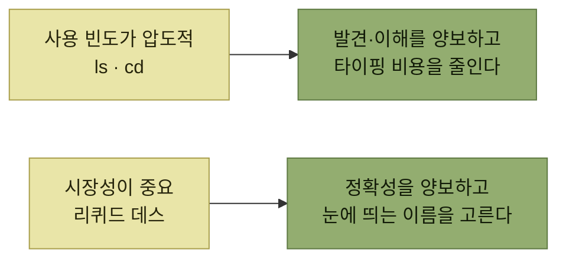

# 전체 여정 최적화와 기표의 한계

> [제품 내 사용자 안내](./README.md)

## 빠른 복습
- **발견·이해·사용 사이에는 트레이드오프가 존재**한다. **사용성을 끌어올리려고 발견 가능성과 이해 용이성을 양보하는 선택**도 있다.
- 유닉스의 `ls`, `cd`가 그 예다. **자주 쓰이는 명령은 읽히는 빈도보다 타이핑되는 빈도가 훨씬 높다.** **사용 시나리오가 발견·이해 시나리오를 압도하니 앞의 규칙을 내려놓게** 된다.
- 반대로 **시장성을 중시하는 제품에서는 발견 가능성과 검색 엔진 최적화가 우선**일 수 있다.
- **기능마다 발견·이해·사용의 상대적 무게를 정하라.**
- **기표로 모든 문제를 풀 수는 없다.** 브라우저 쿠키 팝업이 그 예다 — **더 깊은 설계 난제**를 기표로 덮으려는 시도다.
- **제품 이름을 짓고 구조를 잡는 일은 제품 사이클 초반에 해 두는 편이 훨씬 낫다.**

## 세 국면은 서로 값을 매긴다

*같은 원칙도 어느 국면이 무거운가에 따라 뒤집힌다*

> 제가 앞서 **모호한 약어를 짓지 말라**고 했는데, **유닉스와 리눅스에서는 왜 `ls`나 `cd`처럼 뜻이 안 보이는 짧은 명령이 인기를 얻었을까요? 그냥 오래된 나쁜 사례일까요?**

> **아니요, 꼭 그렇진 않습니다.** **자주 쓰이는 명령은 읽히는 빈도보다 타이핑되는 빈도가 훨씬 높거든요.** **한두 번 익혀 두면 끝이고, 하루에 여섯 번이나 `list_files`를 치고 싶은 사람은 없습니다.** 게다가 **이 사용자는 손에 익은 기술자들**입니다.

**규칙을 어긴 것이 아니라 다른 국면을 골랐다**는 설명이다. [앞 절](./5-이해-시나리오-이름-짓기.md)의 **"코드는 쓰이는 것보다 훨씬 자주 읽힌다"** 와 정면으로 반대되는 상황이며, **어느 쪽이 참인지는 그 이름이 놓인 자리가 정한다.**

시장성 쪽 예도 재미있다 — 탄산수 브랜드 **'리퀴드 데스Liquid Death'** 의 이름은 **고맙게도 50%만 정확하고 썩 정교하지도 않지만 마케팅 효과는 확실**하다. **이름이 쇼핑객의 눈을 붙잡고, 부제목을 읽으며 실체를 확인하는 흐름**이기 때문이다.

> [!IMPORTANT]
> **세 국면의 상대적 무게를 정한다**
>
> 기능마다 발견·이해·사용의 상대적 무게가 다르다. 어느 국면을 우선할지 명시적으로 선택한다.

## 기표로 풀리지 않는 문제

> [!WARNING]
> **기표로 모든 문제를 풀 수는 없다**
>
> 완벽한 이름을 찾으려고 헤매다 보면, 사용자 여정을 짚은 뒤에야 대상 페르소나가 알아야 할 것을 담아낼 이름이 없다는 사실을 알게 되기도 한다. **개념이 너무 복잡하거나 안전상의 함정을 품고 있어서**일 수 있다.

원서의 사례는 **브라우저 쿠키와 동의 팝업**이다.

- **비기술 사용자에게 정확히 무슨 일이 벌어지고 사용자의 영역을 얼마나 침범하는지 전달하기란 어렵다.**
- **쿠키 고지를 의무화한 입법자들과 거기 맞춰 대응한 웹사이트들은 사실 기표로 이 문제를 풀어 보려는 셈**인데, **이건 더 깊은 설계 난제**다.
- **'필수 쿠키'와 '마케팅용 쿠키'를 가르려는 훌륭한 시도**도 있었지만, **사용자는 쿠키의 온톨로지를 또렷이 잡지 못한다.** 결과적으로 **대다수가 모든 쿠키를 그냥 꺼버린다** — **일부는 사용자에게 이득이거나 개인 부담 없이 인터넷 경제를 떠받칠 만한 것인데도.**
- **더 근본적인 문제는 쿠키가 사용자 대면 기능이 아니라 저수준 프로그래밍 추상화로 출발했다는 점**이다. **집단 행동 문제 탓에 2025년 기준으로 이 문제는 대체로 미해결 상태**다.

**이름이 나쁜 것이 아니라 이름 붙일 대상이 잘못 잡혀 있었다**는 진단이다. 그래서 다음 처방이 따라온다.

> **제품 이름을 짓고 구조를 잡는 일은 제품 사이클 초반에 해 두는 편이 훨씬 낫습니다.** 사용자 여정 전체를 함께 살피게 되고, **거기서 값진 설계 통찰이 나올 때가 많거든요.**

### 코딩 실습

> **추상화가 어색하거나 안전하지 않은데 고칠 수 없다면, 감추려 하지 마세요.** **이름을 일부러 못생기게 두고, 오히려 눈에 띄게 해 주의와 재검토를 끌어내세요.** 코드 리뷰어가 더 나은 아이디어를 낼지도 모릅니다.

저자가 본 실물 사례가 `_do_not_use_or_you_will_be_fired`라는 **비공개 클래스 변수**였다. **그 작명에 마지못해 존경을 표하게 됐다**고 적혀 있다.

## 2.8 요약

> 다중 페르소나 앱이라면 **페르소나마다 따로 온톨로지와 발견 경로를 자신 있게 마련해도** 좋습니다.

| 국면 | 챙길 것 |
| --- | --- |
| **발견** | **사용자의 온톨로지에 이미 있거나 다른 이름과 어울리는 이름**을 고른다. **제품을 헤쳐 가도록 도와줄 기표**를 깔고, **복잡한 기능은 천천히 풀어 보여 준다.** 여정을 그림으로 봐야 하면 **PDM 맵**을 그린다 |
| **이해** | **무엇보다 모호함을 피한다.** 사용자 유형별로 일관된 경험을 주면서도, **제품을 이해하는 '입구'를 여러 갈래로 반복해서** 제공한다 |
| **사용** | 사람들이 함수를 쓸 때 **잘못 빠지기 쉬운 '위험 지대'를 이름으로 드러낸다** |

> 이번 장은 **개발 단계에 속하지만**, **가장 중요한 제품 온톨로지 개념의 이름과 구조는 더 일찍 잡아 두는 편이 좋습니다.** 전체 설계 과정에 값진 통찰을 줄 수 있습니다.

**이 책의 구성 자체에 대한 단서**이기도 하다. PART 1이 '개발'이지만, 여기서 다룬 이름·구조 문제는 **PART 3 발견, PART 4 정의로 다시 올라간다.**

## 함께 읽기
- [다음 절 — 연습 문제](./9-예제-foo에서-멀어지기.md)
- [이 장의 목차](./README.md)
