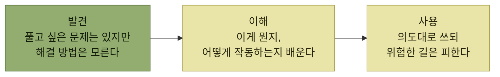

# 제품 내 사용자 안내

> [AI 시대의 엔지니어링 전략](../README.md)

## 사용자가 헤매면 그것은 설계의 잘못이다

> 기계와 그 기계를 만드는 사람의 의무는 사람을 이해하는 것입니다. 기계가 던지는 제멋대로이고 알 수 없는 지시를 사람이 헤아려야 할 의무는 없습니다.
> — 『도널드 노먼의 디자인과 인간 심리(개정증보판)』(학지사, 2016)

**제품의 주인공은 사용자**다. 소설가와 다른 점은 하나 — **프로덕트 디자이너는 주인공의 여정을 쉽게 만들어 줘야 한다.** 시나리오를 길잡이 삼아 **꼭 필요한 자리에 이정표를 박아 두면** 된다.

도널드 노먼은 그 이정표를 **기표signifiers**라 불렀다. **인터페이스 안에 숨겨 둔 단서로, 이 기능이 무엇을 하는지를 알려 주는 실마리**다.

- 목적이 한눈에 들어오는 **이름이나 아이콘**
- 누를 수 있다는 사실을 알려 주는 **버튼 테두리**
- 드롭다운 메뉴라고 알려주는 **아래쪽 화살표**
- 하나만 골라야 한다는 뜻의 **라디오 버튼**, 여러 개를 고를 수 있다는 신호인 **체크박스**
- 밑줄 그어진 **파란 하이퍼링크**와 그 옆에 붙은 페이지 설명 문구
- **다음에 무엇을 해야 할지 알려 주는 에러 메시지**

## 사용자 여정의 세 국면

*[그림] 사용자 여정을 이루는 세 종류의 시나리오*

> [!IMPORTANT]
> **세 국면은 모두 팀의 책임이다**
>
> 기능을 출시하는 책임을 맡았다면 발견·이해·사용을 모두 떠안아야 한다. 기능을 눈에 띄게 하고, 이해를 돕고, 안전하게 쓰도록 이끄는 일은 여러분 팀의 책임이다. **셋 중 하나라도 빠뜨리면 그 기능은 본래 낼 수 있었던 임팩트에 한참 못 미친다.**

[1장](../01-프로덕트-사고의-기본/README.md)에서 말한 **"구멍 없는 이야기"** 가 여기서 구체적인 점검표가 된다. **세 시나리오를 빠짐없이 짚어 보면 플롯의 구멍을 메울 수 있다.**

## 목차

- [사례 연구: MS 오피스 리본](./1-사례-연구-ms-오피스-리본.md)
- [발견 시나리오: 프로덕트 발견 매핑](./2-발견-시나리오-프로덕트-발견-매핑.md)
- [발견 시나리오: 온톨로지와 여러 갈래의 길](./3-발견-시나리오-온톨로지와-여러-갈래의-길.md)
- [발견 시나리오: 점진적 공개와 다중 페르소나](./4-발견-시나리오-점진적-공개와-다중-페르소나.md)
- [이해 시나리오: 이름 짓기](./5-이해-시나리오-이름-짓기.md)
- [이해 시나리오: 중복 설명](./6-이해-시나리오-중복-설명.md)
- [사용 시나리오: 위험을 이름에 드러내기](./7-사용-시나리오-위험을-이름에-드러내기.md)
- [전체 여정 최적화와 기표의 한계](./8-전체-여정-최적화와-기표의-한계.md)
- [예제: foo에서 멀어지기](./9-예제-foo에서-멀어지기.md)

## 이 장의 두 갈래 서술

원서는 조언을 두 갈래로 준다. 하나는 **MS 오피스 리본 사례 연구**이고, 다른 하나는 **`코딩 실습` 사이드바**다.

> 이 박스에서는 **평소 코딩에 프로덕트 사고를 어떻게 얹을지** 짚습니다. **함수와 클래스도 결국은 작은 제품**이거든요. **사용자는 옆자리 동료들과 협력자들**입니다. 이름과 주석을 잘 남기면 코드 리뷰와 유지 보수가 한결 가벼워집니다.

이 정리에서는 사이드바 내용을 각 절 안에 **`### 코딩 실습`** 으로 남긴다.

## 함께 읽기

- [다음 장 — 에러와 경고](../03-에러와-경고/README.md) — 발견·이해·사용 원칙을 실패 경로의 진단 메시지와 에러 구조에 적용하는 방법
- [1.7 시뮬레이션](../01-프로덕트-사고의-기본/7-시나리오의-구성-시뮬레이션.md) — 이 장의 세 국면은 시뮬레이션을 돌려 볼 세 지점이다.
- [『좋은 코드의 기준』 2.2 이름 짓기](../../내-코드가-불안한-개발자를-위한-좋은-코드의-기준/02-움직이는-코드에서-뜻을-전하는-코드로/2-이름-짓기.md) — 같은 주제를 코드 안쪽에서만 다룬 장. 이 장은 그 원칙을 **제품 UI와 코드에 동시에** 적용한다.
