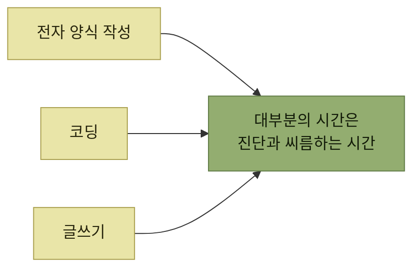

# 진단의 가치

> [에러와 경고](./README.md)

## 빠른 복습
- **입력이 복잡하고 자유로운 애플리케이션과 플랫폼에서 진단은 사실상 메인 인터페이스**다. **사용자는 시간을 거의 다 에러와 씨름하며 다음 단계로 넘어가는 데 쓴다.**
- 그런데도 **에러 처리는 스크린샷이나 홍보 자료, API 메서드 목록에 드러나지 않는다는 이유로 쉽게 간과**된다.
- **자율 에이전트autonomous agent가 이 문제를 다시 부각**시켰다. **에이전트는 에러 메시지로 스스로 실수를 고치라는 지시를 받으므로, 메시지가 충분히 도움이 되지 않으면 과업에 실패**한다.
- **에이전트는 사용량 기준으로 과금되므로 시행착오의 비용이 그대로 금전적 비용**이 된다.

> [!NOTE]
> **진단은 메인 인터페이스일 수 있다**
>
> 입력이 복잡하고 자유로운 제품일수록 사용자는 성공 경로보다 실패 경로에 오래 머문다. 진단은 제품에서 가장 중요한 인터페이스일 수 있다.

## 우리는 이미 에러 안에서 산다

> **전자 양식을 작성하는 경험은 결국 빠뜨린 입력과 잘못 쓴 입력을 통보받는 과정**입니다. **제 코딩 시간도 절반은 에러와 린트 규칙과 씨름하는 시간**입니다. **워드 프로세서로 글을 쓸 때조차 밑줄 친 글자를 보며 교정과 재작성을 요구**받습니다.

*진단은 예외 상황이 아니라 사용자가 가장 많이 머무는 화면이다*

**"메인 인터페이스"라는 표현이 과장이 아니다.** 성공 경로는 한 번 지나가면 끝이지만, **실패 경로는 반복해서 밟는다.** 그런데 우리는 **성공 경로만 스크린샷으로 찍어 리뷰**한다 — 원서가 지적한 간과의 이유가 바로 이것이다.

## 에이전트가 문제를 되살렸다

> **자율 에이전트는 자기 행동 때문에 생긴 에러 메시지를 일상적으로 받아 들고, 그 메시지로 스스로 실수를 고치라는 지시를 받습니다.** **메시지가 충분히 도움이 되지 않으면 에이전트는 과업에 실패합니다.** 이것저것 시도하는 과정은 **느릴 뿐 아니라 비용도 많이** 듭니다. 특히 **에이전트는 사용량 기준으로 과금**되므로, **이러한 시행착오의 비용은 그대로 금전적 비용으로 이어집니다.**

**에러 메시지의 품질이 청구서에 찍히는 시대**라는 뜻이다. 사람 사용자는 나쁜 메시지 앞에서 **추측하고 검색하고 동료에게 물어** 어떻게든 빠져나가지만, 에이전트는 **메시지에 적힌 것만 가지고** 다시 시도한다. **메시지에 없는 정보는 존재하지 않는 정보**다.

## 진단 시나리오는 폭을 넓게 잡는다

> 에러와 경고를 다룰 때는 **시나리오 폭을 넓게 잡아야** 합니다. **엣지 케이스를 찾아내는 데서 시작**합니다. **개발자가 어떻게 반응을 자동화할지, 최종 사용자가 어떻게 메시지를 읽고 움직일지까지 함께** 봐야 해요.

> **사용자에게는 맥락과 다음 행동이 살아 있는 에러를** 줍니다. **개발자에게는 에러 타입과 코드, 메타데이터를 신중히 골라 매끄러운 복구를** 도와줍니다.

이 장이 밟는 순서다.

| 단계 | 내용 |
| --- | --- |
| ① | **에러 메시지를 보게 될 사용자와 그 사용자가 처한 상황을 먼저 이해** |
| ② | **에러를 이해하도록 충분한 맥락을 제공** |
| ③ | **어떻게 대처할지 구체적으로 알려주는 실행 가능한 에러 메시지** |
| ④ | **상위 개발자가 자기 사용자에게 잘 응대하도록 에러 코드와 타입을 신중히 선택** |
| ⑤ | **사용자가 수행하려는 작업의 맥락을 반영할 수 있도록 API나 UI 계층에서 에러를 발생** |
| ⑥ | **시프트 레프트 — 나쁜 일이 일어나기 전에 에러를 최대한 일찍 터뜨린다** |

이 정리에서는 ①이 [2절](./2-에러-시나리오-분류.md), ②가 [3절](./3-맥락-제공.md), ③이 [4절](./4-실행-가능성-개선.md), ④가 [6절](./6-프로그래밍-가능한-에러.md), ⑤가 [5절](./5-인터페이스에서-에러-발생.md), ⑥이 [7절](./7-조기-진단-시프트-레프트.md)에 해당한다.

표를 읽는 법. ①~③은 **메시지를 읽는 사람**을 위한 것이고, ④~⑤는 **그 에러를 받아 처리하는 코드**를 위한 것이며, ⑥은 **시점**의 문제다. 같은 에러라도 **누구에게, 어디서, 언제** 말하느냐가 각각 다른 설계 결정이다.

**엣지 케이스를 어떻게 나열하는지는 8장**에서 다룬다. 이 장은 **이미 알고 있는 에러를 다듬는 데 집중**한다.

## 함께 읽기
- [다음 절 — 다섯 가지 에러 범주](./2-에러-시나리오-분류.md)
