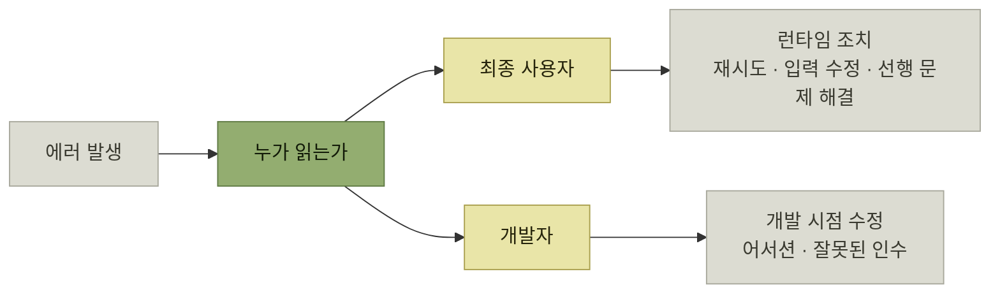

# 에러 시나리오 분류

> [에러와 경고](./README.md)

## 빠른 복습
- 에러를 만들 때 결정할 것 — 사용자를 향해서는 **"에러 메시지는 무엇인가"**, 개발자를 향해서는 **"이 에러의 클래스나 코드는 무엇인가"**, **"문제를 콕 집어내려면 어떤 메타데이터가 필요한가"**.
- 대상은 **사람 시나리오와 프로그래머 시나리오**로 갈리고, 개발자도 **같은 코드베이스 팀원**인지 **다른 팀·다른 회사 개발자**인지로 다시 갈린다.
- 원서는 **다섯 가지 범주**로 대부분의 상황을 설명한다 — **시스템 에러, 어서션, 개발자 측 잘못된 인수, 사용자 측 잘못된 인수, 사전 조건 미충족**.
- 분류하면 **대화 상대가 누구인지, 에러를 언제 고치는지가 바로 보인다.** **이 감각이 있으면 어휘 선택과 행동 제안이 자연스럽게 맞춰진다.**
- **'PC Load Letter'는 실행 가능한 메시지였지만 엉뚱한 페르소나에게 말을 걸어서 실패**했다.
- **사용자와 개발자는 에러를 이해하려고 구현 방식을 이해할 필요가 없어야 한다.**

## 다섯 가지 범주

| 에러 타입 | 예시 시나리오 |
| --- | --- |
| **시스템 에러**(System error) | 결제 처리기 다운. 타임아웃. **부하 상황의 일시적 에러** |
| **어서션**(Assertion) | **이 로컬 변수는 절대 `null`이면 안 됨** |
| **개발자 측 잘못된 인수**(Invalid Developer Argument) | **문자열이 와야 할 자리에 정수가 들어옴** |
| **사용자 측 잘못된 인수**(Invalid User Argument) | 사용자가 **잘못된 신용카드 번호**를 입력함 |
| **사전 조건 미충족**(Preconditions Not Met) | 사용자가 **리소스 접근 권한이 없거나 로그인하지 않음** |

*원서 [표 3-1] 에러 범주*

| 에러 타입 | 고치는 시점 | 흔한 조치 |
| --- | --- | --- |
| **시스템** | **런타임** | 최종 사용자가 **나중에 재시도** |
| **사용자 측 잘못된 인수** | **런타임** | 최종 사용자가 **입력을 고친 뒤 재시도** |
| **사전 조건 미충족** | **런타임** | 최종 사용자가 **다른 문제를 먼저 해결** |
| **어서션** | **우리 개발 시간** | **팀 엔지니어에게 통보** |
| **개발자 측 잘못된 인수** | **그들의 개발 시간** | **우리 함수를 쓰는 개발자가 코드 수정** |

*원서 [표 3-2] 에러 시나리오 범주의 시기와 대상*

표를 읽는 법. **'고치는 시점' 열이 세 덩어리로 나뉜다** — 위 셋은 **런타임(사용자가 지금 뭔가 해야 함)**, 넷째는 **우리 개발 시간**, 다섯째는 **남의 개발 시간**이다. **시점이 다르면 메시지를 읽을 사람도, 쓸 어휘도 다르다.**



*분류의 목적은 라벨이 아니라 "누구에게 무엇을 시킬 것인가"를 정하는 것이다*

## 어서션은 사용자가 볼 물건이 아니다

> **프로덕션에서 어서션이 터지면 보통 치명적**이에요. **저자가 예상하지 못한 상태라 동작을 예측할 수 없습니다.** 대개 크래시나 형편없는 에러 메시지로 이어지죠. **때로는 데이터 손상 같은 더 나쁜 결과**가 나옵니다.

> **어떤 언어는 프로덕션에서 어서션을 아예 빼버려 실행을 빠르게** 만듭니다. **성능에 영향을 주는 핵심 경로에 어서션을 기대선 안 된다**는 뜻입니다. 어떤 경우든 **최종 사용자가 어서션을 직접 마주하리라 기대해선 안 됩니다.**

## 페르소나가 다르면 메시지도 다르다

> 어떤 애플리케이션에서는 **최종 사용자가 다 같은 사용자가 아닙니다.** 대표 사례가 **사전 조건 미충족** 에러입니다. **이 사용자는 관리자인가요, 일반 최종 사용자인가요?** 이 구분에 따라 **직접 지시를 줄지, 관리자에게 문의하라고 안내할지**가 갈립니다.

여기서 'PC Load Letter'가 다시 등장한다.

> 이 메시지는 **프린터 용지함을 다시 채우라고 알려주려는 것**이었습니다. **사용자가 무엇을 해야 하는지는 알려 주었으므로 실행 가능한 메시지라고 볼 수 있습니다.** 다만 **엉뚱한 페르소나에게 말을 걸어서 실패**했죠. **'PC'는 '용지 카세트paper cassette'의 약자, 'Letter'는 '8.5×11인치' 용지 규격**이었습니다. **차라리 용지함을 A, B, C로 이름 붙이고 'B 용지함 확인'이라고 했으면 훨씬 이해하기 쉬웠을 것**입니다.

**실행 가능성과 이해 가능성은 별개**라는 점이 이 사례의 교훈이다. 메시지는 **정확했고 조치까지 담고 있었지만**, [사용자의 온톨로지](../02-제품-내-사용자-안내/3-발견-시나리오-온톨로지와-여러-갈래의-길.md)에 없는 약어로 쓰였다.

## 실전 분류 — `ZeroDivisionError`는 어느 범주인가

```python
# metric_name: e.g. 'channelz.api_calls.count'
def recent_average_for_metric(metric_name: str, timespan: str = '1h'):
    metrics = MyMetrics.get_data(metric_name).withinLast(timespan)
    return sum(metrics)/len(metrics)
```

*원서 예시 — `metrics`가 비면 `return` 문에서 `ZeroDivisionError`가 난다*

> `metrics` 배열이 비어서 이 메서드가 `ZeroDivisionError`를 던지면, **호출자는 몹시 혼란스럽습니다. 함수의 내부 구현까지 알아야 이해할 수 있으니까요.**

> [!IMPORTANT]
> **구현을 알아야 이해되는 에러는 실패한 진단이다**
>
> 사용자와 개발자는 에러를 이해하려고 내부 구현 방식을 알아낼 필요가 없어야 한다.

> **코드가 말 그대로 계산기가 아닌 한 0으로 나누기 에러는 어서션**입니다. **테스트 시점에 발견해서 이 코드는 개선이 필요하다고 팀에 알리는 용도**입니다. 이러한 에러가 발생하지 않도록 **나눗셈을 시도하기 전에 사전 검증upfront validation을 해 두세요.**

그렇다면 그 검증은 어느 범주일까. **`len(metrics) == 0`으로 이어지는 상황이 여럿**이기 때문에 답도 여럿이다.

| 엣지 케이스 | 범주 |
| --- | --- |
| **`metric_name`이 유효한가?** | **개발자 측 잘못된 인수** |
| **`MyMetrics` 제공자가 다운됐는가?** | **시스템 에러** |
| **최근 데이터가 없는가?** | **사전 조건 미충족** |
| **`timespan`이 너무 짧은가?** | **개발자 측 잘못된 인수** |

*원서 [표 3-3] 0으로 나누기 에러 범주*

표를 읽는 법. **하나의 증상(`len == 0`) 뒤에 네 개의 원인이 있고, 범주가 셋으로 갈린다.** 그래서 원서의 결론이 따라온다 — **각 경우에 다른 행동을 제안해야 하고, 그러려면 코드에서 검사가 분리돼야 하며, 필요한 맥락이 있는 시점에 검증을 수행해야 한다.**

**"에러를 한 곳에서 잡는다"가 왜 부족한지**가 여기서 드러난다. 증상이 합류하는 지점에서는 이미 **원인 정보가 사라져** 있다. 이 문제를 [5절](./5-인터페이스에서-에러-발생.md)이 이어서 다룬다.

## 함께 읽기
- [다음 절 — 분류 위에 메시지를 얹는다](./3-맥락-제공.md)
- [『요즘 우아한 백엔드 개발』 24장](../../요즘-우아한-백엔드-개발/24-illegalargumentexception은-400-bad-request인가/1-4xx와-5xx는-무엇을-가르는가.md) — 같은 분류 문제를 HTTP 상태 코드로 다룬 글
