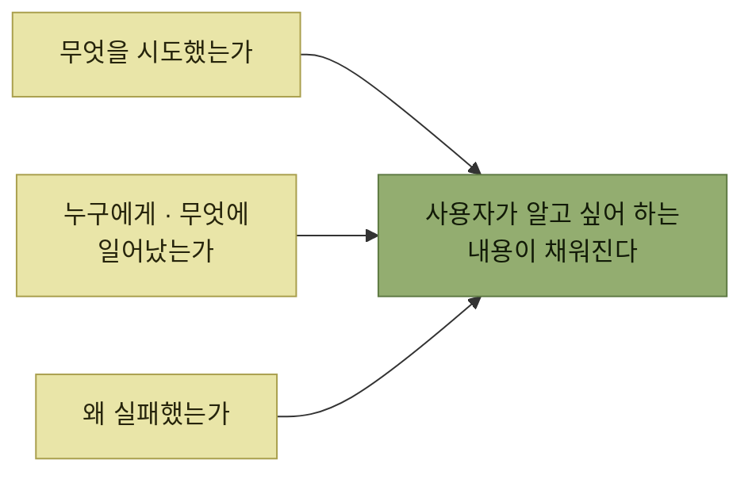

# 맥락 제공

> [에러와 경고](./README.md)

## 빠른 복습
- 진단을 본 사용자는 두 가지를 알고 싶어 한다 — **제품의 온톨로지 용어로 무엇이 에러를 일으켰는가**, **할 수 있는 게 있다면 무엇을 해야 하는가.**
- **사용자는 자신이 무엇을 잘못했는지 당연히 알고 있을 것이라 생각하기 쉽지만, 실제로는 그렇지 않은 경우가 매우 많다.**
- 완전한 맥락을 주려면 셋을 해야 한다 — **관련 데이터를 다시 보여주고**, **자세한 원인을 알려주고**, **사용자가 무엇을 했는지 다시 짚어준다.**
- 정리하면 맥락은 세 질문에 답해야 한다 — **무엇을 시도했는가, 누구에게 또는 무엇에 일어났는가, 왜 실패했는가.**
- 원서는 이 셋을 **채널즈 API의 실패 사례 세 번**으로 하나씩 보여준다. 매번 **고객의 보고를 받고 나서야** 고쳤다는 점이 핵심이다.

## 사례 — 채널즈 메시징 API

엘리스가 덩에게 보여준 SDK 설계 초안이다.

```python
class ChannelzBot:
    def __init__(self, bot_handle: str):
        # ...
        pass

    # channel 또는 users 중 하나는 필수이다.
    def send_message(
            message: str, channel: Optional[str], users: Optional[List[str]]):
        ...
```

```python
bot = ChannelzBot('@bippity_bot')

# 예시: 채널로 메시지 보내기
bot.send_message(channel='#some-channel', message="Hello world!")

# 예시: 이모지를 포함해 여러 사람에게 각각 개별 메시지 보내기
bot.send_message(users=['@drew', '@gabriel'], message="Hello :world:!")
```

*원서 예시 — 엘리스가 스케치한 성공 유스 케이스*

덩의 지적이 이 장 전체의 문제 제기다.

> 엘리스가 보여준 건 **API의 성공 유스 케이스뿐**이거든요. **호출자가 뭘 해야 할지 이미 아는 상태**죠. **그 전 단계는 어떻게 될까요?** 사용자의 코딩 세션이 여정이라면 **엘리스는 도착지만 보여준 셈**입니다. **누군가 지도 앱으로 길을 물었는데 핀 꽂힌 목적지만 찍어 돌려준 것**과 비슷합니다.

## ① 관련 데이터를 다시 보여준다

**유닛 테스트 맥락이라면 '사용자가 존재하지 않음' 정도로도 쓸 만하다.** 자기 테스트 코드를 흘깃 보면 **`@deng`의 철자가 틀렸음을 바로 알아차리기** 때문이다. 그런데 **현실 시나리오는 훨씬 지저분**하다.

```python
bot.send_message(users=input.users, message=input.message)
```

*값이 다른 곳에서 넘어오면 개발자는 무엇이 문제인지 볼 수 없다*

> 생각 없이 **'사용자가 존재하지 않음'만 달랑 내보내면**, 개발자는 **어떤 사람을 가리키는지, 계정명이 왜 잘못됐는지** 바로 알기 어렵습니다. 차라리 **'사용자 @deng가 존재하지 않음'** 정도로 말해주는 편이 낫습니다.

> **개인정보 보호나 보안상의 이유로 가려야 하는 경우가 아니라면, 에러를 일으킨 데이터를 사용자에게 다시 보여 주십시오.**

## ② 자세한 원인을 알려준다

치킨리틀 팀이 보고한 에러는 이랬다.

```text
에러: 사용자 '@buckcluck'가 존재하지 않음
```

**벅 클럭이 치킨리틀의 직원**이었기 때문에 **다들 완전히 혼란스러워했고, 채널즈 API의 버그라고 결론**지었다. 확인해 보니 **@buckcluck 계정이 실제로 비활성 상태**였다 — **문제의 벅은 회사를 그만뒀을 수도** 있다.

```python
def on_missing_user(channelz_user: str):
    if is_inactive_employee(
            Employees.get_employee_from_channelz_user(channelz_user)):
        message = f"User {channelz_user} has been deactivated."
    else:
        message = f"User {channelz_user} does not exist."
    raise RuntimeError(message)


def send_message(users: Optional[List[str]], ...):
    for user in users:
        if not channelz_user_exists(user):
            on_missing_user(user)
    # ...
```

*원서 예시 — 같은 증상(사용자를 못 찾음)을 두 원인으로 갈라 말한다*

```text
에러: 사용자 '@buckcluck'가 비활성 상태입니다.
```

**"존재하지 않음"과 "비활성 상태"는 사용자가 할 일이 완전히 다르다.** 앞의 문장은 **오타를 찾게** 만들고, 뒤의 문장은 **인사 상태를 확인하게** 만든다. 같은 코드 분기에서 나오는 에러라도 **원인을 갈라 말하지 않으면 사용자는 엉뚱한 곳을 뒤진다.**

## ③ 사용자가 무엇을 했는지 다시 짚어준다

> **유닛 테스트에서는 어떤 함수 호출이 문제를 만들었는지 알아내기 쉽습니다. 현실에서는 에러 보고와 실제 행동이 떨어져 있는 경우가 많아요.**

- **에러가 어떤 로그에 한 줄짜리로 남고, 누가 만들어낸 에러인지 불분명**할 수 있다.
- **에러가 장시간 프로세스의 지연된 일부**일 수 있다. **온라인 주문 처리에서 사용자가 뭘 주문했는지 다시 상기시켜 줘야 하는 경우**처럼.
- **제품이 AI 기반이라면 사용자의 지시를 어떻게 해석했는지 다시 보여줘야** 할 수 있다. **에러를 내기 전에, 어떻게 해석했는지를 먼저 사용자에게 보여 주세요.**

치킨리틀의 **옵저버빌리티 팀** 사례가 이 문제의 대가를 보여준다. 이 팀은 **급하지는 않지만 중요한 프로덕션 문제를 알릴 때 채널즈 메시징 API를 쓰고, 정말 심각한 문제에는 페이저 서비스**를 쓴다.

```text
에러: 사용자 '@foxyloxy'가 비활성 상태임
```

> 처음에는 **메시지가 중요한지 몰랐습니다.** @foxyloxy가 이미 떠났으니 **신경 쓸 필요 없겠거니** 했어요. 하지만 얼마 뒤, **중요한 알림 몇 건이 전달되지 않았고 이슈가 이틀간 방치**됐다는 사실이 드러났습니다.

**폭시 록시가 이미 회사를 떠났는데도 그 시점에 온콜 담당자로 설정돼 있었던** 것이다. 팀은 **폭시를 온콜 로테이션에서 빼서 고쳤고**, **메시지가 전달되지 않을 때를 대비해 에스컬레이션할 폴백 사용자를 두는 표준 관행**도 도입했다.

고쳐 쓴 메시지는 이렇다.

```text
에러: '@foxyloxy'가 비활성 상태라 '[@foxyloxy, @buckcluck]'에게 Channelz 메시지를 전달할 수 없습니다.
```

> [!IMPORTANT]
> **사용자가 시도한 작업을 다시 말한다**
>
> 에러에는 무엇을 시도했는지, 누구에게 또는 무엇에 일어났는지, 왜 실패했는지를 함께 담는다.

### 덤으로 드러난 설계 문제

> 이렇게 명확하게 의사소통하면 **중요한 사실도 자연스럽게 드러납니다. 사용자 중 한 명이라도 존재하지 않으면 메시지가 하나도 전송되지 않았다는 점**입니다. 덩과 엘리스는 이게 **'설계 의도'인지 아니면 버그인지 토론**합니다. **결론은 버그라는 쪽**입니다. **이 메시지들은 중요한 알림일 수 있으니, 가능한 한 많이 보내는 편이 낫습니다.**

**메시지를 제대로 쓰려다 동작의 결함을 발견한 것**이다. 수신자 목록을 에러에 적으려면 **"누구에게 보내려 했고 누구에게 실패했는가"** 를 코드가 알아야 하는데, 그것을 적는 순간 **전부 실패했다는 사실**이 눈에 들어왔다.



*에러에 붙이는 맥락이 답해야 할 세 질문*

> **조금 더 나은 작성 기법과 사용자에 대한 약간의 공감만 있었더라도, 엘리스는 처음부터 이 메시지를 쓸 수 있었을 겁니다. 여러 번 반복을 거치지 않아도 됐죠.**

## 함께 읽기
- [다음 절 — 무슨 일이 났는지 아는 것은 절반일 뿐이다](./4-실행-가능성-개선.md)
- [2장 — 맥락을 되짚어 주는 것이 왜 버그를 잡는가](../02-제품-내-사용자-안내/6-이해-시나리오-중복-설명.md#코딩-실습--중복이-버그를-잡는다)
