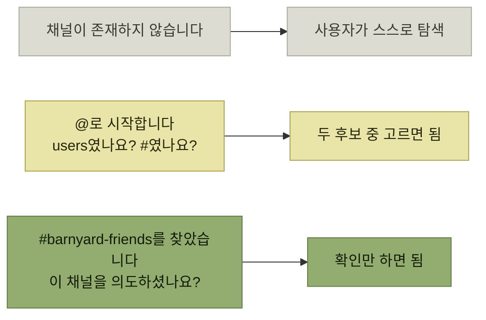

# 실행 가능성 개선

> [에러와 경고](./README.md)

## 빠른 복습
- **무슨 일이 일어났는지 아는 것만으로는 문제를 절반밖에 해결하지 못한다.** **사용자는 종종 문제를 어떻게 해결해야 하는지에 대한 지시를 받아야 움직인다.**
- **읽기 작업이나 AI에서는 점점 더 우리가 사용자를 대신해 실수를 바로잡을 수도** 있다. 구글의 **'다음 검색 결과를 표시합니다: [수정]'** 이 그 예다.
- **'탐색 공간search space' 덩어리를 없애고 행동을 제안하면, 사용자의 몇 시간을 아껴주거나 사용자가 제품을 떠나는 일을 막을 수** 있다.
- **시스템 에러 뒤에 붙는 "잠시 뒤 다시 시도해 주세요" 한 마디만 있어도 워크플로 완료율이 올라간다.**
- 조언이 복잡하면 **그 에러를 해결하는 전용 문서로 링크**를 건다.

## 맞는 말인데 도움이 안 되는 메시지

```python
bot.send_message(message="The sky is falling!", channel="@barnyard-friends")
```

```text
채널 '@barnyard-friends'에 Channelz 메시지를 전달할 수 없습니다: 채널이 존재하지 않습니다.
```

*원서 예시 — 맥락은 다 들어 있지만 사용자는 여전히 막혀 있다*

> 뭐가 잘못됐는지 보이나요? **알아내는 데 시간이 걸릴 수 있습니다. 채널즈 용어에 익숙하지 않다면, 채널 접두사가 @가 아니라 # 이라는 사실을 모를 수 있기 때문**입니다.

**[앞 절](./3-맥락-제공.md)의 세 질문에는 이미 답한 메시지**라는 점이 중요하다. 무엇을 시도했는지(채널로 전송), 무엇에 일어났는지(`@barnyard-friends`), 왜 실패했는지(채널이 없음)가 다 있다. 그런데도 **사용자는 다음에 무엇을 할지 모른다.** 맥락과 실행 가능성은 별개의 축이다.

## 선택지를 준다

```text
채널 '@barnyard-friends'에 Channelz 메시지를 전달할 수 없습니다: @로 시작합니다.
'users'에 넘기려던 건가요? 아니면 '#barnyard-friends'를 의도하셨나요?
```

여기서 한 걸음 더 갈 수도 있다. **채널즈는 계정을 조회해 `#barnyard-friends`가 존재하는지, 사용자에게 공개돼 있는지까지 확인해 보여줄 수** 있다.

```text
채널 @barnyard-friends는 @로 시작하는데, #barnyard-friends라는 채널을 찾았습니다.
이 채널을 의도하셨나요?
```



*메시지가 좋아질수록 사용자에게 남는 탐색 공간이 줄어든다*

**메시지의 품질은 "사용자에게 남겨 놓은 일의 양"으로 잴 수 있다.** 첫 줄은 전부 사용자 몫이고, 마지막 줄은 예/아니오 하나만 남는다.

> [!TIP]
> **사용자에게 남겨 둔 일을 줄인다**
>
> 탐색 공간을 없애고 행동을 제안하면 사용자의 시간을 아끼고 제품 이탈을 줄일 수 있다. 좋은 메시지는 가능한 후보를 좁혀 확인할 선택지만 남긴다.

## 값싼 한 줄과 링크

- **시스템 에러 뒤에 붙는 "잠시 뒤 다시 시도해 주세요" 한 마디만 있어도 워크플로 완료율이 올라간다.** — [분류](./2-에러-시나리오-분류.md)가 정해준 조치를 그대로 적어주기만 해도 된다.
- **가끔은 조언이 복잡**해진다. **채널 같은 새 개념을 사용자에게 소개해야 할 수 있고, 여러 결정 단계를 안내해야** 할 수도 있다. 이럴 때는 **전용 문서로 링크**를 건다.

```text
이 에러를 해결하려면 https://channelz.io/docs/errors/invalid_channel 문서를 참고하세요.
```

**URL은 메시지가 담을 수 없는 분량을 담고, 나중에 갱신할 수도 있다.** [8절의 윈도우 블루스크린 분석](./8-요약과-예제.md)에서도 같은 기법이 좋은 평가를 받는다.

## 함께 읽기
- [다음 절 — 이렇게 쓰려면 어디서 던져야 하는가](./5-인터페이스에서-에러-발생.md)
- [2.7 위험을 이름에 드러내기](../02-제품-내-사용자-안내/7-사용-시나리오-위험을-이름에-드러내기.md) — 사고가 나기 전에 이름으로 막는 쪽
- [4.4 운영자 가이드](../04-자사-제품-체험/4-문서-주도-개발-문서의-종류.md#운영자-가이드는-딥-링크가-생명이다) — 에러 메시지에서 구체적인 해결 절차로 바로 연결하는 방법
