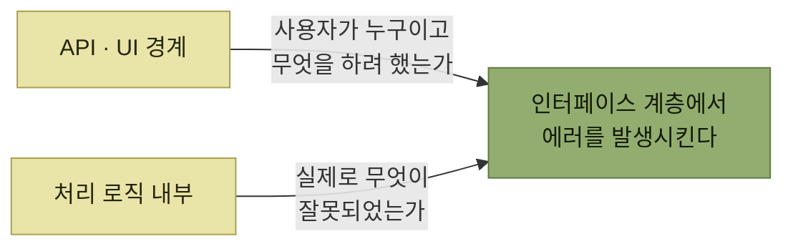

# 인터페이스에서 에러 발생

> [에러와 경고](./README.md)

## 빠른 복습
- **좋은 에러 메시지를 쓰기 어려운 이유 중 하나는 제대로 하려면 코드 조직이 꼼꼼해야 하기 때문**이다.
- 최고의 에러에는 두 정보가 필요하다 — **시스템에서 무슨 일이 일어났는가**, **사용자는 무엇을 하려 했는가.** **문제는 현실에서 이 둘이 서로 다른 코드 조각에 들어 있다는 점**이다.
- **API·UI 경계**는 사용자가 누구이며 무엇을 하려 했는지 알고, **처리 로직의 깊은 내부**는 실제 문제를 안다.
- 그래서 **에러는 시스템과 사용자가 만나는 인터페이스 계층에서 발생시키는 것이 가장 바람직**하다.
- 방법은 둘 — **API 경계에서 사전 검증으로 선제적으로 발생**시키거나, **에러 핸들러로 하위 레벨 에러를 가로채 적절한 형태로 재포장**한다.

> [!NOTE]
> **사용자 시나리오를 아는 계층에서 에러를 발생시킨다**
>
> API나 애플리케이션의 가장 바깥 계층은 사용자가 누구이며 무엇을 하려 했는지 안다. 이 경계에서 사전 검증하거나 하위 에러를 재포장한다.

## 정보가 두 곳에 나뉘어 있다



*좋은 에러는 두 정보가 만나는 자리에서만 쓸 수 있다*

> **파이썬의 나눗셈 연산은 어떤 수학 법칙이 위반되었는지는 정확히 알지만, 그 나눗셈이 어떤 목적으로 사용되었는지는 전혀 알지 못합니다.** 따라서 **사용자에게 도움이 되는 에러 메시지를 제공할 수 없습니다.**

**깊은 곳일수록 정확하고 얕은 곳일수록 의미가 있다.** [2절의 `ZeroDivisionError`](./2-에러-시나리오-분류.md)가 그 예였다 — 나눗셈은 **자기가 왜 호출됐는지 모른다.**

> **다른 방법으로는 사용자와 관련된 모든 맥락을 하위 계층으로 전달하는 방식도 있으며, 이에 대해서는 뒤에서 살펴보겠습니다.**

## 방법 ① 사전 검증

치킨리틀 옵저버빌리티 팀의 온콜 함수다.

```python
def alert_team(bot: ChannelzBot, team: Team, message: str):
    team_metadata = get_team_metadata(team)
    bot.send_message(users=[team_metadata['on_call_user']], message=message)
```

`team_metadata['on_call_user']`가 유효하지 않으면 `send_message`가 이런 에러를 낸다.

```text
에러: '@gooseyloosey'가 비활성 상태라 '[@gooseyloosey]'에게 Channelz 메시지를 전달할 수 없습니다.
```

> **맞는 말이긴 합니다.** 다만 구시 루시가 회사를 떠났을 때, **사용자는 어떻게 고쳐야 할지 몰랐습니다.**

**틀린 메시지가 아니라 "고칠 자리를 모르는 메시지"** 다. 온콜 데이터는 **치킨리틀 직원들이 웹 페이지에서 UI로 설정한 것**인데, 채널즈 API는 그런 페이지가 있는 줄 모른다.

```python
def alert_team(bot: ChannelzBot, team: Team, message: str):
    team_metadata = get_team_metadata(team)
    if not channelz_user_exists(team_metadata['on_call_user']):
        error_message = (
            f"Cannot send alert '{message}' to team {team}'s on-call: "
            f"On-call employee {team_metadata['on_call_user']} doesn't exist. "
            f"Update the team's on-call rotation at {ON_CALL_BASE_URL}/{team}.")
        raise ValueError(error_message)
    bot.send_message(users=[team_metadata['on_call_user']], message=message)
```

*원서 예시 — 상위 함수가 자기 맥락(온콜 로테이션 URL)을 얹어 미리 검증한다*

```text
'barnyard-friends' 팀에 Channelz 알림을 보낼 수 없습니다. 온콜 사용자 '@gooseyloosey'가
존재하지 않습니다. https://corp.chickenlittle.io/oncalls/barnyard-friends에서 온콜
로테이션을 갱신하세요.
```

> **상위 레벨 API인 `alert_team`은 호출자 의도를 `send_message`보다 훨씬 완전하게 잡아냅니다. 훌륭한 에러를 만들 토대**가 되죠.

## 방법 ② 에러 재포장

사전 검증에는 두 가지 문제가 있다.

| 문제 | 내용 |
| --- | --- |
| **비용** | **채널즈 API에 왕복 호출을 한 번 더** 쓴다 |
| **중복 구현** | **채널즈 API가 이미 내부적으로 수행하고 있는 여러 예외 검사 로직을 다시 구현**해야 한다. **계정이 비활성인지 확인하는 검사** 같은 것 |

표를 읽는 법. 둘째 줄이 더 무겁다. **검증 로직이 두 벌**이 되면 **한쪽만 갱신되는 순간 어긋난다** — 원서가 든 예가 **직원이 이름 변경 때문에 채널즈 계정명을 바꾼 경우**이며, **그건 별도 수정이 필요**하다.

```python
def alert_team(bot: ChannelzBot, team: Team, message: str):
    team_metadata = get_team_metadata(team)
    try:
        bot.send_message(users=team_metadata['on_call_users'], message=message)
    except ChannelzUserNotFoundError as error:
        error_message = (
            f"Cannot send a Channelz alert to team {team}'s on-call: "
            f"On-call employee {team_metadata['on_call_user']} doesn't exist. "
            f"Update the team's on-call rotation at {ON_CALL_BASE_URL}/{team}.")
        raise ValueError(error_message) from error
```

*원서 예시 — 하위 에러를 가로채 자기 맥락으로 다시 포장한다*

> 마지막 줄의 **`from error` 절**을 보세요. 파이썬에서 **'예외 체이닝chained exception'** 을 표현하는 방식으로 **내부 에러를 보존**합니다. **많은 프로그래밍 언어에 비슷한 장치**가 있습니다.

```text
ChannelzUserNotFoundError: User @looseygoosey's account has been deactivated.

The above exception was the direct cause of the following exception:

ValueError: Cannot send a Channelz alert to team 'barnyard-friends'.
On-call employee '@looseygoosey' doesn't exist.
Update your on-call rotation at
https://corp.chickenlittle.io/on-calls/barnyard-friends.
```

> **메시지는 길어졌지만, 사용자가 알고 싶어 할 내용을 전부 담습니다.**

**두 계층이 각자 아는 것만 말하고 체인으로 이어 붙었다는 점**이 이 출력의 핵심이다. 아래쪽은 **정확한 원인**(비활성 계정), 위쪽은 **의미와 조치**(온콜 로테이션을 갱신하라). 어느 한쪽도 혼자서는 이 메시지를 쓸 수 없다.

그리고 이 방식이 성립하려면 조건이 하나 붙는다 — **옵저버빌리티 팀은 엘리스에게, 이걸 하려면 채널즈 SDK에 구체적인 에러 타입이 필요하다고 요청**한다. `except`로 잡으려면 **잡을 타입이 있어야** 하기 때문이며, 그것이 [다음 절](./6-프로그래밍-가능한-에러.md)의 주제다.

## 함께 읽기
- [다음 절 — 재포장할 수 있는 에러를 만들려면](./6-프로그래밍-가능한-에러.md)
- [『아키텍트 첫걸음』 4.4 오류 처리 위치](../../아키텍트-첫걸음/4-아키텍처-구현/4-애플리케이션-기반-구현.md#어디에서-처리할-것인가) — 같은 질문을 레이어 관점에서 다룬 절
