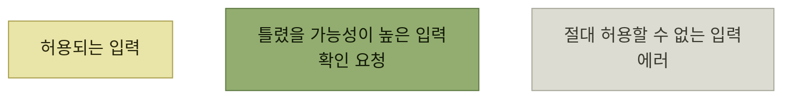

# 조기 진단 - 시프트 레프트

> [에러와 경고](./README.md)

## 빠른 복습
- **조기에 진단을 내보내는 일을 흔히 시프트 레프트**라 부른다. **시스템에도, 사용자에게도 이점이 많다.**
- 시스템 쪽 — **쓸모없는 코드 경로를 잘라내 리소스 사용을 줄이고**, **서비스 거부(DoS) 공격을 막는 데 결정적**일 수 있으며, **예측하지 못한 입력으로 인한 데이터 손실 같은 버그도** 막는다.
- 사용자 쪽 — **프로덕션 배포 후가 아니라 IDE에서 에러를 만나면** 시간을 크게 번다. **빠른 피드백을 받으면 사용자는 자기가 뭘 했는지 더 잘 기억하고, 무엇이 올바른 행동인지도 더 확신**한다.
- 네 가지 방법 — **정적 검증**, **사전 검증**, **테스트 허용**, **사용자 확인 요청**. **엔지니어들은 앞의 두 가지는 넓게 실천하지만 뒤의 두 가지는 아쉽게도 잘 안 한다.**

## ① 정적 검증

> **입력값을 검증할 때 정적 검증은 복잡한 분석이나 네트워크 호출 없이도 비용 부담이 적게 수행할 수 있지만, 동적 검증은 더 많은 처리나 추가적인 맥락이 필요**합니다.

> [!TIP]
> **저렴한 검사는 일찍 자주 실행한다**
>
> 저렴한 검사와 비싼 검사를 분리한다. 네트워크 호출이나 복잡한 분석이 필요 없는 검사는 사용자 행동에 가까운 시점에서 반복한다.

**많은 프로그래머가 정적 타입 검사와 린터의 즐거움을 아는데, 이 즐거움은 제품에도 똑같이 적용된다.**

| 정적으로 잡을 수 있는 것 | 무엇이 좋은가 |
| --- | --- |
| **우편번호가 해당 국가의 정확한 길이인지** | 네트워크 왕복 없이 즉시 |
| **신용카드 번호·UPC 코드·ISBN의 체크섬** | **오타와 자리 바뀜 같은 흔한 에러**를 막는다 |

표를 읽는 법. 체크섬 줄에는 **덤이 하나 붙는다** — **어떤 번호의 체크섬이 맞지 않으면, 단지 우리 데이터베이스에 없는 게 아니라 그냥 틀렸다는 사실을 아는 것**이다. 즉 **진단의 확신도가 올라가고**, 그만큼 [더 단호한 조치](./4-실행-가능성-개선.md)를 제안할 수 있다.

## ② 사전 검증

[5절](./5-인터페이스에서-에러-발생.md)에서 사전 검증은 **더 실행 가능하고 이해하기 쉬운 에러 메시지를 만드는 도구**였다. **시프트 레프트 도구이기도** 하다.

> **세탁소에 가서 빨래를 모두 마쳤는데, 막상 건조기를 사용하려고 보니 사용할 수 있는 건조기가 한 대뿐이고 몇 시간 동안 예약이 꽉 차 있다**고 생각해 보십시오. **입구에 안내문 하나만 붙어 있었어도 젖은 빨래를 오래 들고 기다리거나 상하게 만드는 일을 피할 수 있었을 것**입니다.

> 마찬가지로 **계좌 이체를 할 때는 출금하기 전에 목적지 계좌가 유효한지 먼저 확인하는 것이 중요**합니다. **세탁, 자금 이체, 자금 세탁(?)처럼 여러 단계를 거치는 작업은 사전 검증의 효과를 크게** 볼 수 있습니다.

**되돌리기 비용이 단계마다 커지는 작업**이 사전 검증의 자리다. 젖은 빨래도, 출금된 돈도 **되돌리기가 비싸다.**

## ③ 테스트 허용

> **플랫폼 엔지니어가 가장 자주 빠뜨리는 사용자 시나리오가 있다면 바로 테스트**입니다. **엔지니어는 자기 프로덕션 제품을 성공적으로 쓰는 고객을 떠올리지만, 그 고객이 거기까지 가는 시행착오는 잘 고려하지 않습니다.**

**페이크fake**는 **프로덕션 시스템의 고충실도high-fidelity 버전**이다. **프로덕션 경로와 최대한 많은 코드를 공유하되, 데이터베이스나 온라인 서비스처럼 테스트를 느리고 덜 안정적으로 만드는 런타임 의존성은 일부 우회**한다.

채널즈가 만들어야 할 페이크의 조건이다.

- **사용자의 테스트 환경이나 개발 머신에서 테스트할 수 있도록 인메모리나 가벼운 로컬 프로세스로** 돌아야 한다.
- **사용자와 채널을 다량 입력할 수 있어야** 한다. **그래야 API를 쓰는 다양한 코드 조각을 테스트**할 수 있다.
- **가능한 한 많은 시나리오에서 프로덕션 서비스처럼 동작**해야 한다.

### 스트라이프의 테스트 모드

> 결제·청구 API와 UI를 제공하는 **스트라이프는 인기 있는 '테스트 모드'** 를 운영합니다. **실제로 돈을 옮기지 않고도 진짜 같은 거래를 해볼 수 있는 기능**이죠. 고객은 **특수한 신용카드 번호를 넣어 여러 가지 사용자 측 잘못된 인수와 사전 조건 미충족 에러를 일부러 일으킬 수** 있습니다. **`4000 0000 0000 9995`라는 카드 번호는 잔액 부족(`insufficient_funds`) 서브코드를 가진 `card_declined` 에러를 흉내** 냅니다.

> **스트라이프 사용자는 프로덕션보다 테스트 모드에서 훨씬 많은 시간을 보냅니다.**

**이 한 문장이 테스트 허용의 근거 전부**다. [1절](./1-진단의-가치.md)이 "진단이 메인 인터페이스"라고 했다면, 여기서는 **"테스트 모드가 메인 환경"** 이라고 말하는 셈이다. 사용자가 가장 오래 머무는 곳을 **부수적인 것으로 취급하는 습관**이 같은 실수의 두 얼굴이다.

## ④ 사용자 확인 요청

> **확인 요청은 앱이나 플랫폼에 놓인 일종의 과속방지턱**입니다. **사용자가 제대로 한 게 맞는지 스스로 점검하게** 도와주죠. **경고보다는 강하지만 에러만큼 거슬리지는 않습니다.**



*원서가 말하는 '중간 상태' — 많은 개발자가 양 끝만 생각한다*

**구글의 'Did you mean'** 이 좋은 예다. 사용자가 'compture'를 검색했을 때 **어쩌면 밴드 이름 'Compture'를 가리킨 것일 수도** 있으므로 **구글은 무작정 에러를 띄우지 않고 의심되는 바를 먼저 알려준다.** 또 다른 예로 **여러 페이지에 걸친 입력 양식은 제출 전에 요약 화면**을 보여준다.

### 드라이 런 + 확인 요청

**사전 테스트를 허용하는 흔한 방법 하나가 '드라이 런dry run' 뒤에 확인 요청을 붙이는 것**이다. **주식 거래 앱에서 매수하려는 주식 수에 현재 주가를 곱해 예상 결제 금액을 미리 보여 주는 것**만으로도 충분하다.

채널즈의 예는 재시도 정책이다.

```python
(ChannelzBot('@bippity_bot')
    .with_retry_policy(
        backoff_coefficient=2.0,
        initial_interval_seconds=10, max_interval_seconds=600)
    .send_message(...))
```

```python
# Too spammy!
.with_retry_policy(backoff_coefficient=1.0, initial_interval_seconds=1)
```

**1초에 한 번씩 무한히 재시도하는 정책**은 **채널즈에 의도치 않은 DoS 공격**이 될 수 있고, **치킨리틀의 트래픽은 틀림없이 제한**될 것이다. 그래서 엘리스는 **재시도 정책을 시뮬레이션해 보고 나쁜 동작에 깃발을 꽂는다.**

```text
Your retry_policy (currently initial_interval_seconds=1, backoff_coefficient=1.0,
max_attempts=Infinite) will result in 601 attempts in 600 seconds. This exceeds
our limit of 50. You may ignore this by adding .ignore(Errors::RetryPolicySpamminess)
to your policy.
```

> 엘리스는 **자신의 휴리스틱이 정확하다고 확신하지는 못합니다.** 그래도 이렇게 **개발을 잠시 멈추는 확인 요청을 제공하면 빠르게 움직이면서 사용자를 도울 수** 있습니다. **휴리스틱이 빗나가면 사용자가 불평할 테고, 그때 기준을 올려 조정하면** 됩니다.

**확신이 없어도 말할 수 있다**는 것이 확인 요청의 값이다. 에러는 확신을 요구하지만 **확인 요청은 추측으로도 낼 수 있고, 무시할 길(`.ignore(...)`, `--force`)만 함께 주면** 된다.

### 한계

> [!CAUTION]
> **확인 요청은 안전 경계가 아니다**
>
> 사용자는 확인을 무심코 누르거나 `--force` 플래그를 복사할 수 있다. **절대로 허용할 수 없는 입력은 확인 절차만으로 막지 않는다.**

> 그럼에도 **많은 개발자는 입력은 허용되거나 허용되지 않거나 둘 중 하나라고 생각하는 데 익숙**합니다. 하지만 **입력이 잘못되었을 가능성이 높다는 중간 상태를 고려하기 시작하면, 인터페이스를 훨씬 더 풍부하고 유연하게 설계**할 수 있습니다.

## 함께 읽기
- [다음 절 — 요약과 연습 문제](./8-요약과-예제.md)
- [『아키텍트 첫걸음』 5.1 시프트 레프트](../../아키텍트-첫걸음/5-품질-보증과-테스트/1-아키텍트와-품질-보증을-위한-작업.md#시프트-레프트) — 같은 용어를 테스트 시점에 적용한 절
- [4.1 도그푸딩으로서의 테스트](../04-자사-제품-체험/1-도그푸딩으로서의-테스트.md) — 사용자 시나리오를 테스트로 옮겨 제품 위험을 더 일찍 드러내는 방법
