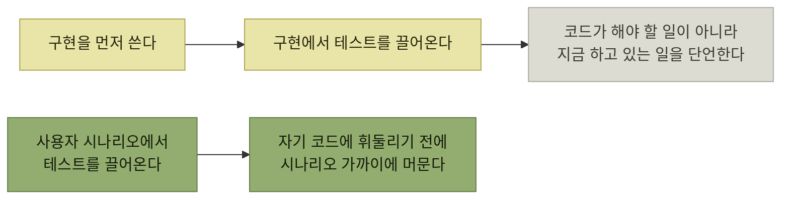

# 도그푸딩으로서의 테스트

> [자사 제품 체험](./README.md)

## 빠른 복습
- **코드를 쓰기 시작하면, 테스트를 쓰는 일이 내 제품을 체험하는 가장 좋은 길 가운데 하나**가 된다.
- 켄트 벡은 **"TDD는 애플리케이션 개발의 두려움을 없애기 위한 것"** 이라고 했다. **두려움을 줄이는 가장 좋은 방법은 프로덕션과 충실히 맞닿은 테스트를 쓰는 것**이다.
- **TDD에서는 구현 전에 테스트를 작성**하는데, **무엇을 근거로** 할까. **구현에서 끌어올 순 없다. 아직 없으니까. 있어도 안 된다 — 구현 편향implementation bias이 생긴다.**
- **진짜 영감의 원천은 사용자 시나리오**다. **테스트부터 작성하면 자기 코드에 휘둘리기 전에 사용자 시나리오 가까이에 머물 수** 있다.
- 이 절의 테스트는 **시스템 지향과 제품 지향이 섞여** 있다. **시스템 지향은 시스템 리스크**를, **제품 지향은 제품 리스크(사용자가 작업을 끝마치지 못할 가능성)** 를 줄인다.
- 저자의 경험상 **제품 지향 테스트를 덜 쓰며**, **엔지니어들은 자신이 활용할 수 있는 테스트 유형이 생각보다 다양하다는 사실을 잘 모르는** 경우도 많다.

> [!IMPORTANT]
> **테스트는 사용자 시나리오에서 시작한다**
>
> 구현에서 테스트를 끌어오면 현재 코드의 동작만 확인하기 쉽다. 먼저 사용자 시나리오를 세우고 제품이 해야 할 일을 검증한다.

## 구현 편향

*테스트를 어디서 끌어오느냐가 테스트의 값을 정한다*

**"구현을 보고 쓴 테스트는 버그까지 함께 단언한다"** 는 것이 구현 편향의 뜻이다. 그런 테스트는 **바뀌면 깨지지만 틀리면 안 깨진다** — 정확히 반대여야 한다.

## 테스트로 무엇을 얻는가

이 절은 **신중하게 선정한 자동화 테스트**로 다음을 하자고 한다.

- **핵심 시나리오의 정확성을 검증**한다.
- **엣지 케이스를 다듬는다.**
- **의도한 사용 방식을 문서로 남긴다.**
- **지금 무엇을 만들고 있는지 스스로 다시 생각하게** 만든다.
- **두고두고 반복 실행할 수 있는 가치를 쌓는다.**

앞의 둘은 흔한 이유지만, **셋째와 넷째가 이 장의 주제**다 — 테스트를 **검증 장치가 아니라 도그푸딩 기회**로 보는 것이다. 테스트를 쓰는 동안 우리는 **자기 API의 첫 사용자**가 된다.

## 두 종류의 리스크

| | 무엇을 줄이는가 |
| --- | --- |
| **시스템 지향 테스트** | **애플리케이션이 버그를 일으키거나 불안정하거나, 확장하지 못하는 시스템 리스크** |
| **제품 지향 테스트** | **제품 리스크 — 사용자가 작업을 끝마치지 못할 가능성** |

표를 읽는 법. **두 리스크는 독립적**이다. **완벽하게 동작하는데 아무도 목표를 달성하지 못하는 제품**이 가능하고, 그 반대도 가능하다. 그래서 **테스트 묶음의 목표는 시스템 문제와 제품 문제를 효율적으로 찾아내는 것**이며, **다양한 테스트를 적절히 조합하는 것이 중요**하다.

## 용어 — 목과 페이크

| 용어 | 정의 |
| --- | --- |
| **목Mocks** | **의존성이 특정 방식으로 호출되는지 확인하는 비기능적 자리 표시자** |
| **페이크** | **복잡한 기능을 단순한 구현으로 대체하는 방법.** 예를 들어 **로컬 파일시스템 기반의 SQL 버전인 SQLite를 실제 SQL 데이터베이스의 페이크로** 쓸 수 있다 |

표를 읽는 법. **목은 "어떻게 불렸는가"를 보고, 페이크는 "무엇이 나오는가"를 준다.** 그래서 목이 많은 테스트는 **호출 방식이 바뀌면 깨지고**, 페이크를 쓴 테스트는 **결과가 바뀌면 깨진다.** [3.7](../03-에러와-경고/7-조기-진단-시프트-레프트.md)이 말한 **페이크의 정의(고충실도 버전)** 와 같은 개념이다.

## 함께 읽기
- [다음 절 — 프로덕트 압박 순으로 늘어놓은 테스트 유형](./2-테스트-종류-고르기.md)
- [『아키텍트 첫걸음』 5.2 단위 테스트](../../아키텍트-첫걸음/5-품질-보증과-테스트/2-기능-테스트-자동화.md#단위-테스트) — 목과 스텁을 다른 관점에서 정리한 절
