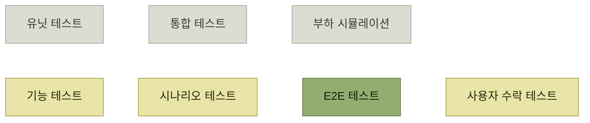

# 테스트 종류 고르기

> [자사 제품 체험](./README.md)

## 빠른 복습
- 원서는 테스트 유형을 **코드베이스에 거는 '프로덕트 압박product pressure'이 큰 순서**로 늘어놓는다.
- 목표는 여섯 가지 — **가장 중요한 시스템·제품 리스크 최소화**, **핵심 시나리오 커버**, **자동화로 사용자 수락 테스트 반복 줄이기**, **투입 대비 가치 극대화**, **높은 신호 대 잡음비**, **중요한 엣지 케이스는 기능 테스트로 보완**.
- **시스템 리스크가 큰 기능에는 부하 시뮬레이션과 통합 테스트**를, **제품 리스크가 큰 기능에는 기능·시나리오·사용자 수락 테스트**에 비중을 둔다. **E2E는 둘 다에 좋다.**
- **가장 중요한 목표는 테스트를 통해 사용자에게 직접 영향을 주는 동작을 단언하는 것**이다.

> [!NOTE]
> **프로덕트 압박**
>
> 사용자가 혼자서 또는 집단적으로 취할 가능성이 높은 일련의 행동을 바탕에 두고 제품을 검증하는 관점이다.

## 프로덕트 압박 순으로 본 테스트 유형

| 유형 | 무엇을 하는가 |
| --- | --- |
| **유닛 테스트** | **개별 함수나 클래스 같은 작은 코드 조각**을 시험한다. **기능 개발 초기에 엣지 케이스를 살피거나 계약을 명시**하는 데 쓴다. **빠르게 실행**되어야 하며 **가장 안쪽 개발 루프**에서 쓰인다. **대상에만 집중하기 위해 목 사용률이 높다.** 다만 **중요한 시스템·제품 버그를 잡는 데는 성능이 그다지 좋지 않다** |
| **통합 테스트** | **여러 컴포넌트를 함께** 시험한다. **컴포넌트 간 상호작용에서 문제가 발생하는 경우가 많기** 때문이다. **의존성을 목으로 대체하는 일을 최소화**하고 **대부분 실제 프로덕션 코드를 돌리며 필요하면 페이크를** 끼운다 |
| **기능 테스트** | **개별 기능의 제품 동작**에 초점을 둔다. **의존성은 페이크로** 채운다. **페이크가 없으면 목을 쓰기도 하지만 이건 '나쁜 냄새'** 다 — **테스트 결과를 믿기 어려워지기** 때문이다 |
| **시나리오 테스트** | 기능 테스트와 닮았지만 **특정 기능이 아니라 일반적인 사용자 시나리오**를 돌린다. **여러 기능을 한꺼번에 건드리거나, 한 기능에 가장 흔한 입력 조합**을 넣는다. **사용자의 작업 전체가 끝까지 굴러가는지** 확인한다 |
| **부하 시뮬레이션** | **수많은 가상 요청으로 제품에 스트레스**를 준다. **요청은 가급적 실제 조건을 모방하는 게 이상적**이다(9장에서 다룬다) |
| **E2E 테스트** | **사용자에게 제공되는 기능을 가장 포괄적으로 검증**하는 자동화 테스트. **예상치 못한 시스템 통합 문제까지** 잡는다. **본질적으로 아무것도 스텁 처리하지 않고 보통 UI까지 포함하는 시나리오 테스트** |
| **사용자 수락 테스트** | **실제 사용자가 수동으로 제품을 돌려보고 문제를 보고**한다 |

표를 읽는 법. **위로 갈수록 빠르고 아래로 갈수록 현실에 가깝다**는 익숙한 축에, **"목을 얼마나 쓰는가"** 라는 축이 겹쳐 있다. 유닛은 **목 사용률이 높고**, 기능 테스트는 **목을 쓰면 나쁜 냄새**이며, E2E는 **아무것도 스텁하지 않는다.** 즉 **목의 양이 그 테스트가 어떤 리스크를 잡을 수 있는지를 결정**한다.

*원서 [그림 4-1]을 옮긴 것 — 위쪽 세 개는 시스템 리스크, 아래쪽 네 개는 제품 리스크 쪽에 치우치며, 오른쪽으로 갈수록 투입 노력이 커진다*

## 테스트 종류를 고르는 목표

- **제품이 돌아가지 않게 만들 가장 중요한 시스템·제품 리스크를 최소화**한다.
- **발견 단계에서 뽑아낸 핵심 시나리오가 테스트로 다뤄지는지** 확인한다.
- **자동화로 사용자 수락 테스트의 반복을 줄인다.**
- **테스트 작성에 드는 공을 고려해, 테스트의 가치를 최대한 높인다.**
- **신호 대 잡음비를 높게 유지해, 테스트 실패가 의미 있는 이벤트가 되도록** 한다.
- **중요한 엣지 케이스는 기능 테스트로 보완**한다.

다섯째 항목이 실무에서 가장 자주 무너진다. **자주 깨지는 테스트가 방치되면 빨간불이 배경이 되고**, 그 순간 테스트 묶음 전체의 값이 0에 수렴한다.

### 상황에 따라 무게가 달라진다

| 상황 | 어디에 무게를 두나 |
| --- | --- |
| **시스템 리스크가 큰 기능** | **부하 시뮬레이션과 통합 테스트** |
| **제품 리스크가 큰 기능** | **기능·시나리오·사용자 수락 테스트** |
| **제품에서 가장 새로운 부분** | **가장 잘 깨지기 쉬우니 그쪽에 집중** |
| **오래된 인프라 컴포넌트를 새것으로 교체**(같은 의미를 그대로 유지) | **시스템 테스트에 무게**를 싣고 **제품 동작은 기존 테스트에 맡겨도** 된다 |
| **성숙한 테크 회사의 '포장 도로paved roads' 위에서 새 제품** | **제품 리스크에 더 집중**할 수 있다 |

표를 읽는 법. 아래 두 줄이 대칭이다. **인프라를 갈아끼울 때는 제품 동작이 상수**이고, **다져진 인프라 위에서 새 제품을 만들 때는 시스템이 상수**다. **변하는 쪽에 테스트를 붙인다**는 한 문장으로 요약된다.

## 사용자 가치 중심 테스트

> **가장 중요한 목표는 테스트를 통해 사용자에게 직접 영향을 주는 동작을 단언하도록 하는 것**입니다.

피해야 할 전형적인 테스트 셋이다.

| 피해야 할 것 | 왜 |
| --- | --- |
| **구현 세부 사항이나 목 의존성에 지나치게 의존하는 유닛 테스트** | **코드베이스가 변할 때마다 유지 보수 비용을 계속 잡아먹는다.** 저자는 **구현 이후 기능 테스트가 같은 자리를 커버하면 자기가 짠 유닛 테스트를 일부러 지우기도** 한다 |
| **지나치게 세부적인 내용을 검증하는 E2E 테스트** | **제품의 외부 동작이 조금만 바뀌어도 쉽게 깨진다** |
| **비현실적인 트래픽 패턴으로 돌리는 부하 시뮬레이션** | **실제로는 필요하지 않을 확장이나 안정성 개선에 시간을 쓰게** 만든다 |

표를 읽는 법. 세 줄 모두 **"틀린 것을 단언한 테스트"** 가 아니라 **"사용자와 무관한 것을 단언한 테스트"** 다. 그래서 **통과해도 안심할 수 없고 실패해도 고칠 것이 없다.** **테스트를 지우는 것도 선택지**라고 원서가 명시한 대목이 눈에 띈다.

## 이 장의 예시 — 넷플릭스 웹 팀

앞으로의 예시는 **넷플릭스 웹 팀**이다. **홈 화면에 시청 옵션을 띄우는 게 주 임무**이며, 페이지에는 **클릭해서 재생할 수 있는 작품이 격자 형태**로 표시된다. **'평단의 호평을 받은 TV 쇼', '내 목록' 같은 주제별 행**이 있고, **아래로 스크롤하면 '클래식 SF·판타지' 같은 행이 추가로** 뜬다. **알고리즘이 사용자에게 맞춰 추천한 결과**다.

이 책은 프로덕트 사고를 다루므로 **시나리오·기능·E2E·사용자 수락 테스트에 집중**하고, **부하 시뮬레이션은 9장**에서 다시 다룬다.

## 함께 읽기
- [다음 절 — 네 가지 테스트를 넷플릭스 예제로](./3-시나리오-기능-e2e-사용자-수락-테스트.md)
- [『아키텍트 첫걸음』 5.2 테스트 전략 고려사항](../../아키텍트-첫걸음/5-품질-보증과-테스트/2-기능-테스트-자동화.md#테스트-전략-검토-시-고려사항)
