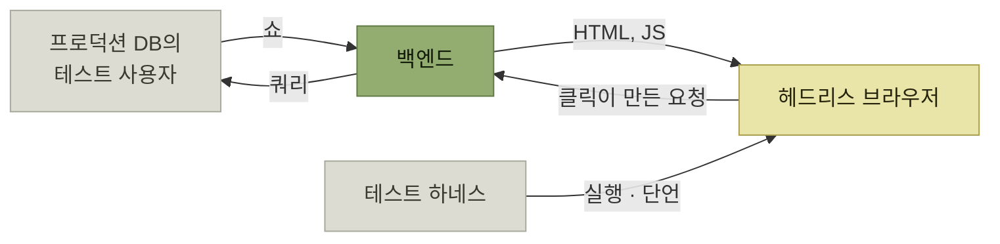

# 시나리오 · 기능 · E2E · 사용자 수락 테스트

> [자사 제품 체험](./README.md)

## 빠른 복습
- **시나리오 테스트는 실제 사용 사례를 담아낸다.** **사용자가 실제로 할 행동을 옮긴 것이라 중요한 버그를 잡을 가능성이 크다.**
- 시나리오 테스트는 **보통 함께 어울려 다니는 요소를 두 개 이상 묶는다** — **사용자 흐름에서 자주 같이 나타나는 기능 두 개 이상**, 그리고 **실제 세계와 비슷한 양과 가장 흔한 형태의 데이터**.
- **가능한 한 E2E 테스트에 가깝게 설계하되, 나머지는 충실도 높은 페이크로 대체**한다.
- **스스로 문서가 되는 시나리오 테스트는 특히 중요**하다. **사실상 제품 요구 사항을 영속적인 형태로 남긴 것**이다. **새 팀원이 들어오면 시나리오 테스트를 가장 먼저 보여주라.**
- **모든 걸 시나리오 테스트로 다룰 필요는 없다.** **개별 기능을 케이스별로 꼼꼼히 시험하려면 기능 테스트**를 쓰며, **특히 엣지 케이스를 다룰 때** 좋다.
- **E2E 테스트는 팀이 많이 쓰진 않지만 아주 중요한 자리**를 차지한다. **중요한 출시를 막아낼 수만 있다면 실행 빈도가 낮아도 괜찮다.**

> [!TIP]
> **핵심 사용자 여정을 시나리오로 고정한다**
>
> 자주 함께 나타나는 기능과 현실적인 데이터를 묶어 사용자의 작업이 처음부터 끝까지 완료되는지 검증한다.

## 시나리오 테스트

> 시나리오 테스트는 **개별 기능의 틀 밖으로 나가 사용자 관점에서 제품 전체를 바라보게** 만듭니다. **이것만으로 테스트 매트릭스 전체를 다룰 수는 없지만, 잘 고르면 출시 후 발생하는 버그가 비교적 사소한 수준에 그치게** 하는 데 도움이 됩니다.


*[그림 4-2] 전형적인 백엔드 시나리오 테스트 구성 — 양쪽에 페이크를 붙인다*

**백엔드 팀이라면 브라우저를 직접 띄우지 않고 DOM 환경을 시뮬레이션하는 편이 편하고**, **넷플릭스의 실제 분산 데이터베이스를 그대로 쓰는 건 테스트 비용이 감당이 안 된다.**

```python
# 로그인한 사용자가 영화를 보려고 홈페이지를 연다.
def watch_movie_from_homepage():
    set_up_fake_movies()  # 테스트에서 실제로 영화를 내려받아 재생하고 싶지는 않다.

    # 사용자가 홈 화면을 본다. 홈 화면에는 영화 썸네일이 표시되어야 한다.
    home_page_source = get_source("netflix.com")
    home_page_dom = get_dom(home_page_source)
    movie_listing = find_one("movie_thumbnail", home_page_dom)
    assert(movie_listing)

    # 사용자가 영화 중 하나를 클릭한다.
    watch_movie_page_request = movie_listing.click_target()
    watch_movie_source = get_source(watch_movie_page_request)
    watch_movie_dom = get_dom(watch_movie_source)

    # 영화 페이지가 정상적으로 로드되고 자동으로 재생이 시작된다.
    assert_autoplay_on(watch_movie_source)
```

*원서 의사코드 — 각 행동이 다음 행동으로 사슬처럼 이어진다*

> **테스트가 각 행동을 다음 행동에 사슬처럼 이어붙인 점**을 보세요. **`watch_movie_page_request`를 하드코딩하지 않았습니다. HTML과 자바스크립트에서 뽑아내 씁니다.** **위젯이 화면에서 가려지는 것 같은 UI 계층 문제를 다 잡아내진 못합니다.** 그래도 **홈페이지가 돌려준 영화 페이지 링크가 올바른지는 확실히** 합니다.

**하드코딩하지 않은 것이 이 테스트의 값**이다. 링크를 상수로 박으면 **"홈페이지가 올바른 링크를 준다"** 는 사실은 검증되지 않는다. **앞 단계의 출력을 다음 단계의 입력으로 쓰는 것**이 시나리오 테스트를 시나리오답게 만든다.

> 테스트는 **주석과 이름으로 사용자 시나리오의 이야기를 같이 들려주기도** 합니다. 이렇게 **스스로 문서가 되는 시나리오 테스트는 특히 중요**합니다. **사실상 제품 요구 사항을 영속적인 형태로 남긴 것**이거든요. **새 팀원이 들어오면, 시나리오 테스트를 가장 먼저 보여주세요.**

### 더 생각해 볼 만한 시나리오 테스트

| 테스트 | 무엇을 확인하나 |
| --- | --- |
| **두 번째 페이지 로드** | 홈페이지를 렌더링한 뒤 **스크롤 다운을 시뮬레이션해 추가 행을 로드**한다. **처음 렌더링이 추가 데이터를 불러올 URL과 함께 이뤄졌는지 단언**하고 **그 URL을 실제로 호출해 새 콘텐츠가 로드되는지** 확인한다 |
| **신규 사용자 경험** | **테스트 계정을 새로 만든다.** **사용자에 대해 아는 게 없으니 홈페이지는 가장 인기 있는 콘텐츠를 보여줘야** 한다. **합성 데이터로 쇼 데이터베이스를 채우고 그 쇼가 실제로 표시되는지** 확인한다 |
| **시청 이어보기** | **라이브러리를 렌더링하고, 마지막 시청 지점에서 쇼를 재개할 수 있는 요소가 페이지 어딘가에 렌더링돼 있는지** 확인한다 |

표를 읽는 법. 셋 다 **"기능 A가 동작하는가"가 아니라 "사용자가 하려던 일이 끝나는가"** 를 묻는다. 그리고 셋 다 **여러 컴포넌트를 가로지른다** — 렌더링, 데이터 적재, 개인화가 함께 걸린다.

## 기능 테스트

**더 넓은 테스트 매트릭스 안에서 개별 기능을 케이스별로 꼼꼼히 시험**할 때 쓴다. 넷플릭스 예시라면,

- **'내 목록', '평단의 호평을 받은 TV 쇼' 같은 테마 행 렌더링**
- **사용자가 아직 아무것도 담지 않은 상태에서 '내 목록'을 렌더링하는 엣지 케이스**
- **영화 목록에서 재생, 좋아요, 자세히 보기 같은 요소를 클릭해 적절한 페이지가 렌더링되는지 확인**

**빈 '내 목록'** 이 좋은 예다. 시나리오 테스트는 **가장 흔한 형태의 데이터**를 쓰므로 이런 경계를 자연히 지나치고, **기능 테스트가 그 빈틈을 메운다.**

## E2E 테스트



*[그림 4-3] 전형적인 E2E 테스트 구성 — 페이크 대신 사전 제작·QA 환경의 데이터베이스와 헤드리스 브라우저를 쓴다*

> **프로덕션 쇼 데이터 위에서 구현되므로, 콘텐츠 변경에 잘 버텨야** 합니다. '신규 사용자 경험' 시나리오라면 **가장 인기 있는 쇼를 하드코딩하는 대신, 테스트 안에서 별도로 쿼리해 정보를 받아옵니다.**

E2E가 잡아내는 것들이다 — **인기 영화 데이터베이스를 채우는 야간 작업이 실행되지 않았을 수도**, **신규 사용자 계정 생성이 곧 오류로 돌아갈 수도**, **UI 요소 하나가 실수로 화면에서 가려졌을지도** 모른다. **지연 회귀도 잡는다** — **개별 실행 속도는 들쭉날쭉해서 신뢰할 만한 테스트가 안 될 수 있지만, 각 흐름을 여러 번 돌려 평균을 내면** 잡아낼 수 있다.

### E2E가 되갚는 방식

> **E2E 테스트는 사용자 가치에 맞지 않는 단언과 가정을 두면 호되게 되갚아 줍니다.**

| 나쁜 습관 | 대신 |
| --- | --- |
| **하드코딩한 짧은 대기 시간** — **바쁜 테스트 환경에서 타임아웃** | **콜백을 쓰거나 폴링을 사용해 테스트가 완료될 때까지 기다린다** |
| **"페이지의 세 번째 요소"** — **디자이너가 요소를 재배치하면 바뀐다** | **UI 요소에 지속적인 시맨틱 태그**를 달아 자동화로 검색하게 한다. 예를 들어 **`play_video`나 `more_info` 같은 태그** |

표를 읽는 법. 둘 다 **"지금 우연히 참인 것"에 기댄 단언**이다. [앞 절](./2-테스트-종류-고르기.md#사용자-가치-중심-테스트)의 원칙 — **사용자에게 직접 영향을 주는 동작을 단언하라** — 를 어겼을 때 치르는 비용이 E2E에서 가장 크다.

## 사용자 수락 테스트

> **일부 직원이나 자원자에게 사전 운영 환경에서 실행할 몇 가지 테스트 시나리오를 제공하며, 그 테스트를 통과해야 서비스를 출시할 수** 있습니다.

적합한 상황들이다.

- **국제화와 지역화** — **각자 다른 다양한 언어 사용자들이, 엔지니어 혼자 시험하기엔 너무 방대하고 복잡한 다양한 상황에서 제품 동작을 검증**하는 과정
- **컴플라이언스 기준을 따지는 테스트**
- **대형 언어 모델(LLM)의 출력 검증.** 특히 **레드팀red teaming은 사용자가 적대적 태도를 취해 AI가 원래 설계된 범위 밖의 행동을 하도록 유도하는 방식**

> **실제 사람을 대상으로 테스트를 진행하는 일은 시간이 오래 걸리고 비용이 많이 들 수** 있습니다. 그래도 **자동화 테스트가 준비되지 않았거나 가능하지 않다면, 기꺼이 실행해야** 합니다. **검증에 진심이라면 당연한 선택**이에요.

> 종합하면, **자동 테스트는 '이중 위협dual threat'** 입니다. **이른 시점에는 중요한 도그푸딩 기회를 주고, 이후에는 제품이 진화하는 동안 가치를 계속 돌려줍니다.**

## 함께 읽기
- [다음 절 — 문서도 같은 두 가지 몫을 한다](./4-문서-주도-개발-문서의-종류.md)
- [『아키텍트 첫걸음』 5.2 E2E 테스트](../../아키텍트-첫걸음/5-품질-보증과-테스트/2-기능-테스트-자동화.md#e2e-테스트)
