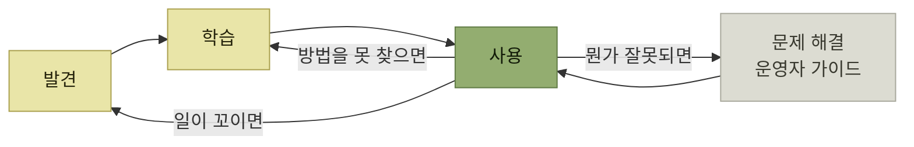

# 문서망과 문서로 하는 도그푸딩

> [자사 제품 체험](./README.md)

## 빠른 복습
- **사용자들이 항상 발견에서 학습, 사용으로 일직선으로 가는 건 아니다.** **업무를 수행하는 과정에서 이런 단계들을 자연스럽게 오간다.**
- 그래서 **문서는 서로, 그리고 제품과 촘촘히 연결**돼야 한다. **'이동 경로trails of breadcrumbs'** 를 만들어 둔다.
- **상호 연결된 문서 네트워크를 구축하라.**
- **문서를 쓰는 과정은 입장 바꿔보기를 통해 사용자의 여정을 보게** 만든다. **글을 쓰며 지겹다거나 설명하기 어렵다고 느껴지면, 그 지점에서 짜증이 난다.** 그 **고통을 제품 개선의 에너지로** 돌린다.
- **핵심은 수정 비용이 적게 드는 초기 단계에 이를 수행하는 것**이다.
- **기능 인터페이스의 품질은 사용 가이드가 얼마나 간결해질 수 있는지로 평가**하라.

> [!TIP]
> **문서를 제품의 탐색 경로로 연결한다**
>
> 사용자는 발견·학습·사용 사이를 오간다. 관련 문서와 제품 화면을 상호 연결해 필요한 순간 다음 행동으로 이동할 수 있게 한다.

## 문서망

> **배움은 필요할 때, 배우는 사람의 관심이 쏠릴 때 일어나야 합니다.**
> — 도널드 노먼

*사용자는 단계 사이를 오간다 — 문서도 그 경로를 따라 이어져야 한다*

> **제품을 정한 뒤 발견은 학습으로 바뀌고, 사용 중에 일이 꼬이면 다시 발견으로 돌아갑니다.** **뭔가 잘못되면 사용자는 운영자 가이드로 내던져집니다.** **어떻게 해야 할지 방법을 못 찾으면 사용에서 학습으로 건너갑니다.**

> **사용 가이드는 중요한 개념을 언급할 때 개념 가이드로 링크해야 하고, 개념 가이드는 설명을 도와주는 예시로 링크해야** 합니다.

> **상호 연결된 문서 네트워크를 구축하세요.**

## 문서를 쓰다가 제품을 고치게 된다

원서는 두 장면을 든다.

### 장면 ① 설치 가이드

**오픈소스 개발자 도구의 시작 가이드를 쓰는 중**이다. **깨끗한 환경을 새로 준비해 기기에 제품을 처음부터 설치**한다 — **새 사용자 환경에 여러분의 환경을 맞추는** 것이다.

> 그런데 **자꾸 에러가 납니다. 프로젝트를 개발하는 몇 주 동안 여러분이 설정해둔 도구와 환경 변수들이 떠오르죠.** 가이드를 돌아보니 **내용이 꽤 길어졌습니다.**

> 마음에 안 들어서, **사용자가 별도로 설치할 필요가 없도록 모든 종속성을 컨테이너에 포함시켜 배포하기로** 합니다. 이제 **가이드에서 성가신 단계를 모두 지우고, 컨테이너를 실행하는 훨씬 간결한 지시로** 바꿉니다.

> **기능 인터페이스의 품질은 사용 가이드가 얼마나 간결해질 수 있는지로 평가하세요.**

**문서 길이가 설계 품질의 계기판**이라는 뜻이다. 길어지는 가이드는 **글을 못 써서가 아니라 제품이 요구하는 게 많아서**다.

### 장면 ② 런북

**SaaS 서비스 당직 중, 프로세스가 메모리 초과로 다운돼 디버깅에 허덕이던 사용자를 막 지원**했다.

> 같은 상황에서 사용자들이 어떻게 해야 하는지 문서로 남기려고 **런북 항목을 만들다가, 여러분이 직접 자원 한도를 설정하게 해주면 문제 자체가 안 생긴다는 걸 깨닫습니다.** **런북은 그대로 배포하되, 그에 앞서 설정을 추가해 런북의 필요 자체를 허물어 버립니다.**

*문서 작성의 고통은 제품 결함의 신호다*

> **신중하게 작성하면, 그 고통을 제품 개선의 에너지로 돌릴 수 있습니다.**

## 개발 과정에 문서를 끼워 넣는 방법

| 시점 | 무엇을 쓰나 | 무엇을 얻나 |
| --- | --- | --- |
| **설계 전** | **페르소나 메뉴와 시나리오 메뉴.** **아마존은 프로젝트 시작 시점에 가짜 보도자료를 쓰는 것으로 유명**하다 — **제품이 출시됐을 때 대중에게 어떻게 알릴지 미리 예측해** 쓴다 | 이런 **'마케팅 퍼스트' 방식은 타깃 페르소나를 이해하고, 제품의 가치를 그들 관점에서 평가**하게 한다 |
| **기능 초기 버전을 쓰는 동안** | **사용 가이드를 미리** 작성한다 | **불필요한 단계나 까다로운 결정을 발견해, 수정 비용이 적게 드는 시점에 사용성 문제**를 잡는다 |
| **핵심 추상화를 정할 때** | **개념 가이드**를 써서 팀원들과 공유한다 | **설명이 막히면 이름을 바꾸거나 재구성**하는 걸 고려한다. **사용자가 굳이 신경 쓸 만한 개념이 아닌 것 같다면, 더 상위 개념을 제시할 필요**가 있을 수 있다 |
| **기능이 낳을 문제를 볼 때** | **사용자가 어떻게 해결해야 하는지 문서로** 설명해 본다 | **문서를 작성하고 안내하고 지원하는 것보다 안전성 문제 자체를 수정하는 편이 더 비용이 적게 들 수도** 있다 |

표를 읽는 법. 네 줄 모두 **"쓰다 보니 고칠 것이 보였다"** 는 같은 구조다. 셋째 줄이 특히 날카롭다 — **개념을 설명하기 어렵다는 것은 글솜씨 문제가 아니라 추상화가 잘못 잡혔다는 신호**로 읽으라고 한다. [2장의 쿠키 사례](../02-제품-내-사용자-안내/8-전체-여정-최적화와-기표의-한계.md)와 같은 진단이다.

## 이상적인 제품 경험을 미리 써 본다

> 문서를 효과적으로 활용하는 또 다른 방법은 **이상적인 제품 경험을 상상해보는 것**입니다. **코드를 작성하기 전에, 미래의 사용자에게 제품 경험을 설명하고 이를 팀원들과 공유**하세요. 그러면 **다음 프로젝트는 그 문서에 담긴 내용을 현실로 만들기 위해 필요한 모든 기능을 구현**하게 될 것입니다.

> 종합하면, 어떤 제품군에서는 **문서가 사람과 AI 모두에게 발견, 이해, 사용 시나리오를 돕습니다.** **문서를 내보내지 않는 제품에서도, 가짜 문서를 쓰는 일이 같은 시나리오에 집중하게 해주고 도그푸딩을 더 흥미롭게** 만듭니다.

**출시하지 않을 문서를 쓰는 것도 값이 있다**는 것이 DDD의 핵심 주장이다. 산출물이 아니라 **쓰는 동안 하게 되는 생각**이 목적이기 때문이다.

## 함께 읽기
- [다음 절 — 외부의 시각을 부담 없이 끌어오는 방법](./6-마찰-로그.md)
- [앞 절 — 어떤 문서를 쓸 것인가](./4-문서-주도-개발-문서의-종류.md)
