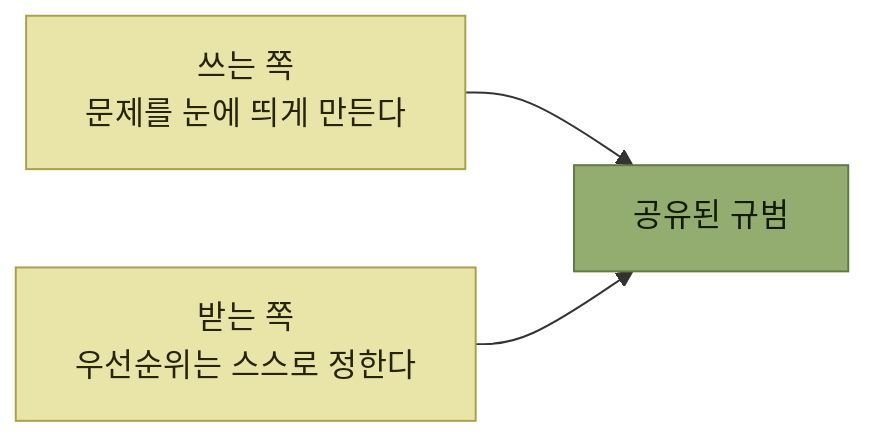

# 마찰 로그

> [자사 제품 체험](./README.md)

## 빠른 복습
- **가장 뛰어난 제품 기획자라도 다른 사람이 무엇을 하는지 보면 자주 놀란다.** 이제 사용자와 소통할 차례인데, **실수를 너그럽게 봐줄 수 있는 사용자부터** 시작한다.
- **마찰 로그는 제품을 쓰면서 비공식적으로 적어두는 문서**다. **겪은 혼란이나 막힘을 그대로 보고**하고, 다 쓰면 **담당 엔지니어나 PM에게 넘긴다.**
- **마찰 로그는 도그푸딩 에너지를 생산적인 사용으로 돌려준다.** **넘길 수 있는 짧은 문서가 하나 있으면 계속 이어갈 동기가 생긴다.**
- 작성자의 역할은 **문제를 눈에 띄게 만드는 것까지**다. **해결책을 대놓고 제안하지 않는다.**
- 수집할 때는 **티켓이나 절차를 요구하지 말고**, **피드백의 결말을 알려주고**, **전달한 사람을 탓하지 않는다.**
- **마찰 로그는 남의 제품을 자유롭게 평하고 트집 잡아도 괜찮은 안전한 공간**이어야 하며, 동시에 **받는 팀도 언제 어떤 우선순위로 다룰지 부담 없이 정할 수** 있어야 한다.

> [!CAUTION]
> **경험을 기록하고 해결책을 강요하지 않는다**
>
> 마찰 로그 작성자는 사용 중 겪은 문제를 구체적으로 드러내는 데 집중한다. 해결 방법과 우선순위는 제품 맥락을 아는 담당 팀이 정한다.

## 스트라이프의 CTO가 쓰던 것

> 저는 **스트라이프에서 일하며 마찰 로그를 배웠습니다.** 당시 **마찰 로그는 스트라이프 문화의 일부**였어요. 특히 당시 **CTO였던 데이비드 싱글턴은 1년에 몇 주를, 제품의 여러 구석과 내부 인프라를 돌며 마찰 로그를 쓰는 데** 썼습니다.

> 데이비드는 **'잠입 조사'까지 했어요. 엔지니어링 부사장이 질문한다는 사실을 알고 있는 우리 팀의 편향된 시각에 영향을 받지 않고 지원 경험을 파악하기 위해, 다른 엔지니어들을 통해 지원 채널에서 질문을 올리기도** 했습니다. **그의 마찰 로그는 긍정적이면서도 건설적**이었습니다.

> 데이비드는 **제품을 개선했고, 팀에 영감을 주었으며, 엔지니어링 전반에 우호적인 마찰 로그 문화를 유지하는 데 기여**했습니다. **본인도 제품과 인프라의 최신 상태에 가깝게 머물 수** 있었습니다.

**관찰자 효과를 피하려고 신분을 감춘 대목**이 인상적이다. **"CTO가 물었다"는 사실 자체가 지원 경험을 바꿔버리기** 때문이며, 이는 [도그푸딩이 내부 사용자에 기대는 방식](./README.md)의 약점을 정면으로 다룬 조치다.

## 마찰 로그를 쓰는 법

> 마찰 로그는 **시나리오를 따라가며 마찰 지점에 방점을 둔 일지**입니다. 목표는 단순합니다. **제품 체험을 보고하는 것**입니다.

- **본인이 대표하는 페르소나를 소개하면서 시작**한다. **제품을 처음 쓰는 사람인가? 체험에 영향을 줄 만한 사전 지식은 무엇인가?**
- **제품을 쓰는 의도를 표현**한다.
- **문서 대부분은 겪은 것 가운데 가장 중요한 부분을 따라가며** 쓴다.

원서가 실은 예시(인스타그램에 영상을 음소거해 올리기)의 요지다.

> 저는 **드루비Drewbie(Drew + Newbie)** 입니다. **인스타그램은 처음 쓰지만, 틱톡은 써봤어요.** 영상을 올리고 싶은데, **소리는 끄고 싶어요.**

> 인스타그램에 **사진·영상 라이브러리 전체 접근 권한을 주지 않았더니, '개인정보 관리'로 들어가 게시글에 쓸 권한을 줄 영상을 골라야** 했습니다. **요즘 앱들은 이 흐름을 훨씬 깔끔하게 만들어 놨던데, 인스타그램은 왜 안 그럴까** 싶습니다.

> **마이크 아이콘을 포함한 아이콘 한 줄이 보입니다. 영상 음소거가 될 거라 기대하고 마이크를 누릅니다.** 그런데 **재생 버튼과 '오디오 넣기' 버튼이 달린 '스크러버'가 떴어요. 기대했던 방향과 전혀 다릅니다.**

> **도움이 될 만한 아이콘이 안 보였는데, 이리저리 만지다가 오른쪽으로 스와이프해서야 화면 바깥에 아이콘이 더 있다는 걸 알게 됐어요.** 이제 **'확성기' 아이콘이 보이고, 누르니 음소거**가 됩니다. 이 부분은 **아주 간단했고, 앞으로 써먹을 수 있는 '보이스 부스트' 기능도 새로 알게 됐어요.**

### 왜 해결책을 제안하지 않는가

> **해결책을 제시하기보다 제 경험을 설명한 이유**를 보세요. **인스타그램 팀이라면 무엇이 가능하거나 바람직한지에 대해 더 잘 알고 있을** 겁니다.

> **마찰 로거로서 제 역할은 문제를 눈에 띄게 만드는 것까지**입니다. 제가 **"아이콘을 두 줄로 배치해야 한다"고 말해버리면, 팀 입장에서는 자기 일을 제가 대신 하려는 것처럼 느낄 수** 있어요. **자기들의 로드맵을 제가 정하는 것처럼 느껴질 수도 있고, 그 아이디어를 거부하고 다른 대안을 탐색하지 않을 수도** 있습니다. **마찰 로그의 대상이 누구인지 잘 모를수록, 더 조심해야** 합니다.

**해법을 제시하면 논의가 그 해법의 가부로 좁아진다**는 지적이다. 문제만 남겨두면 팀은 **더 나은 답을 찾을 여지**를 갖는다.

> **잘 작동하는 부분은 일부러 대충 넘어가긴 했습니다.** 다만 **제품 경험이 좋았던 지점에는 칭찬을 아끼지 않았어요. 그래야 마찰이 도드라지고, 프로덕트 팀은 자기들이 잘하는 지점도 알 수** 있습니다.

## 마찰 로그를 수집하는 법

> **사용자가 제품을 실제로 어떻게 겪었는지 생생한 진실을 아는 건 금과 같습니다.** 그렇다면 다른 사람을 어떻게 제품에 끌어들일까요? **마찰 로그가 재미있다고 해도, 사람들은 바쁩니다. 아무 보상 없이 시간을 내주지 않습니다.**

| 누구 | 어떻게 |
| --- | --- |
| **본인** | **초심자의 시선으로 바라본다** |
| **얼리 어답터** | **마찰 로그를 써 달라고 부탁**한다 |
| **새 팀원** | **제품의 세부 사항에 빠르게 적응하는 방법으로** 권한다 |
| **개발자·디자이너·데이터 과학자 등** | **'버그 배시'나 해커톤처럼 여럿이 함께 제품을 쓰는 자리**를 만든다 |

표를 읽는 법. 셋째 줄이 영리하다. **새 팀원에게는 마찰 로그가 부탁이 아니라 혜택**이다 — 어차피 해야 할 온보딩이 **팀에 값진 데이터**가 된다. 그리고 **그 시선은 딱 한 번만 쓸 수 있는 자원**이다.

### 피드백을 받는 쪽의 규칙

> 그리고 **피드백을 받으면 방어적으로 굴지 마세요. 선물처럼 받아들이면** 됩니다.

- **티켓을 열거나 어떤 절차를 따르라고 요구하지 마세요.** 그런 절차는 **시간을 들이기 망설이게 만드는 허들**이며, **그들의 피드백이 여러분의 시간을 들일 가치가 없다는 신호로도** 읽힌다.
- **피드백의 결말을 알려주세요.** 누군가의 마찰 로그가 실제 개선으로 이어졌다면 **본인에게 전하되 가급적 그 사람의 매니저도 알 수 있는 방식**으로 전한다. 저자의 회사에는 **'쿠도스kudos' 제도**가 있다.
- **스스로나 팀이 부담을 느끼더라도, 전달한 사람을 탓하지 마세요.** **시간 압박은 피드백이 가리키는 제품 개선 과제를 분류하는 단계에서 따로** 다룬다.

## 마찰 로그 문화

> 마찰 로그는 **남의 제품을 자유롭게 평하고 트집 잡아도 괜찮은 안전한 공간**이어야 합니다. 동시에 **받는 팀도 발견된 내용을 언제, 어떤 우선순위로 다룰지 부담 없이 정할 수** 있어야 하고요. **양쪽이 각자의 역할을 알고 있으면, 이 상호작용은 대체로 아주 멋지게** 굴러갑니다.

*규범이 없으면 같은 행동이 공격으로 읽힌다*

> **명확한 규범이 없으면, 어느 날 갑자기 어떤 팀에 피드백을 건네는 일이 공격적이거나 비판적으로 느껴질 수** 있습니다. **상대가 하던 일을 멈추고 내 문제를 고쳐주길 바라는 건지도 불분명**하고요. **트집을 잡으면 남들이 나를 까다로운 사람으로 볼까 걱정**되기도 합니다. **기대치가 불분명할수록 남의 기분을 상하게 할까 하는 걱정만 커집니다.**

> 아직 규범이 아니라면, **이것이 인터넷에서 찾아볼 수 있는 정해진 관행이라는 점을 활용**해 보세요. 제가 지금 회사에 이 방식을 소개했을 때는 **기존 블로그 글을 인용해 제가 무엇을 하는지 설명했고 반응이 좋았습니다.** **얼마 지나지 않아 다른 사람들도 마찰 로그를 쓰기 시작**했습니다.

## 함께 읽기
- [다음 절 — 샘플이 셋을 하나로 묶는다](./7-샘플과-요약.md)
- [『요즘 우아한 백엔드 개발』 2장](../../요즘-우아한-백엔드-개발/02-전체-서비스를-관통하는-도메인-모듈-안전하게-분리하기/4-Step-3-안전하게-배포하기.md#방향을-맞추는-방법) — 팀 안에서 관행을 정착시키는 다른 방식(밋업·ADR·스터디)
