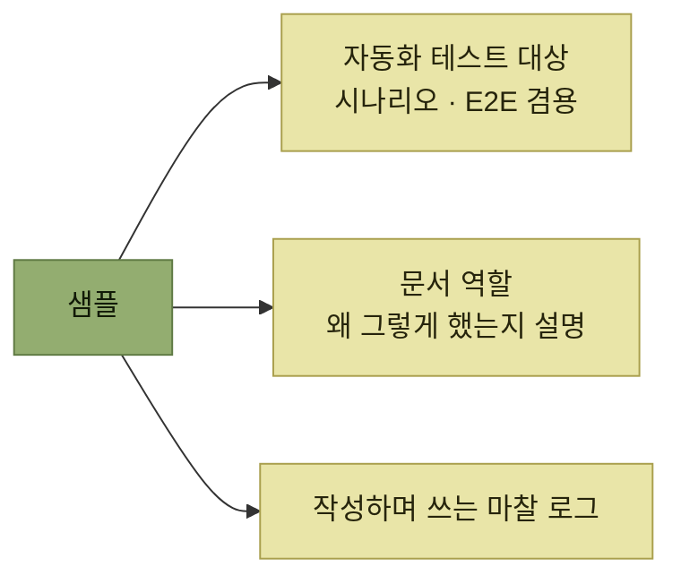

# 샘플과 요약

> [자사 제품 체험](./README.md)

## 빠른 복습
- **샘플이란 제품의 흔한 활용법을 보여주는 참고 예제**다. **제대로 만든 샘플은 테스트와 문서, 마찰 로그를 아름답게 하나로 묶어준다.**
- **모든 제품이 샘플을 쓸 수 있는 건 아니지만, 생산성·창작·제품 개발용 애플리케이션이라면 대체로 도움**을 받는다.
- 샘플에도 종류가 있다 — **기능 샘플**은 **기능 테스트처럼 단일 기능 하나**를, **시나리오 샘플**은 **시나리오 테스트나 사용 가이드처럼 핵심 시나리오를 돕는 여러 기능의 조합**을 보여준다.
- 요약 — **제품 설계와 개발 전 과정에서, 제품을 직접 쓰고 제품에 압박을 가할 방법을 끊임없이 찾으라.**

> [!TIP]
> **샘플을 테스트 가능한 사용 설명서로 만든다**
>
> 현실적인 샘플을 자동화 테스트 대상으로 유지하면 예제·문서·제품 검증을 하나의 자산으로 묶을 수 있다.

## 샘플의 두 종류

| 종류 | 대응하는 것 | 예 |
| --- | --- | --- |
| **기능 샘플** | **기능 테스트** | **정렬이나 필터 같은 단일 기능 하나**를 보여준다 |
| **시나리오 샘플** | **시나리오 테스트 · 사용 가이드** | **사무용품 예산 시트** — **일반적인 예산 편성 모범 사례를 보여주는 동시에, 실제로 비품 예산을 짜는 사람에게 곧바로 쓸모**가 있다 |

표를 읽는 법. 시나리오 샘플의 특징은 **"예제인 동시에 쓸모 있는 물건"** 이라는 점이다. 그래서 사용자가 **읽고 마는 것이 아니라 가져다 쓰고**, 그 과정에서 **제품 사용법이 자연스럽게 전달**된다.

## 샘플 작성 조언

- **샘플을 자동화 테스트의 대상으로 삼아 계속 동작하게 유지하고, 시나리오 테스트나 E2E 테스트로도 겸하게** 한다. 예산 템플릿이라면 **오류 없이 열리는지 확인하고, 몇 가지 값을 입력한 뒤 남은 예산이 올바르게 계산되는지** 검증한다.
- **구체적인 시나리오와 언어를 써서 구체적으로** 만든다. **'iniTECH' 같은 소프트웨어 회사를 가정하고, 빨간 스테이플러나 바퀴벌레 약처럼 그럴듯한 구매 항목으로 데이터를 미리** 채운다. **사용자는 '항목 1'이나 'foo' 같은 추상적인 용어를 해석하기보다, 구체적인 사물에서 응용하는 쪽을 훨씬 쉽게** 느낀다.
- **코드 주석을 달듯, 샘플에서 왜 그런 선택을 했는지도 알려준다.** 초보자를 겨냥했다면 **짧은 설명 머리글을 달고 상대 참조와 절대 참조 사용법을 다룬 문서로 링크**를 건다.
- **발견 시나리오를 고민**한다. **사용자가 마주한 문제에 맞는 샘플을 어떻게 찾아낼까?** **템플릿 카탈로그**에 올리고, 많다면 **태그 시스템으로 '회계'나 '재무' 아래 분류**한다.
- **샘플을 만드는 동안 직접 마찰 로그를 쓰고, 그 경험을 제품에 다시 반영**한다. **샘플 작성을 다른 팀이 맡고 있다면 그 팀에게도 마찰을 보고해달라고** 청한다.

**둘째 항목이 [2장의 "foo에서 멀어지기"](../02-제품-내-사용자-안내/9-예제-foo에서-멀어지기.md)와 정확히 같은 이야기**다. 그 장은 이름에 대해 말했고, 여기서는 **예제 데이터**에 대해 말한다. `foo`는 어느 자리에서도 정보가 0이다.

*샘플 하나가 이 장의 세 도구를 동시에 수행한다*

## 4.5 요약

> **제품 설계와 개발 전 과정에서, 여러분의 제품을 직접 쓰고 제품에 압박을 가할 방법을 끊임없이 찾으세요. 그래야 제품이 실제 사용 환경을 견뎌낼 수** 있습니다.

| 도구 | 이 장의 결론 |
| --- | --- |
| **테스트** | **모든 테스트가 똑같은 무게를 갖는 건 아니다.** **시나리오 테스트와 E2E 테스트는 제품을 미덥게 문서화하고 제품이 계속 동작하도록 보장**하며, **기능 테스트는 테스트 커버리지의 빈틈을 메운다** |
| **문서** | **모든 문서가 같은 목적을 가진 건 아니다.** **사용 가이드와 시작 가이드는 제품을 시험해 보는 훌륭하고 체계적인 길**이며, **초기에 개념 가이드를 써보는 일은 아이디어와 제품 커뮤니케이션 전략을 다듬는 데** 도움이 된다 |
| **마찰 로그** | **동료에게서 실행 가능하고 솔직한 경험 기반 피드백을 얻어내는 훌륭한 방법** |

표를 읽는 법. 세 줄 모두 **원래 목적 외에 도그푸딩이라는 두 번째 몫**을 한다. 이 장의 주장은 **"검증을 위해 새 일을 늘리라"가 아니라 "하던 일을 사용자의 눈으로 하라"** 는 것이다.

## 함께 읽기
- [다음 절 — 위키피디아 마찰 로그 연습](./8-예제와-답안.md)
- [다음 장 — 출시 이후의 이야기](../05-지속적인-사용자-이해/README.md)
