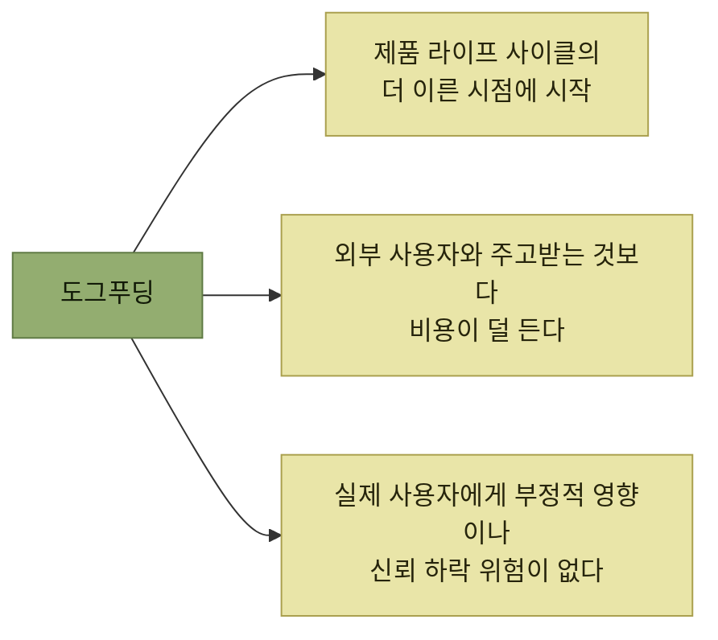

# 자사 제품 체험

> [AI 시대의 엔지니어링 전략](../README.md)

## 베타 사용자는 오지 않는다

> **새로운 시스템을 설계하는 사람은 단순히 시스템을 구현하고 최초의 대규모 사용자가 되는 데 그쳐서는 안 되며 최초의 사용자 매뉴얼도 직접 작성해야 합니다.** 제가 이 모든 활동에 깊이 참여하지 않았다면, **수백 건의 개선 사항은 결코 일어나지 못했을** 겁니다. 그런 개선점을 생각해 내지 못했을 뿐만 아니라 **왜 중요한지조차 몰랐을** 테니까요.
> — 도널드 커누스Donald Knuth

> 제품은 아직 작습니다. **출시 직전 버전을 바로 써줄 열혈 베타 테스터 무리는 없습니다.** 대부분의 사용자는 **자기 일이 먼저**입니다. 그 와중에 써주는 사람도 **위험한 설계 지점은 굳이 안 건드립니다.** 마감은 다가오고, **검증을 건너뛰고 싶은 유혹**이 찾아옵니다.

> 다행히 **쉽게 끌어올 수 있는 사용자**가 있습니다. 바로 **여러분 자신, 팀 동료, 회사 안의 다른 사람들**입니다. 이들은 **제품의 성공에 함께 기여하며 처음부터 돕고자 하는 동기**를 갖고 있습니다.

> **가장 먼저 여러분이 직접 제품의 고객이 되어 보십시오.** 이렇게 하면 제품을 **초기에, 적은 비용으로, 그리고 위험 부담 없이** 검증할 수 있습니다.

> [!IMPORTANT]
> **가장 먼저 제품의 고객이 된다**
>
> 외부 베타 사용자를 기다리기 전에 팀이 직접 제품을 사용하면 더 이른 시점에 낮은 비용으로 위험을 발견할 수 있다.

## 도그푸딩

**팀원이 자기 제품을 직접 쓰는 일을 도그푸딩dogfooding**이라 부른다. **1990년대 MS에서 굳어진 표현**으로, **자사 OS와 컴파일러의 최신 버전을 직원이 먼저 쓰도록 하는 문화**에서 나왔다. **"반려견의 사료를 먹는다"** 는 표현에서 따온 것으로, **자기 제품을 검증하려면 그 정도는 해야 한다**는 뜻이다.

> 도그푸딩은 **여러분이나 동료 중 일부가 목표 사용자 페르소나에 해당하고, 실제 사용 환경을 충분히 재현할 수 있을 때 가장 효과적**입니다. 하지만 **이상적인 조건이 아니더라도, 팀이 사용자에 대해 잘 이해하고 실제 사용자의 입장에서 생각하며 행동할 수 있다면** 기대 이상으로 큰 효과를 발휘할 수 있습니다.

**중요한 것은 어떤 방식으로든 직접 사용해 볼 방법을 찾는 것**이다. 농업 기술 회사라면 **직접 농지를 구입**하거나, 어렵다면 **온실·실험실·컴퓨터 시뮬레이션으로 환경을 재현**하거나, 그것도 어렵다면 **실제 농부와 협력해 농지의 일부를 실험에 활용**한다.

*도그푸딩의 세 가지 핵심 장점*

## 이 장이 다루는 네 가지 접근법

| 접근법 | 무엇을 하는가 |
| --- | --- |
| **테스트** | **실제 사용 환경을 반영한 시나리오 테스트**를 작성한다 |
| **문서** | **사용 가이드를 직접 써보면서 제품을 어떻게 쓰는지 말로 풀어낸다.** **꼼꼼하게 작성하다 보면 제품의 문제점을 미리 발견**할 수 있다 |
| **마찰 로그** | 직접 도그푸딩하며 느낀 경험을 기록하거나 **동료에게 작성해 달라고 요청**한다. **도그푸딩을 이어갈 동기가 생기고 더 쓸모 있는 피드백이 모인다** |
| **샘플** | 적절한 제품이라면 **샘플을 만들어 직접 시험**해 본다 |

표를 읽는 법. 앞의 둘은 **원래 하던 일(테스트·문서)을 다른 눈으로 다시 보는 것**이고, 뒤의 둘은 **새로 만드는 산출물**이다.

> **문서 작성과 자동화 테스트는 보통 도그푸딩으로 여겨지지는 않습니다.** 하지만 제대로 수행한다면, **두 방법 모두 사용자의 입장에서 제품을 사용해 보며 제품을 검증한다는 점에서 도그푸딩의 성격을 강하게** 띱니다.

## PART 2가 답하는 질문

> **AI 시대 엔지니어라면, 큰 릴리스를 앞두고 한 가지 질문에 집착해야 합니다. 내 제품이 제 역할을 하는지를 사용자에게 어떻게 검증받을 것인가** 하는 질문이죠.

원서는 양극단의 두 회사를 나란히 놓는다.

| | 조건 |
| --- | --- |
| **대형 소셜 미디어 기업** | **새 기능을 기꺼이 사용해 보는 방대한 사용자 기반**과 **뉴스 피드라는 강력한 배포 수단**을 갖췄다. **일부 사용자에게만 노출해 피드백과 사용 지표를 수집하고 A/B 테스트**를 할 수 있다 |
| **자율주행 자동차 스타트업** | **출시까지 수년 동안 반복 개선**해야 하고, **데이터 수집 중에는 전문 운전자를 탑승**시켜야 하며, **주행 거리의 99.999999% 이상에서 치명적 사고가 없어야** 한다 |

표를 읽는 법. **공통점이 거의 없어 보이지만 한 가지는 분명히 같다 — 둘 다 자신의 제품을 검증하고 있다.** 조건이 다르면 **검증의 형태**가 달라질 뿐, **검증을 건너뛰는 선택지는 어느 쪽에도 없다.**

**4장은 출시 전**(직접 써보기·테스트·마찰 로그·문서), **5장은 출시 후**(피드백·실험·지표)를 다룬다.

## 목차

- [도그푸딩으로서의 테스트](./1-도그푸딩으로서의-테스트.md)
- [테스트 종류 고르기](./2-테스트-종류-고르기.md)
- [시나리오 · 기능 · E2E · 사용자 수락 테스트](./3-시나리오-기능-e2e-사용자-수락-테스트.md)
- [문서 주도 개발: 문서의 종류](./4-문서-주도-개발-문서의-종류.md)
- [문서망과 문서로 하는 도그푸딩](./5-문서망과-문서로-하는-도그푸딩.md)
- [마찰 로그](./6-마찰-로그.md)
- [샘플과 요약](./7-샘플과-요약.md)
- [예제와 답안](./8-예제와-답안.md)

## 함께 읽기

- [3.7 시프트 레프트](../03-에러와-경고/7-조기-진단-시프트-레프트.md) — **페이크**와 **테스트 허용**이 그 절에서 먼저 나온다.
- [『아키텍트 첫걸음』 5.2 테스트 피라미드](../../아키텍트-첫걸음/5-품질-보증과-테스트/2-기능-테스트-자동화.md#테스트-피라미드) — **테스트 유형을 나누는 다른 축**. 그 책은 **비용과 개수**로 나누고, 이 장은 **시스템 리스크와 제품 리스크**로 나눈다.
- [다음 장 — 지속적인 사용자 이해](../05-지속적인-사용자-이해/README.md) — 출시 이후 피드백과 지표를 통해 제품을 계속 진화시키는 방법으로 이어진다.
