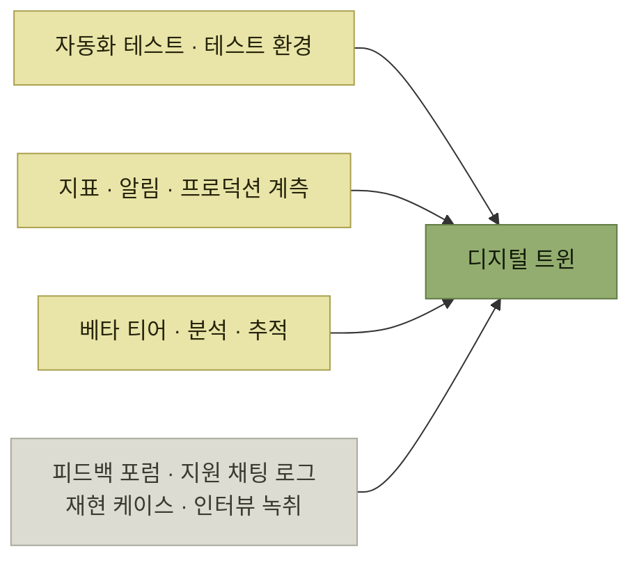

# 디지털 트윈 관리자

> [지속적인 사용자 이해](./README.md)

## 빠른 복습
- **더 빠른 배포 주기를 얻으려고 업계가 치른 노동은 영웅적인 수준**이었고, **직무 기술서를 거의 새로 쓰는 일**에 가까웠다.
- **2014년 MS는 테스트 직군과 엔지니어 직군을 하나로 합쳤다.** **코드를 테스터에게 넘기는 방식은 너무 느리다는 판단**이었고, 동시에 **소프트웨어 엔지니어가 자기 코드의 품질까지 책임지도록** 한 조치였다.
- 일반 소프트웨어 제품에서 디지털 트윈은 **자동화 테스트와 테스트 환경, 지표와 알림, 베타 티어, 프로덕션 계측, 분석, 추적**이 결합한 결과물이며, **피드백 포럼 의견, 고객 지원 채팅 로그, 재현 케이스, 고객 발견 인터뷰 녹취**까지 들어간다.
- 즉 **우리 제품이 현실에서 어떻게 움직이는지를 정량과 정성으로 그릴 수 있게 해 주는 건 모두 포함**된다.

> [!NOTE]
> **디지털 트윈**
>
> 프로덕션 시스템과 하드웨어 기반에 대한 가상 모델 및 시뮬레이션이다. 소프트웨어에서는 테스트·관측성·지표·사용자 피드백을 함께 포함한다.

## 새 직무 기술서

원서가 정리한 원칙 다섯 줄이다.

- **테스트는 우리가 직접 작성한다.**
- **지표를 만들고 제품을 모니터링한다.**
- **데이터 파이프라인에 데이터를 보내고 제품 분석을 돕는다.**
- **피드백 채널에서 고객과 직접 연결된다.**
- **롤아웃을 단계별로 진행하고 A/B 테스트를 돌린다.**

**다섯 줄 모두 "만드는 일"이 아니라 "만든 뒤를 보는 일"** 이다. 이것이 [앞서 본 배포 주기의 변화](./README.md)가 엔지니어에게 청구한 값이다 — **빠르게 내보내는 대신, 내보낸 것을 계속 지켜봐야** 한다.

## 디지털 트윈이란

**자율주행 R&D 부서는 차량과 센서, 차가 작동할 시뮬레이션 환경과 고해상도 디지털 모델을 구축**한다. **운전자의 행동과 승객 안전 제약을 알고 있고, 운전 소프트웨어를 시뮬레이션 안에서 테스트하고 다듬을 수** 있다.

*정량(테스트·지표)과 정성(로그·녹취)이 함께 디지털 트윈을 이룬다*

**정성 자료가 같은 목록에 들어 있다는 점**이 이 개념의 특징이다. 자율주행의 디지털 트윈이 물리 모델이라면, 소프트웨어의 디지털 트윈에는 **사람이 남긴 말**도 포함된다.

## 이 책 전체에 흩어진 디지털 트윈

| 어디 | 무엇 |
| --- | --- |
| **4장** | **테스트** — **실제 프로덕션에서 확인한 내용이나 앞으로 발생할 것으로 예상되는 상황을 바탕으로** 작성한다 |
| **9장** | **시뮬레이션** — **포착한 실제 요청이나 그에 준하는 데이터를 입력해 디지털 트윈에 부하**를 건다 |
| **4장** | **마찰 로그** — **사용자가 제품을 사용하는 경험을 기록**한다 |
| **이 장** | **그 나머지** — 변화를 위한 설계, 사용자 피드백, 제품 지표 |

표를 읽는 법. **테스트도 마찰 로그도 이미 디지털 트윈의 일부**였다는 재해석이다. [4장](../04-자사-제품-체험/README.md)에서는 그것들이 **검증 도구**로 소개됐는데, 여기서는 **제품을 비추는 모델의 부품**으로 다시 놓인다.

> **이 시대 우리의 역할은 그 그림을 완성하는 것**입니다. **제품 그 자체와 나란히 디지털 트윈을 쌓고, 롤아웃을 모니터링하면서 거기서 배우고, A/B 테스트로 성능을 비교하고, 피드백을 로드맵에 반영하는 일**이죠.

## 함께 읽기
- [다음 절 — 반복하려면 먼저 코드가 바뀔 수 있어야 한다](./2-변화를-위한-설계-오큘러스-사례.md)
- [4.1 도그푸딩으로서의 테스트](../04-자사-제품-체험/1-도그푸딩으로서의-테스트.md)
