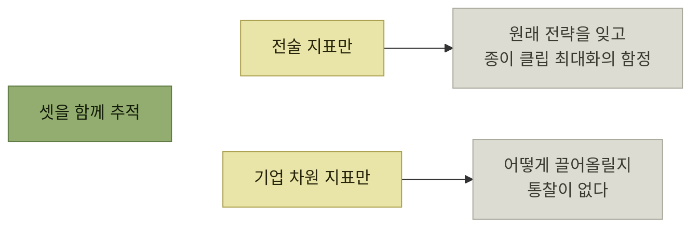

# 전술과 전략, 요약과 예제

> [지속적인 사용자 이해](./README.md)

## 빠른 복습
- 지표는 **전술적인 것에서 전략적인 것으로 이어지는 스펙트럼**이다. **가장 전술적인 지표는 브랜드 광고 캠페인 조회수** 같은 것 — **광고를 만들고, 돈을 쓰고, 숫자가 올라가는 걸 지켜보면** 된다.
- **가치 지표는 더 전략적이지만 측정하기까지 시간이 더 걸린다.** 그래서 **후행 지표trailing metrics**라 불린다.
- **사용자 가치와 가장 잘 맞춰진 지표일수록 어떤 기능이 그 가치를 창출했는지 신속하고 정밀하게 측정하기 어렵다.** **이 근본적인 모순이 올바른 지표를 고르는 기술을 흥미진진하게** 만든다.
- **전술 지표만 있으면 원래 전략을 잊고 종이 클립 최대화의 함정**에 빠지고, **이익 같은 기업 차원 지표만 있으면 그걸 어떻게 끌어올릴지에 대한 통찰은 거의 얻을 수** 없다.

> [!IMPORTANT]
> **전술 지표와 전략 지표를 함께 둔다**
>
> 빠르게 움직일 수 있는 선행 지표와 장기 사용자 가치를 보여주는 후행 지표를 연결해 단기 최적화가 목적을 삼키지 않게 한다.

## 전술 지표와 전략 지표

| 전술 지표 | 전략 지표 |
| --- | --- |
| **선행 지표** | **후행 지표** |
| **초점이 움직임** | **창의성이 움직임** |
| **쉽게 게이밍됨** | **통제하기 어려움** |
| **잠재 사용자 가치 측정** | **실제 사용자 가치 측정** |
| **정밀한 측정 용이** | **기능에 귀속시키기 어려움** |

*원서 [표 5-1] 전술 지표와 전략 지표의 경향 비교*

표를 읽는 법. **다섯 줄이 모두 같은 방향으로 정렬**돼 있다 — 왼쪽은 **빠르고 다루기 쉽지만 의미가 얕고**, 오른쪽은 **느리고 흐릿하지만 진짜 가치에 가깝다**. **어느 한쪽이 옳지 않으므로 KPI·가치 지표·도입 지표를 함께 추적**한다.

**영업 이익은 극도로 전략적인 지표**다 — **독점적 지위를 악용하는 기업이 아니라면, 영업 이익은 사용자가 제품의 고유한 혜택을 가치 있게 여긴다는 점을 분명히 보여 주는 동시에 사업 지속 가능성을 시사**한다.

*양극단은 각각 다른 방식으로 실패한다*

## 5.5 요약

> **사용자와 계속 연결돼 있고 그들의 필요에 기민하게 반응하는 일의 중요성은 아무리 강조해도 지나치지 않습니다. 모든 소프트웨어 팀의 핵심 역량이어야** 합니다.

- 먼저 **제품의 구조를 어떻게 설계하면 각 기능에 신뢰와 적응성을 갖추는지** 살펴봤다. **신속한 대응이 가능해지고, 빈번하고 자동화된 릴리스를 통해 지속적으로 개선**해 나갈 수 있다.
- **대규모 환경에서는 정성·정량 지표 어느 하나만으로는 신뢰할 수 있는 의사 결정을 내리기 어렵기 때문에 두 가지를 결합**해 활용한다.
- **정성적 피드백은 사용자 지원에 기반**을 둔다. **사용자가 도움을 요청할 때, 그들의 이야기를 들을 수 있는 황금 같은 기회**를 얻는다.
- **비중 있는 프로젝트마다 KPI를 기반으로 출발**해야 하고, **사용자 임팩트를 보여 주는 도입 지표와 가치 지표를 결합해 추적**해야 한다.

> 이 모든 내용을 하나로 묶기 위해 저는 **'디지털 트윈'** 이라는 개념을 사용했습니다. **소프트웨어 팀은 시뮬레이션, 테스트, 데이터, 그리고 피드백을 바탕으로 디지털 트윈을 지속적으로 발전**시켜야 합니다. **제품이 실제 환경에서 어떻게 동작하는지 측정하고 이해할 수 없다면, 제품을 개선할 근거도 마련할 수** 없습니다.

**이 책의 나머지는 프로덕트 발견과 정의**이며, **이미 제품의 어떤 버전을 출시한 적이 있다면 디지털 트윈에서 얻은 데이터를 활용해 아이디어를 내고 계획하며 우선순위를** 매기게 된다.

## 5.6~5.7 예제와 답안

### 1) 코드를 더 잘 진화시키는 조치

> 페이스북에서 유용하게 사용했던 도구 중 하나는 **'코드모드 도구codemod tool'** 였습니다. **대규모 코드 저장소에서 특정 코드 패턴을 찾아 일괄적으로 변환**할 수 있었습니다. 덕분에 **쓰이는 라이브러리에 대한 변경과 사용 중단이 훨씬 빨라졌고, 그 덕에 엔지니어들은 더 큰 임팩트의 변경을 꿈꿀 수** 있게 됐습니다.

**"더 큰 변경을 꿈꾼다"** 는 표현이 [4절](./4-기술이-만드는-문화.md)과 이어진다 — 도구가 **상상의 범위**를 넓힌다.

### 2) 더 자주 가치를 전달하려면

| 방식 | 롤백 |
| --- | --- |
| **롤링 배포** | **정해진 서버 집합에서 기존 코드를 새 코드로 순차적으로 교체.** **문제가 생기면 이전 버전이 이미 교체된 상태라 롤백에 시간이 더** 걸린다 |
| **블루-그린 · 레인보우 배포** | **여러 버전의 코드를 동시에 배포**한다(이름은 **여러 버전을 색으로 비유**한 데서 유래). **트래픽을 점진적으로 늘릴 수 있고, 뭔가 잘못되면 즉시 되돌릴 수** 있다 |

표를 읽는 법. 차이는 **"옛 버전이 아직 살아 있는가"** 다. 살아 있으면 롤백은 **트래픽 전환**이고, 없으면 **재배포**다 — 이것이 [『요즘 우아한 백엔드 개발』 2장이 "롤백 없이 스위치 ON/OFF"](../../요즘-우아한-백엔드-개발/02-전체-서비스를-관통하는-도메인-모듈-안전하게-분리하기/4-Step-3-안전하게-배포하기.md)를 강조한 이유와 같다.

### 3) AI 어시스턴트에 넣을 맥락

> 제 기술 제품이라면, **관련 문서와 커뮤니티 메시지 보드의 대화 내용, 지원 담당자에게 접수된 문의 내역**을 입력하겠습니다.

### 4) 정량 피드백의 걸림돌 제거

> **애드 혹 분석 플랫폼을 써서 커스텀 질의를 가능**하게 만들 수 있습니다. 가령 **워크플로 업그레이드 오류와 사용자가 도입한 여러 기능의 상관관계**를 살필 수 있어요.

### 5) 반응 기능의 지표

**코멘트와 단일 업보트 버튼을 가진 소셜 네트워크**에서 **반응reaction의 종류를 늘리는 실험**을 한다고 할 때의 답안이다.

| 종류 | 설계 |
| --- | --- |
| **도입 지표** | **A/B 테스트로 기존 업보트 버튼과 신규 반응을 포함한 반응 총수를 측정**해 **몰입도가 높아지는지** 본다. 동시에 **의미 있는 코멘트가 줄어드는지**도 살핀다 — **"축하해요!" 같은 단순한 코멘트가 줄어드는 건 괜찮다고 주장할 여지가 있지만, 더 결이 섬세한 코멘트가 줄어드는 건 바람직하지 않다** |
| **가치 지표** | **일부 사람에게는 새 반응이 타인의 게시물에 달리는 것도 보지 못하게 차단**하고, **자기 게시물에 새 반응을 받았거나 타인이 받는 걸 본 사람이 앞으로 게시를 늘리는지** 본다. 또는 **게시물의 정서 분석으로 어조가 더 다양해지는지** 확인한다 |

표를 읽는 법. 도입 지표 쪽의 **"코멘트가 줄어드는지도 함께 본다"** 가 좋은 습관이다. **한 지표가 오르는 대신 다른 것이 깎이는지**를 같이 보지 않으면, [종이 클립 최대화](./9-가치-지표와-kpi.md)가 된다. 가치 지표 쪽은 **회사 전략(글쓴이가 더 많이 공유하게 한다)에 직접 대응**하도록 설계됐다.

### 6) 어떤 KPI에 영향을 주나

> **대부분의 소셜 네트워크는 '체류 시간time spent'이라는 KPI를 추적**합니다. 제 생각에는 **이런 반응들이 글을 올리는 사람과 더 몰입도 높은 글을 읽는 사람 모두에게 긍정적인 영향을 미칠 것** 같습니다.

## 함께 읽기
- [이 장의 목차](./README.md)
- 다음 장 — 타깃 오디언스 이해
