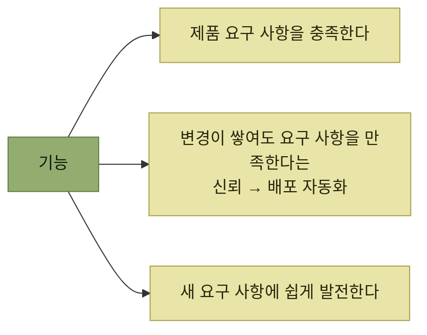

# 변화를 위한 설계 - 오큘러스 사례

> [지속적인 사용자 이해](./README.md)

## 빠른 복습
- 에버렛 로저스의 『개혁의 확산』 — **기술 혁신과 그 확산은 순환 구조 안에서 일어나며, 이 사이클은 피드백과 반복을 기반**으로 한다.
- **제품이 확산되려면 위험을 점점 더 피하고, 네트워크 연결이 약한 인구층의 마음까지 사로잡도록 스스로 적응**해야 한다. 그러려면 **빠른 피드백 사이클을 내장해서 새로운 사용자 물결이 들어올 때마다 어디가 막혔는지** 알아내야 한다.
- 그래서 **우리가 만드는 모든 기능은 세 가지를 해야** 한다 — **제품 요구 사항 충족**, **변경이 쌓여도 요구 사항을 만족한다는 신뢰(배포 자동화)**, **새 요구 사항이 들어와도 쉽게 발전**.
- 오큘러스는 **일정 지연과 쉽게 변경하기 어려운 코드베이스**로 어려움을 겪었고, 엔지니어들은 **2년 뒤를 예측하며 언젠가 만들지도 모를 기능을 상상**했다. **설계 세션은 마라톤이 됐고 과도하게 설계된 해법**이 나왔다.
- 그 태도는 **도구 상황을 보면 합리적**이었다 — **제대로 된 디지털 트윈이 없었고 적절한 추상 계층도 빠져** 있었다.

> [!IMPORTANT]
> **예측보다 반복 능력을 설계한다**
>
> 먼 미래의 요구사항을 모두 맞히려 하지 말고 피드백을 빨리 받고 안전하게 변경할 수 있는 구조와 배포 체계를 만든다.

## 세 가지 역할

*셋을 한꺼번에 해내는 게 소프트웨어 엔지니어링의 묘미다*

> 이 세 가지 재료 없이 일하면, **팀은 고객에게서 멀어지고 제약에 갇혀 사용자를 제대로 섬기지 못합니다.**

## 오큘러스로 옮기며 배운 것

**2015년 페이스북을 떠나 전년도인 2014년에 페이스북이 인수한 VR 회사 오큘러스 VR에 합류**하면서 저자가 겪은 이야기다.

> **2010년대의 페이스북은 빠른 반복에 집착**했습니다. **"빠르게 움직여 부숴라move fast and break things"** 라는 모토로 유명했죠. 그러다 **엄청난 반발이 쌓이자 2014년에 좀 더 성숙한 표현으로** 다듬었습니다. 바로 **"안정적인 인프라 위에서 빠르게 움직이자move fast with stable infra"** 였어요.

> 제가 보기에 이 접근에서 **가장 중요한 부분은, 페이스북이 훌륭한 개발자 도구를 많이 만들어 두었다는 점**이었습니다. **오큘러스 제품이 페이스북 스택 위에 올라와 있기만 하면, 그 도구들을 그대로 쓸 수** 있었거든요.

### 개발자 생산성 팀

> **2000년대에 구글은 회사 엔지니어의 개발을 반복 가능하고 안전하며 빠르게 만들기 위한, 전담 중앙 팀 개념을 개척**했습니다. 요즘 이런 팀은 **개발자 생산성Developer Productivity 팀**이라 부릅니다. **2025년 기준 중견·대형 테크 기업에서 엔지니어링 생산성 쪽으로 배치된 인력은, 엔지니어링 헤드카운트의 15~20% 정도**를 차지하는 경향이 있습니다.

2015년 인수 시점에 페이스북 개발자 생산성 팀이 만들어 둔 것들이다.

| 도구 | 무엇을 하나 |
| --- | --- |
| **핵Hack** | **안전한 코드 변경과 리팩터링을 가능하게 하는 타입 시스템.** **PHP 위에 구축** |
| **기능 플래그 시스템** | **실험과 안전한 롤아웃을 쉽게** |
| **프로덕션 관측성 플랫폼** | **빠르고 유연하며, 사전에 조회할 인덱스를 지정할 필요가 없었다.** 덕분에 **데이터 파이프라인을 변경하지 않고도 궁금한 내용을 자유롭게 조회** |
| **EntSchema** | **모델 개발을 쉽고 강력하게 만들어 주는 데이터베이스 추상화 계층**(8장에서 자세히) |

표를 읽는 법. 넷 다 **개별 기능이 아니라 "바꾸는 행위 자체"를 싸게 만드는 도구**다. **새로운 개발자 생산성 팀의 초기 과업은 디지털 트윈을 만들고 활용하는 쪽으로 기울어 있는 경우가 많으며**, **모든 테스트를 돌려주는 CI 솔루션이 대표적**이다.

## 분석 마비

저자는 **오큘러스의 앱 스토어와 로그인 시스템을 페이스북 인프라 위에서 다시 만드는 일**을 맡았다.

> 코드베이스 재작성 계획을 그리다 보니, **이 팀의 엔지니어들이 앞으로 2년 뒤를 예측하면서 언젠가 만들지도 모를 기능을 상상하는 경향**이 있다는 걸 알아챘습니다. 덕분에 **설계 세션은 마라톤이 됐고, 과도하게 설계된 해법**이 나왔습니다.

> 시간이 지나면서 **그들의 태도에 공감**하게 됐습니다. **도구 상황을 보면 합리적**이었거든요.

| 무엇이 없었나 | 결과 |
| --- | --- |
| **제대로 된 디지털 트윈** | 바꿔도 괜찮은지 확인할 방법이 없다 |
| **적절한 추상 계층** | **REST API가 데이터베이스에 1:1로 매핑**돼 있어 **데이터베이스가 클라이언트와 빡빡하게 결합** |
| | **한 번 내린 결정에 오래 묶일 것 같은 느낌** |

표를 읽는 법. **과잉 설계는 성격이 아니라 환경의 산물**이라는 진단이다. **되돌릴 수 없는 결정이라면 미리 다 정해두려는 것이 합리적**이며, 따라서 고쳐야 할 것은 **사람의 습관이 아니라 되돌릴 수 있게 만드는 도구**다.

이 진단은 [『요즘 우아한 백엔드 개발』 2장](../../요즘-우아한-백엔드-개발/02-전체-서비스를-관통하는-도메인-모듈-안전하게-분리하기/1-왜-도메인을-분리했나.md)의 출발점과 닮았다. 그 팀도 **재고 고도화를 하려다 "지금 구조로는 안전하게 못 바꾼다"** 는 결론에 먼저 도달했다.

## 함께 읽기
- [다음 절 — 무엇을 갖춰야 바꿀 수 있는가](./3-변화의-기술적-토대.md)
- [『좋은 코드의 기준』 1.2](../../내-코드가-불안한-개발자를-위한-좋은-코드의-기준/01-왜-좋은-코드를-작성해야-할까/2-유지보수성은-왜-희생되는가.md) — 바꾸기 어려운 코드가 팀 행동을 바꾸는 다른 사례
