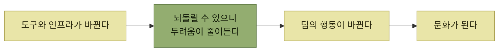

# 기술이 만드는 문화

> [지속적인 사용자 이해](./README.md)

## 빠른 복습
- **기술은 팀 문화에 깊은 영향을 미친다.** **프로세스나 실무 관행의 문제에 대한 해법이, 문화적이기보다 기술적인 경우가 많다.**
- **좋은 소식** — **엔지니어가 해법의 일부가 될 수 있다는 의미**다.
- 오큘러스는 **더 나은 디지털 트윈이 생기자 설계 실수를 바로잡을 수** 있게 되었고, **위험을 피하며 조심스럽게 생각할 필요가 줄어 멋진 걸 만드는 데 집중**하게 됐다.
- 페이스북 벽의 포스터 — **"두렵지 않다면 무엇을 하시겠습니까?"** 저자는 이를 **"뭔가가 두렵지 않으려면 무엇을 해야 할까요?"** 로 확장한다.
- **두려움이 정당하고 합리적인 경우도 많다.**

> [!NOTE]
> **문화 문제의 원인이 기술 제약일 수 있다**
>
> 회귀 테스트와 관측성, 빠른 배포가 부족하면 팀은 합리적으로 변화를 두려워한다. 안전 장치를 개선하면 행동과 문화도 달라진다.

## 재구축이 문화를 바꿨다

> 새로운 인프라 위에서 제품을 다시 쓴 지 몇 달이 지나자, **오큘러스 팀은 완전히 새로운 방식에 동참**하게 되었습니다. **더 나은 디지털 트윈, 즉 회귀를 막아 주는 잘 테스트된 코드, 강력한 프로덕션 관측성, 빠른 변경에 맞춰 설계된 인프라가 생기자, 팀은 설계 실수를 바로잡을 수** 있었습니다. 그 덕에 **위험을 피하며 조심스럽게 생각할 필요가 줄었고, 멋진 걸 만드는 데 집중**할 수 있게 됐습니다. **누군가는 새 기술 스택을 기념하는 재미있는 티셔츠까지 만들어 나눠 줬습니다. 저는 지금도 가끔 그 셔츠를 입습니다.**

> **재구축의 효과는 곧 눈에 띄었습니다.** 그 뒤 **2~3년 동안 팀은 새 스택 위에서 많은 기능을 빠르게 설계하고 짤 수** 있었어요.

*문화를 직접 바꾸려 하지 않고, 두려움의 근거를 없애는 경로*

## 두려움을 없애려면 무엇을 해야 하는가

> **두렵지 않다면 무엇을 하시겠습니까?**
> — 페이스북 아날로그 리서치 랩

> 이 포스터는 **창의성과 대담함의 기운을 북돋우려는 의도**였다고 봅니다. **검증되지 않았지만 임팩트가 큰 아이디어를 파 보거나, 동료에게 따끔하지만 필요한 건설적 피드백을 주는 행동** 같은 것 말이죠.

> 그런데 **두려움이 정당하고 합리적인 경우도 많습니다.** 그래서 저는 이 질문을 이렇게 확장하고 싶어요. **"뭔가가 두렵지 않으려면 무엇을 해야 할까요?"**

**"두려워하지 말라"가 아니라 "두려워할 이유를 없애라"** 로 질문을 바꾼 것이 이 절의 핵심이다. 앞의 문장은 사람에게 부담을 지우고, 뒤의 문장은 **엔지니어가 손댈 수 있는 문제**로 바꾼다.

| 증상 | 기술적 처방 |
| --- | --- |
| **팀 동료가 자기 코드를 꾸준히 덜 테스트한다고 느껴진다** | **테스트 프레임워크를 개선해 테스트 작성을 더 쉽고 재미있게.** 또는 **팀이 의존하는 서비스를 테스트하기 쉽게 해 주는 페이크 라이브러리**를 만든다 |
| **새 버전을 배포하려고 몇 주씩 꼼꼼히 테스트한다** | **트래픽을 점진적으로 올려 주는 기능 플래그**로 배포를 매끄럽게. **CI 테스트가 도그푸딩이나 수동 테스트의 필요성을 줄여** 주기도 한다 |
| **우선순위 결정을 두고 몇 시간씩 논쟁한다** | **데이터가 부족할지도** 모른다. **제품 지표를 더 모으거나 더 나은 제품 분석 솔루션**을 찾는다 |

표를 읽는 법. 세 줄 모두 **사람 문제로 보이는 증상**이다 — 게으름, 소심함, 말싸움. 그런데 처방은 전부 **기술**이다. 셋째 줄이 [이 장 후반의 제품 지표](./8-제품-지표와-도입-지표.md)로 이어진다.

## 오큘러스의 남은 제약

**오큘러스는 페이스북의 다른 조직과 비교했을 때 분명한 그들만의 요구 사항**이 있었다 — **사용자 계정은 페이스북 계정이 아니었고, 고성능·그래픽 집약 게임을 지원**해야 했다. **특수한 라이브러리와 인프라가 필요했지만, 동시에 가능한 한 많은 공통 인프라를 함께 쓰고** 싶었다.

**공통 인프라의 이점을 취하면서 고유 요구를 지키는 줄타기**가 남는다는 뜻이며, 이는 [『아키텍트 첫걸음』 3.3](../../아키텍트-첫걸음/3-아키텍처-설계/3-시스템-아키텍처-선정.md)이 다룬 **공통화와 독립성의 트레이드오프**와 같은 문제다.

> **신뢰할 만하고 적응력 있는 기술 스택의 큰 이점 중 하나는, 예기치 못한 사용자 피드백이 들어와 새 기능이 필요하다는 걸 깨닫는 순간 곧장 움직일 준비가 돼 있다는 점**입니다.

## 함께 읽기
- [다음 절 — 그 피드백은 어디서 오는가](./5-사용자-피드백-수집.md)
- [앞 절 — 무엇을 갖출 것인가](./3-변화의-기술적-토대.md)
