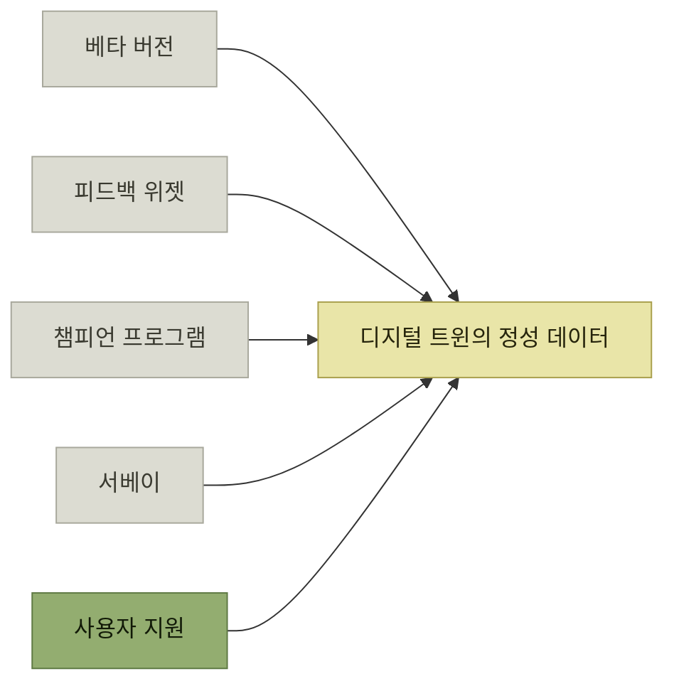

# 사용자 피드백 수집

> [지속적인 사용자 이해](./README.md)

## 빠른 복습
- **사용자가 피드백을 주면, 그 이야기는 테스트와 함께 우리의 디지털 트윈 안에 쌓인다.**
- [4장](../04-자사-제품-체험/README.md)에서는 **도그푸딩과 마찰 로그로 제품 라이프 사이클 초반에 스스로에게 피드백**을 줬다. 이제 **외부 사용자의 의견을 바탕으로 배울 차례**다.
- 방법은 다섯 — **베타 버전**, **피드백 위젯**, **챔피언 프로그램**, **서베이**, **사용자 지원**.
- **베타는 실패의 파급 효과를 낮춘다** — **조금 덜 안정적인 경험을 감수하기로 한 사용자들과 먼저 써 보면 대다수 사용자의 신뢰를 잃지 않고 피드백**을 얻는다.
- **피드백은 맥락이 있을수록 좋다.** **사용자가 특별히 생각을 많이 하지 않아도 필요한 맥락까지 담긴 피드백을 줄 수** 있어야 한다.

> [!TIP]
> **피드백과 맥락을 함께 수집한다**
>
> 사용자가 무엇을 하던 중이었는지 자동으로 담으면 보고 부담은 낮아지고 팀이 재현하고 판단할 수 있는 정보는 늘어난다.

## 베타 — 영향 범위를 줄인다

| 형태 | 내용 |
| --- | --- |
| **얼리 릴리스 프로그램** | **동의한 사용자에게 다른 사람보다 먼저 업데이트**를 준다. **이런 사용자도 인내심에 한계가 있으니, 이들을 계속 행복한 고객으로 붙잡아 둘 정도의 품질은 유지**해야 한다 |
| **베타 티어** | **여러분이 운영하는 인터넷 서비스의 한 버전.** **고객이 자기 환경의 일부를 가리켜, 변경이 주요 프로덕션 트래픽에 도달하기 전에 테스트를 돌릴 수 있는 곳.** **고객이 자기에게 중요한 테스트를 직접 돌려 보고, 영향이 생기기 전에 알릴 수** 있다 |

표를 읽는 법. 둘의 차이는 **누가 테스트를 설계하는가**다. 얼리 릴리스는 **우리가 만든 것을 먼저 준다**는 뜻이고, 베타 티어는 **고객이 자기 시나리오로 검증할 자리를 준다**는 뜻이다. 뒤쪽이 더 값진 정보를 주는 이유는 **우리가 상상하지 못한 사용 방식**이 거기서 드러나기 때문이다.

## 피드백 위젯 — 맥락째로 받는다

> **임베디드 폼은 고객이 피드백을 주기 극도로 편하게** 해 줍니다. **우리가 신경 쓰고 있다는 신호를 보내면서, 사용자의 통찰을 여러분 쪽으로 돌려받게** 해 줘요. **별점 1점짜리 앱 스토어 리뷰나 소셜 미디어에서 터뜨리는 분노 대신** 말이죠.

- **문서에서 헷갈리거나 오래된 부분에 인라인 코멘트**를 달 수 있게 한다.
- **사용자가 새 기능을 쓰고 있다는 걸 알아챘을 때, 반응을 묻는 피드백 요청을 팝업**으로 띄운다.
- **모바일 앱에서는 스크린샷, 앱 경로, 앱 버전, 기기 모델, OS 버전을 코멘트와 함께** 모은다.
- **사용자가 신고하고 싶은 부적절한 콘텐츠 옆에 인라인 위젯**을 둔다.
- **여러분이 궁금해하는 구체적 맥락을 추가로 입력하도록 안내**한다.

**셋째 항목이 [3장의 맥락 제공](../03-에러와-경고/3-맥락-제공.md)을 거꾸로 한 것**이다. 에러 메시지에서는 **우리가 사용자에게 맥락을 되돌려 줬는데**, 여기서는 **사용자에게 묻지 않고 우리가 알아서 맥락을 수집**한다. 어느 쪽이든 **사람이 기억해서 적게 만들지 않는다**는 원칙은 같다.

## 챔피언 프로그램

> 때로는 **커뮤니티 구성원들로부터 더 깊은 기여**가 필요합니다. **심도 있는 피드백, 브랜드 홍보와 옹호 활동, 오픈소스 기여** 같은 것들이 그 예죠.

**MS의 MVP 프로그램 같은 챔피언 프로그램**은 **이런 사람들에게 인센티브를 제공함으로써, 돕고 싶다는 마음에 대해 존중받는다고 느끼게 하고 앞으로도 계속 기여하도록 동기**를 준다. **혜택으로는 무료 소프트웨어나 서비스, 얼리 액세스, 네트워킹 기회, 콘퍼런스 티켓, 평판상의 이점**이 있다.

## 서베이

**과학적이고 반복 가능한 사용자 서베이 설계는 이 책의 범위를 넘지만**, 저자가 유용하다고 느낀 두 가지 쓰임새가 있다.

| 쓰임새 | 내용 |
| --- | --- |
| **자유 서술 응답** | **사용자에 대한 공감을 이끌어내는 귀중한 자료**가 되는 경우가 많다. **NPS 감정 조사를 돌린다면 자유 서술 답변을 꼭 한 번** 들여다본다 |
| **기능 설문** | **사용자가 겪고 있을 것으로 보이는 개별 문제점을 짚어 주고, 얼마나 해결해주길 바라는지 점수나 순위로 매겨 달라**고 요청한다 |

표를 읽는 법. 아랫줄은 **가설 검증 도구**다 — **제품 기획 중에 사용자가 실제로 원하는 것과 팀이 원한다고 넘겨짚는 것을 대조**해 준다. 윗줄은 그 반대로 **가설 밖의 것**을 준다 — **자유 서술 응답까지 곁들이면 의외의 발견도 드러난다.**

*다섯 채널 가운데 원서가 가장 길게 다루는 것은 사용자 지원이다*

**나머지 넷과 지원의 결정적 차이**를 원서는 이렇게 짚는다 — **지원은 사용자가 여러분에게 무언가를 원하는 바로 그 순간에 일어난다.** **다른 채널들은 이런 역동성이 없어 그만큼 덜 미덥고, 추가 보상으로 부추겨야** 굴러간다.

## 함께 읽기
- [다음 절 — 지원이 가장 강력한 피드백 창구인 이유](./6-사용자-지원-플라이휠.md)
- [4.3 마찰 로그](../04-자사-제품-체험/6-마찰-로그.md) — 내부 사용자에게서 같은 종류의 정보를 얻는 방법
