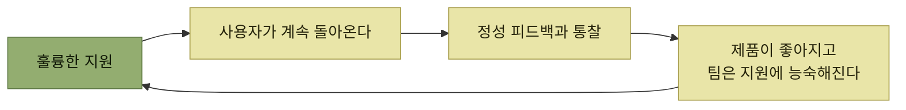

# 사용자 지원 플라이휠

> [지속적인 사용자 이해](./README.md)

## 빠른 복습
- **많은 팀에 사용자 지원은 가장 강력한 제품 피드백 창구**이며, **엔지니어가 깊게 관여하는 경우도 흔하다.**
- **모든 고객 지원 문의는 사실 제품 피드백의 한 형태**다. 그래서 **항상 두 가지를 함께** 생각한다 — **질문한 사용자의 문제를 직접 해결하는 것**과 **제품 개선에 활용할 피드백을 얻는 것**. 이렇게 보면 **지원은 부담이 아니라 윈윈 전략**이 된다.
- **이 구조는 스스로 굴러간다.** **지원이 좋으면 사용자는 더 돌아오고, 결정적 정성 피드백과 사용자 통찰을 계속 가져다준다.** 그동안 **팀은 지원을 더 능숙하고 효율적으로** 하게 된다.
- 질 좋은 지원의 구성 요소 — **빠른 응답과 진입 장벽 제거**, **정중하고 너그러운 태도**, **사용자 시나리오 탐색**, **막힌 부분 해결**, **제품이 더 잘할 수 있었던 방법 고민**, **지원 체계 확장**.

> [!IMPORTANT]
> **지원 문의는 제품 피드백이다**
>
> 한 사용자의 문제를 해결하는 데서 끝내지 말고 같은 장애가 반복되지 않도록 제품·문서·진단을 개선해 플라이휠을 만든다.

## 플라이휠

*'플라이휠 효과' — 한 번 돌기 시작하면 강력하다*

원서의 사례는 **스트라이프의 워크플로 엔진**이다. **엔지니어용 내부 프레임워크**로, **다른 엔지니어의 상태 기반 혹은 장시간 실행 프로세스를 오케스트레이션**한다. **수백 개 팀의 개발자가 다양한 방식으로 부하를 걸었기 때문에 질문이 많았고**, 그럼에도 **익명 전문가 커뮤니티 블라인드의 설문에서 회사 전체 엔지니어들에게 최고 내부 지원으로 여러 번** 뽑혔다.

## ① 진입 장벽을 없앤다

> **피드백은 선물입니다. 사용자가 의견을 주기 어렵게 만들면, 그들은 더 이상 피드백을 제공하지 않을 것입니다.**

**워크플로 엔진 팀은 영업시간 동안 30~60분 안에 질문에 응답하는 걸 스스로 약속**했고, 이를 **'지원 SLA'** 라 불렀다.

| | 결과 |
| --- | --- |
| **많은 팀** | **지원 티켓을 열고 며칠씩 답을 기다리게** 한다. **초기 응답이 빨라도 후속 대응에서 지연이 쌓이는** 경우가 많다 |
| **워크플로 엔진** | **사내 메시징 앱 슬랙에서 직접 지원.** **응답성이 더 좋았고, 다른 사람들이 쉽게 끼어들어 질문에 답할 수** 있었다 |

표를 읽는 법. 티켓 시스템은 **고객 문의가 한꺼번에 쏟아질 때 생기는 압박과 주의 분산에 대한 자연스러운 반응**이지만, **사용자와 제품 모두에 해롭다.** 장벽은 문의를 줄이는 게 아니라 **피드백을 줄인다** — 문제는 그대로 남는다.

## ② 존중하는 태도

> **사용자는 지원을 요청해야 하는 상황을 자신의 잘못처럼 느낄 수도 있으며, 잘못된 표현으로 인해 당황하거나 위축될 수** 있습니다. **사용자는 여러분만큼 제품을 잘 모르기 때문에, 바보 같은 질문을 한다는 가정을 하기 쉬워요. 그 함정에 빠지지 마세요.**

> **건설적 피드백은 늘 환영받는다는 점을 분명히 하세요. 잘못한 건 사용자가 아니라 제품입니다.** 만약 **사용자가 실수했다면, 굳이 짚을 필요는 없어요. 스스로 알아챌 테고 못 알아채도 바로잡는 건 여러분 일이 아닙니다.**

> **"그거 답답하시겠네요" 같은 작은 공감의 말이나 "함께 풀어 봅시다" 같은 명시적 목표 정렬은 여러분이 사용자 편이라는 걸** 보여 줍니다. 또 **경멸이나 조급함이 아니라 호기심으로** 다가가세요. **여러분의 목표는 제품과 사용자 경험을 개선하는 것이지, 사용자를 개선하는 게 아닙니다.**

**마지막 문장이 이 절의 요약**이다. 그리고 현실적인 조언도 붙는다 — **사용자는 여러분이 자기 마음을 읽을 수 있다고 가정하는 것처럼 보일 때가 있으니, 그 느낌에 익숙해지고 인내심을 갖고 빠진 정보를 물어보라.**

## ③ 사용자의 시나리오를 탐색한다

**RCA(근본 원인 분석)** 는 **사용자가 평소와 다른 일을 했거나, 헷갈려 하거나, 제품에 버그나 기능 공백이 있거나, 이 모두가 섞였는지**를 가른다.

> **버그를 만든 코드 줄을 당장 찾아야 한다는 얘기가 아닙니다. 그건 나중에 해도 됩니다.** 지금은 **그게 버그인지, 대략 어디쯤에 있는지를 가려야** 합니다. **그래야 사용자에게 우회 방법을 알려 줄 수** 있으니까요.

| 물어볼 것 | 왜 |
| --- | --- |
| **환경 설정** | **앱 버전 같은 설정 정보를 알면 RCA에 도움**이 되고, **"앱을 업데이트하세요" 같은 해결책**을 안내할 수도 있다 |
| **의도** | **그 목표를 고려할 때 사용자가 취한 행동이 맞는 선택이었나? 우회 방법은? 그들의 시나리오가 지원되기는 하나?** |
| **이전 행동** | **문제의 원인이 사건 자체보다 앞서 일어난 경우가 많다.** **이전 단계로 되돌려 다시 시도하거나 다른 접근**을 취하게 할 수도 있다 |
| **사건** | **무슨 일이 있었는지, 그 영향이 무엇이었는지.** **RCA와 우선순위 결정**에 도움 |
| **이후 시도** | **그다음에 무엇을 해 봤나? 지금도 막혀 있는지** 물으면 **해결 우선순위를 정하거나 어떤 조언을 할지 고르기가 쉬워진다** |

표를 읽는 법. **이 중 어떤 게 가장 유용한지는 상황마다 다르니 메뉴처럼 골라 쓴다.** 워크플로 엔진은 **복잡하고 유연한 플랫폼이라 사람들은 목표 달성을 위한 최적의 설계 패턴을 잘 몰랐고**, 그래서 **원래의 의도까지 역추적**해야 했다. 스트라이프에는 **"WAYRTTD?"("What are you really trying to do?")** 라는 슬랙 이모지까지 있었다 — **빠르고 가볍게 웃으며 묻는 방식**이었다.

## ④ 사용자의 장애 요인을 제거한다

> **사용자에게 최선은 늘 자신이 던진 질문에 답하는 것만이 아닙니다. 물어야 할 줄 몰랐던 질문에 답하는 일일 때도 많습니다.**

워크플로 엔진에서 흔한 문제는 **비멱등nonidempotent 연산**이었다. **멱등성은 함수가 여러 번 호출돼도 첫 호출 이후 다른 결과를 내지 않는 속성**이며, **고객이 송금 중일 때 첫 시도가 타임아웃됐다고 두 번째 시도에 돈을 두 번 옮기면 안 된다.**

> **분산 시스템을 잘 쓰기 위한 규칙이 하나 있다면, 연산을 멱등하게 만들라는 것입니다!**

문제는 **이미 벌어진 일이라 앞으로를 위한 조언은 지금 당장의 문제를 푸는 데 도움이 되지 않는다**는 점이다.

> 저는 **두 가지 답변을 모두 제공하고, 사용자가 자신의 상황과 제약 조건에 맞게 선택하도록 했을 때 많은 사용자를 만족**시킬 수 있었습니다. **보통은 먼저 당장의 문제를 해결할 수 있는 방법을 제시해 사용자가 느끼는 긴장을 풀어준 뒤, 이어서 개선 방향에 대한 조언**을 제공합니다.

**순서가 중요하다** — 급한 불을 끄기 전에 설계 조언을 하면, 옳은 말이라도 들리지 않는다.

## ⑤ 제품에 대해서도 RCA를 한다

> 제품의 이상적인 모습은 **눈이 부실 만큼 완벽**합니다. **지원이 전혀 필요 없습니다.**

> 그래서 저는 **지원 요청을 받을 때마다 제품에 대해서도 RCA를 합니다. 어떻게 해서 사용자가 이 지점까지 닿았을까요?** **사용자는 피드백을 주려는 게 아닐 수도 있습니다. 주로 막힘에서 빠져나가는 데 집중**하고 있죠. **그렇다고 단서에 주의를 안 기울여도 된다는 뜻은 아닙니다.**

> 저는 **사용자의 의사 결정을 따라가며 묻습니다. "내 제품이 이 과정에서 어떻게 도와줄 수 있었을까"** 하고요. **더 나은 에러 메시지나 더 나은 문서가 사용자 타임라인을 더 좋게 만들어 줬을 수** 있어요.

### 지원에서 나온 기능

**비멱등 연산 문제를 겪은 뒤** 저자가 떠올린 개선이다.

> 스트라이프 개발자들은 **워크플로를 테스트하는 데 우리 통합 테스트 프레임워크**를 썼습니다. 그래서 저는 개선을 하나 더했어요. **개발자가 자기 연산을 재시도 가능retryable으로 표시해 두면, 테스트 프레임워크가 그 연산을 두 번 돌려 결과를 비교**했습니다. **일치하지 않으면 에러를 던졌죠.**

> 이 변경으로 **많은 문제가 드러났습니다. 사용자의 제품을 더 좋게 만들었고, 우리의 지원 부담도 줄었습니다. 그리고 이 아이디어는 제품 피드백이 아니라 지원에서 튀어나왔습니다.**

**"멱등하게 만드세요"라는 조언을 테스트가 대신 하게 만든 것**이다. [3.7 시프트 레프트](../03-에러와-경고/7-조기-진단-시프트-레프트.md)의 전형적인 형태이며, **지원 대화 100번보다 검사 하나가 낫다**는 결론이다.

### 바쁘다면

> **사용자 시나리오는 이미 모아 뒀으니, 나중에 다시 볼 수 있도록 할 일 목록으로만 남겨 두세요.** **원래 상황을 떠올릴 수 있도록 정리된 작업 목록을 유지하면 중요한 세부 사항이나 그 안에 담긴 전략적 질문을 놓치지 않을 수** 있습니다. **기록은 스트레스도 줄여주고, 지원 과정에서는 사용자에게 집중할 여유를** 만들어 줍니다.

## 함께 읽기
- [다음 절 — 팀을 갈아 넣지 않고 지원하기](./7-지원을-확장하는-법.md)
- [3.4 실행 가능성](../03-에러와-경고/4-실행-가능성-개선.md) — 지원 요청을 애초에 줄이는 쪽
