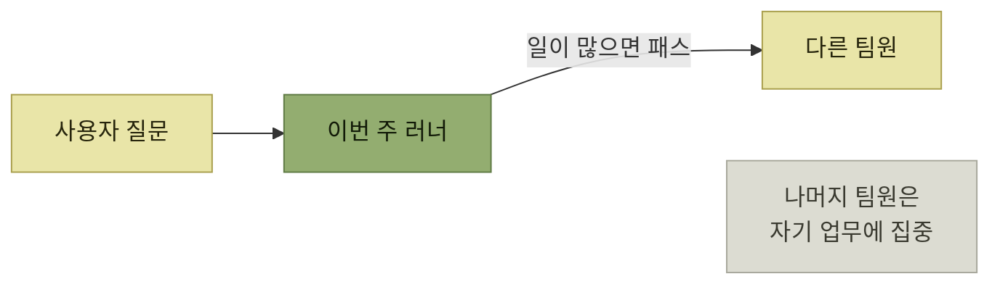

# 지원을 확장하는 법

> [지속적인 사용자 이해](./README.md)

## 빠른 복습
- 워크플로 엔진 팀은 **수백 개의 다른 엔지니어링 팀을 지원하면서도 팀의 초점을 기능 작업에서 완전히 빼지는 않을 수** 있었다. 요령은 셋 — **지원 '로테이션'**, **지원 담당자 역할의 명문화**, **제품과 문서를 꾸준히 개선하는 문화**.
- **러너runner의 역할은 미식축구의 쿼터백**과 비슷하다. **공은 늘 러너가 먼저 받지만, 일이 너무 많거나 적임자가 아니면 다른 팀원에게 패스**할 수 있다.
- **러너는 지원 주간 동안 평소 업무를 하지 않는다.** **프로젝트 일정은 런 위크run week를 휴가처럼 취급**했다.
- **처음 받았을 때보다 더 나은 상태로 남겨 두라** — 러너는 **한 주에 최소 한 가지는 지원을 더 효율적으로 만들 개선을 남겨야** 했다.
- **'문서로 답하기'** — **문서로 명확히 답할 수 있어야 하는데 그렇지 못한 질문이 들어오면, 문서를 갱신한 뒤 그 답을 링크로 안내**한다.
- 다만 **내부 프레임워크였기에 효과적**이었고, **수억 명 대상 제품이라면 이 방식만으로는 확장하기 어렵다.**

> [!TIP]
> **지원 주간에 개선을 하나 남긴다**
>
> 로테이션 담당자는 문의만 처리하지 않고 문서·도구·제품 중 최소 한 곳을 개선해 다음 지원 비용을 줄인다.

## 로테이션과 러너

*쿼터백 모델 — 공은 늘 한 사람이 먼저 받는다*

**매주 로테이션에서 '러너'를 지정해 영업시간 동안 지원을 제공하는 걸 주요 임무로** 맡겼고, **나머지 팀원은 자신의 업무에 집중하되 담당자가 적절한 시간 안에 응답하지 못한 경우에만** 나섰다.

몇 달 뒤 **감당하기 힘들 만큼 부하가 커지자, 팀 전체를 흔들지 않으면서 러너의 부담을 덜어줄 방법**이 필요했고, 다듬어 낸 방식이 위의 세 가지다.

| 규칙 | 효과 |
| --- | --- |
| **패스할 수 있다** | 러너가 **모든 질문의 답을 알아야 한다는 압박**에서 벗어난다 |
| **런 위크를 휴가처럼 취급** | **스트레스가 줄고, 시간이 갈수록 지원 품질이 높아졌다** |
| **한 주에 최소 한 가지 개선** | **버그 수정이든, 자동화든, 제품 사용성 개선이든, 문서 보강이든** 상관없다. **매주 막바지에는 팀 회의에서 자신이 남긴 개선을 보고** |

표를 읽는 법. 둘째 줄이 실무에서 가장 자주 어긋난다. **지원 당번에게 평소 업무를 그대로 주면**, 당번은 **두 일을 다 못 하고 지원이 먼저 밀린다.** **일정에서 아예 빼는 것**이 이 방식이 굴러간 조건이다.

> 다시 말해, **런 위크 동안은 지원이 곧 본업**이었습니다.

셋째 줄은 **플라이휠에 동력을 주는 장치**다. 지원을 처리만 하면 부하는 줄지 않지만, **매주 한 가지씩 구조를 고치면 다음 주 러너의 부담이 줄어든다.**

## 실제로 남긴 개선들

| 문제 | 개선 |
| --- | --- |
| **사용자와 주고받는 횟수가 너무 많다** | **사용자가 쓰는 프로그래밍 언어 같은 설정 정보를 미리 입력해 두도록 요청하는 자동 봇**을 추가해, **담당자가 합류했을 때 그 정보가 이미 준비돼 있게** 했다 |
| **같은 질문이 반복된다** | **'문서로 답하기'** — **문서로 명확히 답할 수 있어야 하는데 그렇지 못한 질문이 들어오면, 문서를 갱신한 뒤 사용자에게 그 답을 링크로 안내** |

표를 읽는 법. **'문서로 답하기'의 대가와 보상**을 원서가 솔직히 적는다 — **문서를 작성할 때 더 신중해야 하므로 사용자는 답변을 조금 더 기다려야 하지만, 그 결과는 이후의 사용자와 AI 지원 봇도 활용**할 수 있다.

> **갱신한 문서를 사용자에게 바로 보여줄 수 없다면**, 가령 공개 전에 검토를 거쳐야 한다면, **초안 형태로 변경안을 작성해 그 내용을 사용자에게 복사해 전달하고, 검토와 반영은 나중에 마무리**하면 됩니다.

> **코드베이스가 쉽게 바뀔 수 있어야 하듯, 문서도 그래야** 합니다. **팀원이 문서를 아주 손쉽게 고칠 수 있게 만드세요. 그렇지 않으면 문서는 금세 오래되어 쓸모를 잃게** 됩니다.

**[3절의 "변화를 위한 설계"](./3-변화의-기술적-토대.md)가 문서에도 적용된다**는 말이다. 고치기 어려운 문서는 안 고쳐지고, 안 고쳐진 문서는 **틀린 답을 계속 준다.**

> 전체적으로 보면, **지원을 확장하는 데는 꾸준한 창의력과 투자가 필요**했습니다. 하지만 **그걸 돌아가게 만들려고 거대한 프로젝트를 벌여야 했던 적은 한 번도 없었습니다.**

## 다층 구조에서의 지원

**제품의 성격에 따라 엔지니어링과 고객 사이에 여러 단계**가 낀다 — **AI 챗봇, 지원 담당 인력, 커뮤니티 운영자, 솔루션 아키텍트**. 또는 **엔지니어링 지원에 별도로 비용을 매길** 수도 있다.

> 이 경우 **엔지니어는 1차 지원에서 해결하지 못한 문제만 전달받는 경우가 많습니다. 하지만 이러한 문제는 제품 개선에 가장 유용한 피드백을 얻을 수 있는 문제와는 다를 수** 있습니다.

**에스컬레이션된 문제는 어렵지만, 흔하지는 않다**는 지적이다. **제품을 고칠 단서는 오히려 1차에서 걸러지는 평범한 혼란 속에** 있다.

- **아직 지원팀과 로테이션을 해본 적이 없다면 꼭 한 번 해보기를 권한다.**
- **중간 역할을 하는 사람들이 필요한 피드백을 전달할 수 있는 소통 채널을 마련**하고, **이들의 피드백도 최종 사용자의 의견과 마찬가지로 적극적으로 맞이**한다.

저자의 현재 실천도 적혀 있다.

> 최근 옮긴 회사에서, 저는 **사용자와 지원 봇이 주고받은 대화를 많이 읽고** 있습니다. **제가 작업 중인 기능과 관련된 단어를 검색해 사용자가 무엇을 헷갈려 하는지** 살펴봐요. 그러다 보니 **봇이 틀린 답을 내놓을 때는 대개 어떤 내용이 문서에 충분히 적혀 있지 않은 탓**이라는 걸 알게 됐습니다. 그러면 저는 **그 빈틈을 메우고, 봇은 다음 학습 때 그 내용을 익히게** 됩니다.

**봇의 오답을 문서의 결함 신호로 읽는 것**이 이 대목의 요령이다. [3장](../03-에러와-경고/1-진단의-가치.md)이 말한 **"에이전트는 메시지에 적힌 것만 가지고 다시 시도한다"** 와 같은 구조다.

## 사용자 지원의 힘

- **사용자에게 훌륭한 지원을 제공해 플라이휠 효과를 일으킨다.**
- **고객의 시나리오 속으로 파고든다.** 그러면 **문제를 해결하고 제품을 개선할 통찰을 더 많이** 얻는다.
- **팀 시간의 일정 비율을 지원에 미리 배정하되, 모든 팀원의 일정이 들쭉날쭉해지지 않는 방식으로** 한다.
- **지원을 확장하는 데 명확히 집중**한다. **같은 노력으로 더 많은 사용자를 지원**할 수 있다.
- **코드 개선과 문서 개선 둘 다 손쉽게 할 수 있도록** 만든다.

> 지원에 많은 분량을 할애한 이유는, **엔지니어가 사용자 피드백을 얻을 수 있는 가장 효과적이고 상호작용적인 방법**이기 때문입니다. 게다가 **사용자가 여러분에게 무언가를 원하는 바로 그 순간에** 일어나거든요.

> **사용자 리포트가 유일한 피드백 원천이 될 수 있는 건 어느 규모까지일 뿐이고, 그 지점을 넘어서면 숫자를 세기 시작해야** 합니다.

## 함께 읽기
- [다음 절 — 숫자를 세기 시작한다](./8-제품-지표와-도입-지표.md)
- [앞 절 — 좋은 지원의 구성 요소](./6-사용자-지원-플라이휠.md)
