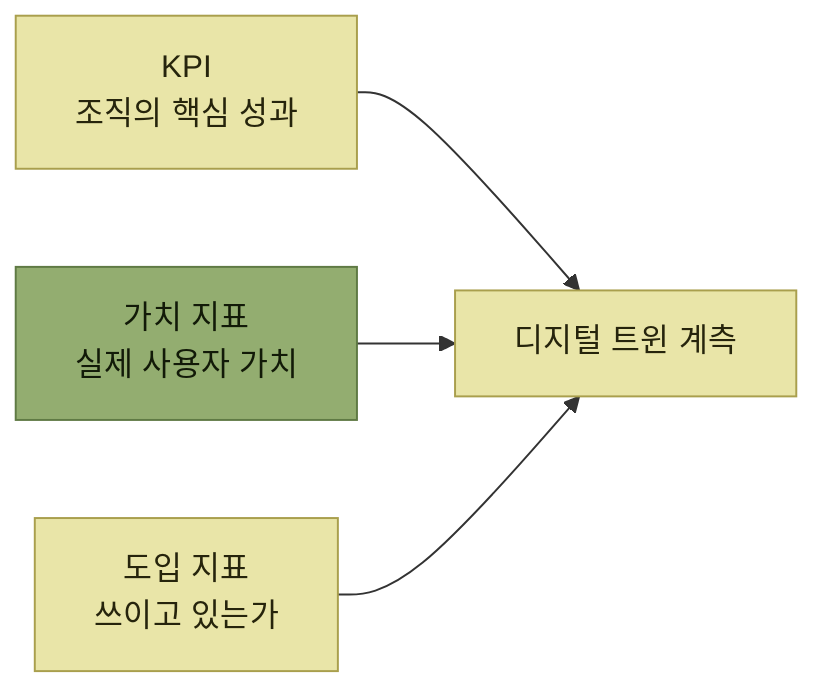

# 제품 지표와 도입 지표

> [지속적인 사용자 이해](./README.md)

## 빠른 복습
- **좋은 디지털 트윈은 실제 환경을 추적하는 센서에서 정보를 얻는다.** **비행기의 디지털 복제본이 수백만 편의 비행 데이터를 받아들이듯**, 우리 트윈도 **사용자와 네트워크, 하드웨어에서 무슨 일이 벌어지는지 감지**해야 한다.
- 지표를 고르는 첫 기준은 **조직의 제품 전략과 맞물리는지** — **이 프로젝트가 회사의 어떤 KPI를 끌어올릴지** 보여 준다.
- 두 번째이자 가장 중요한 기준은 **사용자에게 봉사하는 데 집중**하는 것이다. **가치 지표를 목표로 삼으면 팀은 제품이 어떤 가치를 만들어야 하는지에 대해 책임감**을 갖는다.
- 다만 **사용자가 기능을 알지 못하거나 사용하지 않으면 가치를 전달할 수 없고**, **사용자 가치가 드러나기까지 시간이 걸리는 경우도** 있으므로 **도입 지표도 함께 추적**한다.
- **허영 지표vanity metrics를 피하라.**

> [!NOTE]
> **제품 지표의 세 종류**
>
> KPI는 조직 목표를, 가치 지표는 사용자가 얻는 결과를, 도입 지표는 기능을 발견하고 사용하는 과정을 측정한다.

## 사례 — 템포럴의 세이프 디플로이

저자는 현재 **템포럴 테크놀로지스**에서 일한다. **워크플로의 신뢰성 있는 실행을 위한 프레임워크를 제공**하며 **사용자는 오픈소스 프레임워크로 코드를 짜는 개발자**다. 담당 영역 중 하나가 **세이프 디플로이Safe Deploys**로, **사용자가 워크플로를 오류 없이 업그레이드하도록 돕는 것**이 목표다.

> 워크플로의 특이한 점은 **몇 분, 몇 시간, 심지어 몇 주 동안 실행될 수 있고 잠들 수도** 있다는 것입니다. **워크플로는 시작한 곳과 다른 프로세스에서 재개될 수** 있고, 실제로 자주 그렇습니다. **하나의 워크플로가 깨어났는데, 시작할 때보다 새로운 버전의 코드에서 돌아간다면 어떤 일이 벌어질까요?**

```python
def my_workflow():
    do_stuff()
    # 예상치 못한 기존 워크플로에서 새 코드를 돌리는 건 위험할 수 있다.
    if (originally_started_on_new_version()):
        do_new_stuff()
    else:
        do_old_stuff()
```

*원서 의사코드 — 기능 플래그와 비슷한 방식의 '패칭patching'*

> 이 '패칭'은 **제대로 하면 잘 동작**합니다. 그러나 **발견성discoverability 문제**가 있습니다. **개발자가 이를 해야 한다는 사실 자체를 늘 알아차리는 건 아닙니다. 사용성usability 문제도** 있어요. **변경이 복잡해지면 실수하기 쉽습니다.**

**제대로 패칭하지 않으면 워크플로는 워크플로 업그레이드 오류 상태에 갇힌다.** 이 문제를 돕기 위한 **매니지드 디플로이먼트Managed Deployments**를 만들고 있다고 가정하고 지표 이야기가 전개된다.

**발견성과 사용성**이라는 진단이 [2장의 세 국면](../02-제품-내-사용자-안내/README.md)과 정확히 같은 어휘라는 점을 눈여겨볼 만하다.

## 세 종류의 지표



*세 가지를 함께 봐야 하는 이유는 어느 하나도 혼자서는 충분하지 않기 때문이다*

> **더 넓은 조직은 KPI를 추적하지만, 나머지 둘은 여러분의 제품이나 기능에 한정될 수** 있습니다.

## 도입 지표 — 후보를 하나씩 깎아 나간다

매니지드 디플로이먼트의 어려움은 **앱 개발자에게는 이점이 있지만, 쓰려면 배포 시스템도 함께 변경해야** 한다는 점이었다. **배포 시스템은 플랫폼 엔지니어라 부르는 다른 페르소나가 관리**하므로, **앱 개발자가 플랫폼 담당자에게 변경을 설득해야** 할 수도 있다 — **정치적 문제라 도입을 가로막을 수** 있다.

> **누가 이걸 쓰는지 모른 채 몇 달을 기다릴 수는 없습니다.** **개선에 계속 투자할지, 마케팅을 손볼지, 다른 접근을 시도할지 판단할 근거**가 없어지거든요.

| 후보 | 한계 |
| --- | --- |
| **① 문서 또는 보도자료 조회수** | **사용자 관심은 잡아내지만, 기능을 도입했는지는 알 수 없다** |
| **② 지금까지 만들어진 매니지드 디플로이먼트 수** | **과거에 한 번 써 보고 마음에 들지 않아 이탈한 사용자까지** 센다. **누군가 '생애 사용자'처럼 들리는 지표를 내세우면 의심하라** — **휴면 계정을 잔뜩 포함**하고 있을 수 있다 |
| **③ 활성 매니지드 디플로이먼트** | **사용자가 좋아하면 활성 상태로 남을 가능성이 커서 더 낫다.** 다만 **워크플로가 많은 배포와 비어 있는 배포를 동일하게 집계**해, **가장 중요한 배포의 도입을 인센티브로 삼지 못한다** |
| **④ 활성 매니지드 디플로이먼트 위의 워크플로** | **실행 중인 워크플로 수로 가중치**를 준다. 절충은 아래에서 |

표를 읽는 법. **①②는 '허영 지표'** 다 — **겉보기에는 인상적이지만, 사업 성과나 사용자 행동, 제품 성공에 대한 의미 있는 통찰은 주지 못한다.** 그런데 **추적이 쉽다는 이유로 너무 솔깃**하다 — **데이터베이스 크기만 세면 되니까.**

**③은 선행 지표**로서 **잠재적 사용자 가치를 측정**하고, **사용자가 기능을 그만 쓰면 줄어들기 때문에 실제 사용자 가치도 암시**한다.

### ③과 ④ 사이의 선택

**④는 워크플로가 1000개인 개별 고객을 1이 아닌 1000으로** 잡는다. 목표로 삼으면 동기 부여가 이렇게 바뀐다.

- **통제가 더 어려워진다.** **가장 큰 고객이 도입하면 지표가 폭발하고, 그렇지 않으면 꿈쩍도 안 한다.** **팀원을 불편하게 할 운의 요소**가 끼어든다.
- **오류로 실패한 워크플로가 1000개든 100만 개든, 개발자의 생산성은 거기에 크게 좌우되지 않는다.** **어느 쪽이든 그 장애를 수습해야** 하기 때문이다.
- **거래량이 많은 고객, 보통은 대기업에 집중**하게 된다. **대기업을 위한 추가 기능을 만들거나, 대기업 앱 개발자에게 계속 요청하도록 설득**하게 될 수도 있다.

> **옳은 답은 부분적으로 우리 전략에 달려 있습니다.** **KPI가 엔터프라이즈 도입에 초점을 둔다면, 지표가 거칠게 흔들리더라도 워크플로 가중치를 적용한 지표를 목표로** 삼는 편이 맞을 수 있습니다. 반면 **개발자 생산성과 긍정적 입소문에 초점을 둔다면, 크기로 가중하지 않은 활성 매니지드 디플로이먼트가 잘** 맞습니다.

**지표 선택이 곧 팀 행동의 선택**이라는 것이 이 절의 요점이다. 실제로는 **활성 매니지드 디플로이먼트를 골랐다.**

> 그래도 **이게 정말 도움이 되고 있는지는 아직 모릅니다.** 사용자가 **매니지드 디플로이먼트를 쓰는 게 그저 기본값이라서일 수도, 문서가 그렇게 하라고 시켜서일 수도** 있어요. **이 문제는 가치 지표로** 풀어 보겠습니다.

## 함께 읽기
- [다음 절 — 종이 클립 최대화와 웰스 파고](./9-가치-지표와-kpi.md)
- [4절](./4-기술이-만드는-문화.md) — 우선순위 논쟁의 처방이 "지표를 더 모으라"였던 자리
