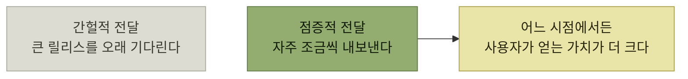
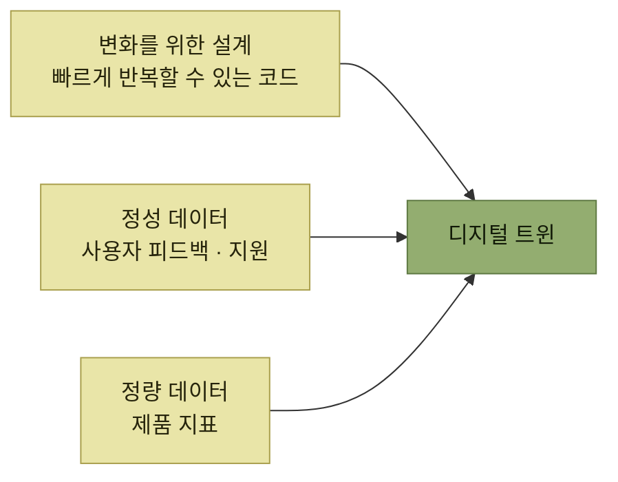

# 지속적인 사용자 이해

> [AI 시대의 엔지니어링 전략](../README.md)

## 20년 동안 배포는 이렇게 바뀌었다

> **확산 이론에서 변하는 건 사람이 아니라 혁신 그 자체입니다.** 혁신이 성공하려면, **점점 더 까다롭고 위험을 피하려는 사람들의 필요에 맞춰 스스로 진화**해야 합니다.
> — 하이 테크 스트래티지스, '혁신 수용 곡선'

저자가 직접 겪은 연대기가 이 장의 배경이다.

| 시기 | 배포 상황 |
| --- | --- |
| **2005년 MS 비주얼 C++ 컴파일러** | **고객은 CD로 받아 설치**했다. **간체 중국어 환경에서 컴파일러가 그냥 다운**됐는데 **패치를 내보낼 방법이 없었다.** **다음 릴리스는 몇 년 뒤**였고, 할 수 있는 일은 **지식 베이스에 우회 안내를 올리는 것뿐** |
| **윈도우 7** | **만드는 데만 3년**, 일부 고객에게는 **여전히 CD 박스로 배송**. **유닛 테스트도 기능 테스트도 없었고 코드 검증은 테스트 엔지니어에게** 기댔다 |
| **2009년 페이스북** | **매주 배포.** **일요일 밤에 빌드를 자르고, 안정화한 뒤 화요일에 릴리스** |
| **그 뒤 페이스북** | **롤아웃은 주 5회로, 결국 하루 여러 번의 지속적 배포로.** **기능 플래그와 A/B 테스트가 코드베이스 곳곳에** 깔렸다 |
| **2018년 스트라이프** | 이미 **좋은 테스트 문화**와 **하루에도 여러 번 배포**. 곧 **대부분의 서비스가 자동 지속적 배포로** 전환됐고, 저자는 **배포 하나하나에 신경 쓰는 일을 멈췄다** |

표를 읽는 법. **가장 아래 줄의 "신경 쓰는 일을 멈췄다"** 가 이 장이 겨냥하는 상태다. 그것을 가능하게 한 것은 의지가 아니라 **테스트와 커버리지가 회귀를 잡아 줄 거라는 신뢰**다.

> **그것은 제가 지금까지 만든 버그 가운데 최악의 버그였습니다.** 하지만 이는 **제 실력이 늘었다기보다 소프트웨어 산업이 발전한 덕분**이라고 생각합니다.

> [!IMPORTANT]
> **제품과 함께 학습 체계도 배포한다**
>
> 잦은 배포만으로는 충분하지 않다. 테스트·관측성·정성 피드백·제품 지표를 함께 갖춰 사용자 반응을 다음 변경으로 연결한다.

**자동차 업계에서는 변화가 더욱 극적**이었다 — **현재 상위 10개 자동차 제조사 가운데 8곳이 원격 업데이트(OTA)를 지원**하고, **심지어 화성 탐사선도 OTA 업데이트를 받을 수** 있다.

*[그림 5-1] 제품의 전체적인 발전 속도가 같더라도, 점증적으로 내보내면 어느 시점에서든 누적 가치가 더 크다*

> 더 좋은 점이 있습니다. **이제 사용자 목소리에 귀 기울이고 응답하기가 훨씬 쉬워졌어요. 더는 영구적인 버그가 없습니다.** **변경 프로세스를 많이 자동화한 덕에, 테스트에 시간을 더 쓰면서도 결과적으로 더 빠르게 움직이게** 됐습니다.

## 이 장의 세 갈래

*이 장은 세 주제를 '디지털 트윈'이라는 하나의 개념으로 묶는다*

> 먼저 짚어 둘 게 있습니다. **엔지니어의 일은 제품을 개발하는 데 그치지 않습니다.** 그 제품이 **시간에 따라 좋아지도록 해 주는 산출물의 묶음, 디지털 트윈digital twin이라 부르는 것까지 함께 만드는 일**입니다.

## 목차

- [디지털 트윈 관리자](./1-디지털-트윈-관리자.md)
- [변화를 위한 설계: 오큘러스 사례](./2-변화를-위한-설계-오큘러스-사례.md)
- [변화의 기술적 토대](./3-변화의-기술적-토대.md)
- [기술이 만드는 문화](./4-기술이-만드는-문화.md)
- [사용자 피드백 수집](./5-사용자-피드백-수집.md)
- [사용자 지원 플라이휠](./6-사용자-지원-플라이휠.md)
- [지원을 확장하는 법](./7-지원을-확장하는-법.md)
- [제품 지표와 도입 지표](./8-제품-지표와-도입-지표.md)
- [가치 지표와 KPI](./9-가치-지표와-kpi.md)
- [전술과 전략, 요약과 예제](./10-전술과-전략-요약과-예제.md)

## 함께 읽기

- [4장 자사 제품 체험](../04-자사-제품-체험/README.md) — **출시 전**의 검증. 이 장은 **출시 이후**를 다룬다.
- [『요즘 우아한 백엔드 개발』 2장](../../요즘-우아한-백엔드-개발/02-전체-서비스를-관통하는-도메인-모듈-안전하게-분리하기/4-Step-3-안전하게-배포하기.md) — **기능 플래그로 점진 배포한 실제 사례**(27개 플래그, 센터 단위, 10→50→100%).
- [『아키텍트 첫걸음』 4.6 구성 관리 및 CI/CD](../../아키텍트-첫걸음/4-아키텍처-구현/6-구성-관리-및-CI-CD.md) — 배포 자동화를 아키텍처 관점에서 다룬 절.
