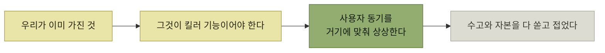

# 가상이 아닌 실제 사용자

> [타깃 오디언스 이해](./README.md)

## 빠른 복습
- [1장](../01-프로덕트-사고의-기본/README.md)의 경험적 지침(**잘 잊고, 주의를 많이 쏟지 않고, 늘 바쁘다**)은 **대체로 맞지만 항상 옳지는 않고, 그것만으로 결정을 내리기엔 디테일이 부족**하다.
- **사용자에 대한 캐릭터 프로필이 흐릿하면 결정 근거가 흔들린다.** **어느새 자기 자신이나 예전 회사에서 모시던 페르소나를 위해 제품을 만드는 생각에** 빠진다.
- **시뮬레이션이 어색하면 금방 티가 나듯, 캐릭터도 앞뒤가 안 맞으면 알아챌 수** 있다.
- 저자는 이런 인물들을 **허수아비 사용자straw man user**라 부른다.
- **판단을 흐리는 편향은 늘 걷어 내야** 한다. **사용자에 대한 명확하고 정직한 기술, 글로 남겨 팀 전체가 공유하는 기술은 선장의 GPS 같은 역할**을 한다.

> [!WARNING]
> **허수아비 사용자를 만들지 마세요**
>
> 팀이 이미 가진 해법에 사용자의 행동과 동기를 억지로 맞추면 편향을 검증 근거로 착각하게 된다.

## 자문해 볼 것 — "이 단계에서 우리 제품을 사용할 사람은 누구일까?"

| 허수아비 사용자 | 무엇이 이상한가 |
| --- | --- |
| **비합리적 행동자** | **동기와 맞지 않는 행동**을 한다. **돈이 부족해 알뜰하게 소비하는 사람이 8달러짜리 라떼를 선뜻 사 마시거나**, **한 달에 수천 달러를 버는 인플루언서가 10달러 기프트 카드 때문에 텅 빈 우리 SNS에 가입**해 준다 |
| **매닉 픽시 드림 유저** | **별 이유 없이 우리 제품에 푹 빠진다.** **친구마다 SNS로 자랑해 주고, 새 기능이 나오는 족족 캡처와 영상까지** 올려 준다 |
| **금욕주의 수도승** | **하루 종일 수도원에 앉아 우리 제품만** 쓴다. **아무리 배우기 어려워도, 시간이 오래 걸려도, 잦은 개편과 불안정한 동작에도 마음을 가다듬고 다시 도전**한다 |
| **분신** | **시스템을 잘 알고 있어 안내가 거의 필요 없고, 내부 구조를 잘 이해하고 있어 직관적이지 않은 동작도 쉽게 받아들인다.** [2장의 '지식의 저주'](../02-제품-내-사용자-안내/5-이해-시나리오-이름-짓기.md#지식의 저주)가 어떻게 덫이 되는지 잘 보여 준다 |
| **엄마 아빠** | **실재한다. 다만 한두 분뿐**이다 |

표를 읽는 법. 다섯 유형이 **각각 다른 것을 과장**한다 — 동기(①), 애정(②), 인내(③), 지식(④), 표본 크기(⑤). 그리고 **다섯 모두 "그래서 이 기능이 쓰인다"는 결론을 편하게 만들어** 준다. 그것이 이들이 자꾸 불려 나오는 이유다.

**④ 분신이 엔지니어에게 가장 위험**하다. 우리는 실제로 시스템을 알고 있으므로, **자기를 사용자 자리에 놓는 것이 가장 자연스럽고 가장 틀리기 쉽다.**

## 편향은 위험하다

원서가 든 상담 사례다. **소셜 카드 게임 스타트업 대표**는 **기존 제품이 자만에 빠져 사용자를 등쳐 먹는다**고 주장했다. 그래서 **사용자가 옮겨 올 동기가 뭐냐**고 물었더니,

> 답은 **"우리한테는 영상 채팅이 있으니까 사람들이 올 것"** 이었습니다. **기존 사이트의 익숙한 인터페이스를 버리도록 설득해야 하는 상황인데도요.**

> 알고 보니 제 지인은 **영상 채팅 기능을 이전 소유자에게서 넘겨받은 처지**였습니다. **그 회사에 이미 돈을 썼고, 엔지니어링 팀의 여력은 부족**했죠. 그러니 **자기한테 있는 게 영상 채팅이니, 영상 채팅이 킬러 기능이어야만 했던** 겁니다.

*가진 것에서 출발하면 사용자 동기가 결론에 맞춰 만들어진다*

대조되는 두 번째 지인은 길을 다르게 잡았다.

> **몰입감 있는 토너먼트 포맷을 만들고, 유명 전문가 몇 명을 섭외해 대회에 출전**시키고, **유튜브에 브랜드 영상을 스트리밍**했어요. 그 영상이 **전문가에게 도전하고 싶어 하는 신규 사용자**를 끌어왔습니다. **결정적으로 이건 1인 모드**였어요. **친구들이 기존 사이트에 묶여 있는 동안에도 반응을 모을 수** 있었죠. **1인 모드가 자생력을 얻자, 이어 멀티 플레이로 사람을 끌어들였습니다.**

> **첫 번째 회사는 수고와 자본을 다 쏟고 접었습니다. 두 번째는 지금까지도 살아** 있고요. **그의 전략은 사용자 동기와 일관되게 맞물려 있다는 점에서, 적어도 싸워 볼 만했습니다.**

**"친구가 저쪽에 있다"는 제약을 인정하고 그 제약이 없는 경로(1인 모드)로 들어간 것**이 두 번째 전략의 요점이다. 첫 번째는 **그 제약을 영상 채팅으로 이길 수 있다고 가정**했다.

> **편향, 편의주의, 정치, 몽상, 논리적 오류, 자존심이라는 바람이 불어와도** 우리를 **목표 방향으로 끌어가** 주거든요.

## 이 장이 밟는 순서

| 순서 | 내용 |
| --- | --- |
| ① | **제품이 성공할지 가늠할 때 쓸 과학적 사고방식** |
| ② | **고객 발견 인터뷰(CDI)나 세일즈 콜**로 사용자가 무엇을 원하는지 파악 |
| ③ | **페르소나를 만들고 글로 정리해 팀에 공유** |
| ④ | **후보 페르소나 가운데 우선순위를 정해 타깃 오디언스 선정** |
| ⑤ | **다면 마켓플레이스** — **승차 공유 서비스를 이용하는 기사와 승객처럼, 서로 상호작용하는 여러 페르소나가 모인 곳** |

## 함께 읽기
- [다음 절 — 과학적 사고방식](./2-제품-테제와-안티테제.md)
- [1.5 동기](../01-프로덕트-사고의-기본/5-시나리오의-구성-동기.md) — 허수아비 사용자를 알아보는 기준
