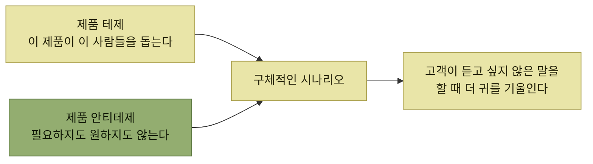

# 제품 테제와 안티테제

> [타깃 오디언스 이해](./README.md)

## 빠른 복습
- **제품 테제product thesis는 어떤 사용자 문제를 해결하려는지, 누구를 위한 제품인지, 그리고 그 문제를 어떤 방식으로 해결할 것인지에 대한 핵심 아이디어를 정리한 것**이다.
- 저자가 **'테제'라는 표현을 좋아하는 이유는 과학적인 접근 방식을 떠올리게** 하기 때문이다.
- **새로운 아이디어를 떠올리고 의욕적으로 개발을 시작하고 싶겠지만, 먼저 자신이 생각한 아이디어에 집착하기보다 호기심을 바탕으로 한 과학적인 태도**를 가져야 한다.
- **임상시험에 비유할 수 있는 이유**도 여기 있다 — **신약 개발의 대부분이 실패하듯, 제품 역시 대부분 성공하지 못한다.**
- 과학적 방법의 두 축은 **귀무가설**과 **교란변수 회피**다. 이를 제품에 옮긴 것이 **제품의 안티테제product antithesis**다.

> [!NOTE]
> **테제와 안티테제를 함께 들고 가세요**
>
> 성공할 이유뿐 아니라 실패할 수 있는 이유도 먼저 적어 두어야 인터뷰의 반대 신호를 놓치지 않는다.

## 앱 센터의 초기 테제

> **앱 센터는 소셜 게이머가 친구들이 즐기는 좋은 게임을 발견하도록 돕고, 앱 개발자가 좋은 품질의 앱을 만들어 앱 센터에서 더 좋은 자리를 차지하도록 경쟁을 유도합니다. 그 결과 페이스북 게이밍 생태계가 성장합니다.**

**세 마디가 한 문장에 들어 있다** — 누구를(소셜 게이머, 앱 개발자), 무엇을(발견, 경쟁), 그래서 무엇이(생태계 성장). [7절](./7-앱-센터의-페르소나와-논페르소나.md)에서 이 문장이 훨씬 구체적으로 다시 쓰인다.

## 안티테제

**'귀무가설'은 이 개입이 아무 효과도 없다는 가설**이며, **실험 결과로 귀무가설을 '반증'** 할 수 있다. 제품에서 그것은 이렇게 된다.

> **고객이 우리 제품이나 기능을 필요로 하지도, 원하지도, 이득을 보지도 못하며, 쓸 수조차 없다는 주장**입니다.

**안티테제에 살을 붙이려면 그 주장이 왜 참일 수 있는지 근거**를 댄다.

> **"소셜 게이머는 이미 알림과 뉴스피드처럼 훨씬 바이럴한 경로로 친구의 게임 초대를 받고 있다. 앱 센터는 의미 있는 트래픽을 만들지 못할 것이다."**

*안티테제는 테제의 반대말이 아니라, 테제와 함께 들고 다니는 짝이다*

> **구체적인 시나리오로 들어가면서 이 안티테제도 같이 다듬어** 갑니다. **안티테제를 곁에 두면 회의적인 시각을 놓치지 않습니다.** **자기 테제가 맞다고 증명하는 데만 머리를 다 쓰면, 제품이 성공할 이유만 보이거든요.** **안티테제를 통해 고객이 듣고 싶지 않은 말을 할 때 더 귀를 기울이게 될 것입니다.**

**"듣고 싶지 않은 말"에 귀를 기울이는 장치**라는 점이 안티테제의 실용적 값이다. 반증 대상을 미리 글로 적어 두지 않으면, 인터뷰에서 나온 부정적 신호는 **예외 사례로 흘려보내기 쉽다.**

이 태도는 [5장이 "가치 지표가 떠오르지 않으면 주의하라"](../05-지속적인-사용자-이해/9-가치-지표와-kpi.md#가치-지표가-떠오르지-않을-때) 고 한 것과 같은 자기 점검이다. 양쪽 모두 **자기 기능을 의심할 근거를 제도화**한다.

## 함께 읽기
- [다음 절 — 이 사고방식을 인터뷰로 가져간다](./3-고객-발견-인터뷰.md)
- 7장 — 제품 테제와 안티테제가 **프로덕트 브리프**의 첫 항목이 된다
