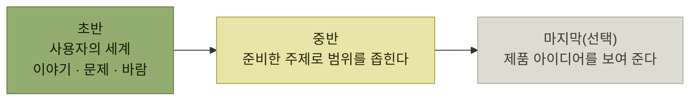

# 고객 발견 인터뷰

> [타깃 오디언스 이해](./README.md)

## 빠른 복습
- **고객 발견의 목표는 제품 테제를 세우고 다듬는 것**이다. 이를 위해 **사람들이 어떤 문제를 겪고 있는지, 누가 그 문제를 겪고 있는지, 왜 그런 문제가 발생하는지**를 파악한다.
- **처음에는 구체적인 제품 아이디어에서 출발할 수 있지만, 그 아이디어에 너무 얽매여서는 안 된다.** **이 단계에서는 해결책보다 문제 자체를 이해하는 데 집중**한다.
- **많은 엔지니어에게는 잠재 고객과의 인터뷰 기회를 마련하는 것 자체가 가장 큰 어려움**이다.
- **CDI(고객 발견 인터뷰)는 현재 고객이나 잠재 고객과 나누는 구조화된 대화**이며 목표가 셋이다.
- 조언은 둘 — **호기심 가득한 과학자의 자세**, **인터뷰의 무게추를 인터뷰 상대 이야기에서 우리 제품 이야기로 천천히 옮길 것**.
- **인터뷰 대상자에게 질문을 덜 할수록, 돌아오는 답변을 더 신뢰할 수** 있다.

> [!IMPORTANT]
> **해결책보다 문제를 먼저 이해하세요**
>
> 고객 발견 인터뷰는 처음 떠올린 기능을 확인하는 자리가 아니라 사용자 문제와 동기의 강도를 발견하는 과정이다.

## 인터뷰 대상자 확보

| 방법 | 요령 |
| --- | --- |
| **고객과 자주 닿는 직군에 기댄다** | **UX 리서처나 PM**, 또는 **어카운트 매니저, 고객 성공 담당, 마케터, 솔루션 아키텍트**. **기존 미팅에 합류해 마지막 몇 분 시간을 얻어도** 된다 |
| **네트워킹으로 전용 자리를 부탁한다** | **답례로 기술 지원을 해 주거나 다가올 로드맵을 발표**해 주겠다고 제안한다. **엔지니어가 시간을 내서 직접 대화해 주면 고객은 특별 대접을 받는 기분**을 느낀다 |
| **지원 상호작용 중에 묻는다** | 5장에서 다룬 **지원 상호작용 중에 인터뷰 의향을 물으면, 여러분이 도움이 됐다면 흔쾌히 그렇다고 할 가능성이 높다** |
| **다른 사람들이 무엇을 원하는지 잘 아는 사람에게 기댄다** | 앱 센터에서는 **게임 스튜디오 사람들에게 "여러분의 고객이 무엇을 원하느냐"** 고 물을 수 있었고, **만나야 할 개인을 소개**받기도 했다 |
| **서베이로 자원자를 추린다** | **후속 인터뷰에 자원할 사람**을 고른다 |

표를 읽는 법. 셋째 줄이 [5장의 플라이휠](../05-지속적인-사용자-이해/6-사용자-지원-플라이휠.md)과 직접 연결된다 — **좋은 지원이 인터뷰 대상자를 만들어 준다.** 넷째 줄은 **한 다리 건넌 정보**를 쓰는 방법인데, **소개까지 받을 수 있다는 점**이 실제 이득이다.

## CDI의 세 가지 목표

| 목표 | 내용 |
| --- | --- |
| ① | **사용자의 근본적인 동기와 처한 상황을 이해**한다. **처음 떠올린 해법이 빗나갔을 때, 사용자 문제에 다른 해답을 떠올릴 창의력이 여기서** 열린다. **사용자가 안고 있는 일련의 문제를 온전히 보면 보다 종합적인 해결책을 설계**할 수 있다 |
| ② | **동기가 얼마나 강한지 파악**한다. **많은 제품이 실패하는 이유는, 사용자가 그것을 전혀 원하지 않아서가 아닙니다. 그저 그럭저럭 원했을 뿐이라서죠** |
| ③ | 이미 구체적인 아이디어가 있다면 **피드백·목업·프로토타입에 대한 의견을 구해 인터뷰 상대의 창의력을** 끌어낸다. **미처 질문해야 한다는 사실조차 몰랐던 부분까지 발견**할 수 있다 |

표를 읽는 법. ②가 이 절에서 가장 값진 문장이다. **"원한다/원하지 않는다"는 이분법이 아니라 강도의 문제**이며, **약한 긍정이 가장 위험한 답**이다 — 인터뷰에서는 통과하고 출시 후에 드러난다.

## CDI 퍼널

*[그림 6-1] CDI 퍼널 — 시간이 갈수록 사용자에서 제품으로 무게추가 옮겨간다*

> 네, 저는 **제 제품 아이디어를 러브크래프트 소설에 등장하는 크툴루 같은 공포의 존재로 상상**하는 걸 좋아합니다. **조심하지 않으면 사용자가 한 번 보고 나서는 잊을 수 없는 것을 보여 주게 되고, 그 결과 사용자의 생각에 영향을 미쳐 이후의 반응이 왜곡될 수** 있기 때문입니다. 그래서 **제품·기능 아이디어를 꺼내기 직전까지의 시간이 그토록 소중**합니다.

**한 번 보여주면 되돌릴 수 없다**는 것이 퍼널 순서의 이유다. 제품을 먼저 보여주면 **그 뒤의 모든 답은 그 제품에 대한 반응**이 되어, **사용자가 원래 갖고 있던 문제의식**을 다시 들을 수 없다.

## 이야기를 청한다

> **인터뷰 대상자에게 질문을 덜 할수록, 돌아오는 답변을 더 신뢰할 수** 있습니다.

> **인터뷰에서 상대방이 먼저 여러분의 기능을 요청하고 들어온다면, 기능 아이디어를 제시했을 때 상대방이 마음에 든다고 말하는 것보다 훨씬 강한 신호**입니다.

**사용자도 자기 인식이 부족하거나 자기 행동을 예측하지 못한다.** 그래서 **직접 자기 니즈를 묻는 대신 제품 테제와 관련 있는 최근 경험담을 들려 달라고 청한다.**

- **사용자는 구체적인 장면 안에 머물게** 된다. **자기가 원한다고 생각하는 것, 하고 싶다고 바라는 것에 대한 편향된 서사를 자기도 모르게 짜는 대신, 실제로 했던 일**을 말해 준다.
- **구체적인 이야기를 따라가다 보면 나중에 설계 작업을 끌고 갈 시나리오의 재료**가 쌓인다(7장).
- **이야기는 사용자의 기억을 건드려서, 경험의 중요한 디테일을 선명하게** 띄워 준다.

**"바람"과 "행동"을 가르는 장치**다. 사람은 자기 바람에 대해서는 편향되게 말하지만, **지난주에 실제로 한 일**은 비교적 정확히 말한다.

## 단계별 질문

| 단계 | 예시 질문 | 무엇을 얻나 |
| --- | --- | --- |
| **초반** | **"최근에 페이스북에서 게임을 해 보거나 발견했던 경험에 대해 의견 있으세요?"** | 마음에 담아 둔 이야기 |
| **초반 후반부** | **"어떤 게임을 좋아하세요?"** | **퍼즐 게임을 좋아하는지 소셜 게임을 좋아하는지** — 페르소나 파악 |
| **중반** | **"전형적인 게임 세션에 대해 말해 주세요"**, **"어떤 게임을 해 볼지 어떻게 결정하세요?"** | **어떤 문제를 겪고 어떤 동기를 갖고 있는지.** **페르소나를 깊게 만들고 유스 케이스 시뮬레이션에 디테일**을 더한다 |

표를 읽는 법. **중반에서 그 문제를 겪고 있지 않다는 답이 나올 수도** 있는데, 이것도 **제품 안티테제로 이어지는 유용한 신호**다 — **이 사용자가 타깃 오디언스가 아닐 수도, 타깃이지만 우리가 풀려는 문제가 그의 문제가 아닐 수도** 있다.

> 이 중반 단계에서 **많은 사람이 자연스럽게 호의적이고 도와주려는 태도**를 보입니다. **긍정이든 부정이든 특정 답을 기대하지 않는 중립적인 표현으로** 질문하세요.

## 마지막 단계 — 아이디어를 보여준다

**인터뷰 대상자가 제품 아이디어에서 이득을 볼 만한 사람으로 보이면 설명하고 반응**을 묻는다. **목업이나 스케치가 있으면 더 좋다.**

여기서도 **점진적으로 범위를 좁힌다.** 먼저 **장르, 별점, 함께 플레이하는 친구, 게임 설명, 인기 순위 같은 정보 목록을 보여 준 뒤 어떤 정보가 가장 중요한지 선택**하게 하고, 그다음 **"저희가 검토 중인 대략적인 콘셉트입니다. 어떻게 생각하시나요?"** 로 구체적인 시안을 보여준다.

> 바로 묻진 않습니다. **"프라이버시가 중요하세요?"는 유도 질문의 교과서적 예시**입니다. 그런데 사용자가 **"음, 그럼 제 친구들이 제가 뭘 플레이하는지 보게 된다는 말이에요?"** 라고 말하면, **이건 강한 신호**죠. 이런 반응을 **충분히 많은 사람이 보이면 '프라이버시에 민감한' 사용자 페르소나를 만들 수** 있습니다.

한 걸음 더 나아가 **실제 계정의 최근 플레이 목록을 불러오게 하고 "이 중에서 어떤 게임을 친구에게 추천하거나, 친구를 끌어들이고 싶으세요?"** 라고 물을 수도 있다. 그 반응은 제품 변경으로 이어진다.

| 사용자 반응 | 제품 변경 |
| --- | --- |
| **5분만 해 보고 그만둔 게임을 자기가 추천한 것처럼 비치는 게 싫다** | **일정 시간 플레이한 뒤에만 공유**하도록 요구 |
| **어떤 게임은 '길티 플레저'다** | **게임 단위로 공유 옵트아웃** 허용 |
| **게임으로 '시간을 허비한다'는 사실을 남들이 알길 원치 않는다** | **기본값으로 어떤 게임 활동도 공유하지 않도록** |

표를 읽는 법. 세 반응 모두 **"프라이버시"라는 추상어 대신 구체적인 장면**에서 나왔고, 그래서 **처방도 서로 다르다.** 만약 "프라이버시가 중요하세요?"라고 물어 "네"라는 답만 얻었다면 **이 세 가지를 구분할 수 없었다.**

## 함께 읽기
- [다음 절 — 가이드를 어떻게 짜고 답을 어떻게 읽나](./4-질문-스크립트와-응답-분석.md)
- [앞 절 — 안티테제를 곁에 두는 이유](./2-제품-테제와-안티테제.md)
