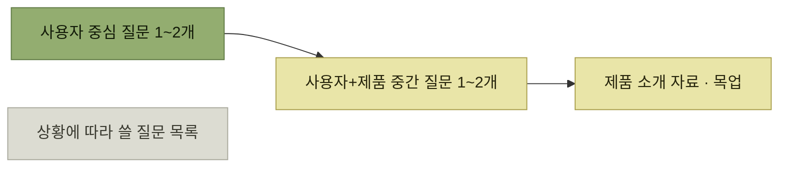

# 질문 스크립트와 응답 분석

> [타깃 오디언스 이해](./README.md)

## 빠른 복습
- **약간의 구조가 있으면 시간 관리가 훨씬 수월**하다. **인터뷰가 진행되는 동안 옆에 둘 인터뷰 가이드**를 만든다.
- **질문 열두 개짜리 완성본을 들고 순서대로 가면** 두 가지를 잃는다 — **사용자가 흥미로운 이야기를 꺼낼 때 더 깊이 파고들 여유**, 그리고 **자연스러움**(**로봇처럼 들린다**).
- **많은 주제를 커버해 모든 고객에게서 일관된 답을 얻고 싶다면, 그건 서베이가 할 일**이다.
- 가이드는 **사용자 중심 단계 질문 1~2개, 사용자와 제품을 함께 다루는 중간 단계 질문 1~2개, 제품을 소개하거나 보여 줄 자료** 정도면 충분하다.
- **인터뷰가 끝난 뒤에는 각 인터뷰의 주요 내용을 정리**하고, **고객 답변에서 얼마나 유의미한 정보가 나왔는지 판단해 요인별 상대적 중요도**를 가늠한다.

> [!TIP]
> **답변의 내용과 신호의 강도를 함께 기록하세요**
>
> 사용자가 먼저 꺼낸 경험과 구체적인 행동은 유도된 동의보다 강한 근거로 다룬다.

## 인터뷰 가이드

*가이드는 대본이 아니라 지도다*

> **고객이 흥미로운 이야기를 할 때는 더 깊이 들어가세요.** 단, **사용자와 관련 없는 주제로 시간을 흘려보내지 마세요.** **"자, 그 멋진 기능을 원하신다면 어떤 식으로 동작하길 원하세요?"라고 묻는 함정에는 빠지지 말고요.**

**마지막 함정이 특히 유혹적**이다. 사용자가 어떤 기능을 원한다고 말한 순간 **설계 대화로 넘어가고 싶어지는데**, 그 순간 [퍼널의 초반](./3-고객-발견-인터뷰.md)에서 얻어야 할 **문제 정보 수집이 끝나버린다.**

> **좀 더 철저하게 준비하고 싶다면 대화의 흐름에 따라 사용할 수 있는 질문 목록을 미리 만들어 두는 것도 좋습니다.** 다만 **대부분은 상황에 따라 사용하는 질문이므로, 모든 질문을 다 하겠다는 생각은 하지 않는 것이** 좋습니다.

> **인터뷰 한두 개를 놓친다고 자책할 필요는 없습니다.** 횟수가 늘수록 감이 옵니다. **어차피 초반 내용이 가장 신호가 강한 경우가 많습니다.**

## 응답 분석 — 같은 정보라도 신호 강도가 다르다

앱 센터에서 **별점star rating 기능이 가치 있는지** 보고 싶었다고 하자. **사용자는 여러 방식으로 그 정보를 주고, 각각 신호 강도가 다르다.**

| 프롬프트 | 고객 응답 | 신호 강도 |
| --- | --- | --- |
| **게임을 해 볼지 어떻게 결정하세요?** | **별점이 있었으면 좋겠어요.** | **강** |
| **전형적인 게임 세션에 대해 말해 주세요.** | 최근에 해 본 게임 몇 개가 별로였어요. | **중** |
| **페이스북 게임에 대해 의견 있으세요?** | 어떤 게임이 좋은지 알기 어려워요. | **중** |
| **앱에 별점이 있었으면 하고 바랐던 때 이야기해 주세요.** | 정말요, 바로 어제도요. | **중** |
| **장르, 별점, 친구 플레이 여부, 설명, 인기를 중요도 순으로 매겨 주세요.** | 별점이 3순위네요. | **약** |
| **앱 별점이 있으면 도움이 될 것 같으세요?** | 네, 뭐. | **약** |

*원서 [표 6-1] 별점 피드백*

표를 읽는 법. **위로 갈수록 사용자가 스스로 꺼낸 말**이고, **아래로 갈수록 우리가 제시한 선택지 안에서 나온 답**이다. **가장 강한 신호는 별점이라는 단어를 우리가 꺼내기 전에 사용자가 먼저 말한 경우**다.

> **프롬프트가 내려갈수록 신호가 약해지니, 뒤쪽 질문은 강한 신호를 먼저 얻은 뒤로 미루세요.**

**질문 순서가 곧 데이터 품질**이라는 뜻이며, 이것이 [퍼널 구조](./3-고객-발견-인터뷰.md)의 실질적 근거다. 아래쪽 질문을 먼저 하면 **위쪽 질문의 답까지 오염**된다.

> 앞서 파악한 **동기가 이 제안의 맥락도 잡아** 줍니다. **사용자가 새로운 게임에 별 관심이 없다면, 그 사용자가 별점에 대해 한 말은 새 게임을 열심히 찾아다니는 사용자만큼 중요하지 않아요.**

**같은 강도의 답이라도 누가 했느냐에 따라 무게가 달라진다** — 응답을 페르소나와 함께 읽어야 하는 이유다.

## 함께 읽기
- [다음 절 — 인터뷰 말고 다른 접점들](./5-세일즈-콜과-서베이-그리고-네트워킹.md)
- [5장의 지표 후보 깎기](../05-지속적인-사용자-이해/8-제품-지표와-도입-지표.md#도입 지표 — 후보를 하나씩 깎아 나간다) — 후보를 나란히 놓고 한계를 짚는 같은 방식
