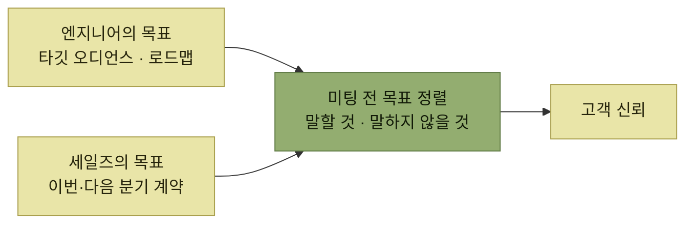

# 세일즈 콜과 서베이, 그리고 네트워킹

> [타깃 오디언스 이해](./README.md)

## 빠른 복습
- **엔지니어는 가끔 세일즈 콜에 동석해 달라는 요청**을 받는다. **세일즈 콜은 고객 발견에 써도 좋다** — **세일즈 담당자도 우리와 똑같이 사용자 페르소나에 대한 정보를 원하기** 때문이다.
- 다만 **목표가 다르다.** 우리는 **타깃 오디언스 파악과 로드맵 구체화**, 세일즈는 **다음 분기나 그다음 분기 안에 계약을 성사시키는 것**이다.
- **미팅 전에 인터뷰 목표를 맞춰 두고**, **무엇을 말하고 무엇은 말하지 않을지 조언**을 구한다.
- **고객 발견 서베이는 인터뷰가 닿지 못하는 범위까지 사용자 니즈를 훑어 준다.** 다만 **상황에 따라 질문을 조정하거나 깊이 있는 대화를 나누기는 어렵다.** 대신 **인터뷰 대상자를 찾는 데 매우 효과적**이다.
- **고객 인터뷰는 중요한 네트워킹 기회**다.

> [!NOTE]
> **접점마다 목적을 구분하세요**
>
> 세일즈 콜에서는 설득보다 발견을 먼저 하고, 서베이는 정성 인터뷰에서 찾은 가설의 규모를 확인하는 데 쓴다.

## 세일즈 콜

**엔지니어가 동석하는 이유**는 **고객에게 기술적인 답을 주거나, 좋은 인상을 남기거나, 로드맵을 발표하거나, 고객의 특수한 니즈에 대응 가능한지 평가**하려는 것이다.

*시간 지평이 다른 두 목표를 미리 맞춰 두어야 한 자리에서 굴러간다*

> **미리 합을 맞추면 세일즈도 우리를 이 귀중한 대화에 끌어들이기 편해집니다.** 우리 쪽에서는 **로드맵에서 약속할 수 있는 것과 없는 것을 분명히 해** 두세요.

> 미팅에 들어가면 **세일즈 담당자는 우리가 고객 신뢰를 쌓는 데 도움을 주기를 기대**합니다. **신뢰는 고객의 니즈에 공감하고 그 편을 들어줄 때** 쌓이죠. **고객은 자기가 조종당한다거나 '세일즈 피치'를 받고 있다는 느낌을 보통 금세 알아챕니다.**

> 요컨대, **세일즈 담당자가 정한 범위 안에서 평소와 같은 과학적인 접근 방식**을 적용하세요. **제품 안티테제가 참일 가능성도 기꺼이 받아들이세요.** **고통스러운 통합 작업과 협상을 거친 뒤에 그런 사실을 알게 되는 것보다, 처음부터 확인하는 편이 훨씬 낫습니다.**

앱 센터의 예가 이어진다. **수준 높은 게임 스튜디오를 플랫폼으로 유치하고 싶었고 앱 센터가 매력적인 공간이 될 것이라 생각**했지만,

> **하지만 게임 개발자들이 정말 원하는 것이 안정적인 API나 더 나은 인앱 결제 지원이라면 어떨까요?**

**우리가 팔고 싶은 것과 그들이 필요한 것이 다를 가능성**을 열어두는 것이 핵심이다. 그래서 **먼저 고객의 이야기를 충분히 듣고 나서 제품 아이디어를 제시**한다.

> 또한 **어떤 고객이 제품에 적합하지 않은지도 솔직하게 설명**해야 합니다. 예를 들어 당시에는 **대부분의 웹 브라우저에서 실행할 수 없는 고사양 그래픽 게임 개발사는 타깃 오디언스로 고려하지 않았습니다.** **이런 기준을 처음부터 명확히 해 두면 서로 불필요하게 시간을 낭비하는 일을** 막을 수 있습니다.

**맞지 않는 고객을 일찍 걸러내는 것도 세일즈에 도움이 된다**는 관점이며, [논페르소나](./7-앱-센터의-페르소나와-논페르소나.md)가 대외적으로 쓰이는 장면이다.

## 고객 발견 서베이

> **서베이는 기본적으로 인터뷰의 압축판**이라, 조언이 거의 그대로 적용됩니다. **열린 질문으로 시작하고, 페르소나를 파악하려 하며, 의견보다 구체적인 행동과 시나리오를 묻고, 우선순위를 가늠**합니다.

> **좋은 설문지는 고객이 채우고 싶은 마음이 들게** 만들어야 합니다. **오디언스에 따라 인센티브를 제안해도 좋고, 우리가 경청하고 있고 여러분이 제품 방향에 영향을 줄 기회가 있다고 알려 주는 것도** 한 방법입니다.

앱 센터 서베이의 문항이다.

- **페이스북에서 게임을 해 본 적 있나요?**
- **페이스북에서 게임을 발견하거나 플레이해 본 최근 경험에 대해 의견 있나요?**
- **이것이 여러분의 즐거움에 얼마나 중요했나요?**
- **정말 재미있게 하셨거나 오래 하신 게임 이름을 몇 개 적어 주세요.**
- **최근에 눈에 띈 게임을 떠올려 보세요. 해 볼지 어떻게 결정하세요?**
- **최근에 해 본 게임을 떠올려 보세요. 어떻게 발견했고, 어떻게 느꼈나요?**

**여섯 문항 중 넷이 "떠올려 보세요"·"이야기해 주세요"** 형태다 — [인터뷰의 "이야기를 청한다"](./3-고객-발견-인터뷰.md) 원칙이 서베이에서도 그대로 쓰인다.

마지막에는 **후속 인터뷰나 추가 대화에 참여할 의향**을 함께 확인한다.

## 인터뷰 대상자와의 네트워킹

> **사용자와 상호작용하는 자세를 떠받치는 핵심 요소 하나는, 피드백을 손쉽게 구할 수 있는 믿을 만한 사람들의 리스트를 갖는 일**입니다.

**눈여겨 둘 사람**은 셋이다 — **날카로운 피드백을 주는 사람**, **페르소나를 완벽히 구현하는 사람**, **제품을 만들었을 때 얼리 어답터가 될 법한 사람**.

> 이들은 **레퍼런스 고객**이 되어 줄 수도 있습니다. **더 넓은 페르소나를 대표하는 실제 개인이나 회사** 말이에요. **디자인 파트너 역할을 하며 요청과 피드백을 함께 짚어** 주기도 하고, **나중에 마케팅에서 '이런 고객들이' 우리 제품을 사용한다고 소개하는 사례**가 되기도 합니다.

[앱 센터의 킥스아이](./7-앱-센터의-페르소나와-논페르소나.md)가 정확히 이 역할을 했다.

## 고객 인터뷰 경험칙

- **인터뷰 대상자가 의견과 피드백, 궁금한 점을 편하게 표현하게** 한다.
- **적게 유도할수록 응답을 더 신뢰할 수** 있다. **인터뷰 초반에 이걸 최우선으로** 둔다.
- **내 바람을 싹 빼낸 중립적인 질문**을 던진다.
- **추상적인 의견과 추측 대신 구체적인 상황**을 묻는다. **"언제였는지 말해 주세요"는 좋은 시작**이다.
- 인터뷰나 서베이 뒤에는 **주요 내용을 정리하고 신호의 강도도 함께 기록**한다. **그래야 해당 문제가 얼마나 중요하고 시급한지 나중에도 정확하게 판단**할 수 있다.
- **인터뷰를 통해 알게 된 사람들과의 인연을 적극 활용**해 후속 대화로 이어 간다.

## 함께 읽기
- [다음 절 — 모은 것을 페르소나로 만든다](./6-타깃-오디언스-선택과-공유.md)
- [4.3 마찰 로그 수집](../04-자사-제품-체험/6-마찰-로그.md#마찰 로그를 수집하는 법) — 협력할 사람을 모으는 다른 방식
