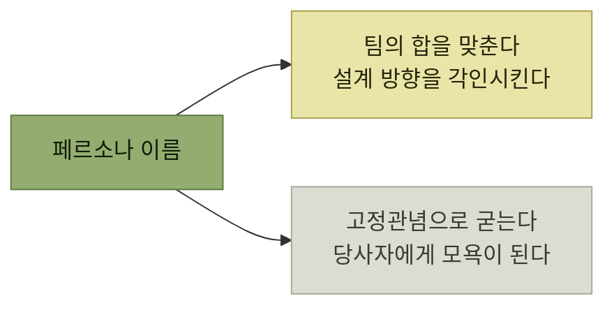

# 타깃 오디언스 선택과 공유

> [타깃 오디언스 이해](./README.md)

## 빠른 복습
- **타깃 오디언스는 페르소나의 일반화된 버전**이며, 네 조건을 만족해야 한다 — **실제 현실의 인구학적 속성에 기반**, **특히 경쟁사 제품 대비 이 제품을 사용할 실질적인 동기**, **구매하고 활용할 수단**, **쓰지 않을 강한 동기는 없을 것**.
- **제품이 완전히 새로운 것이라면 단기 타깃 오디언스는 작아야** 한다. **기존 제품이 제대로 받쳐 주지 못하는 핵심 오디언스를 찾아 집중**하고 **확장은 그다음**이다.
- **사람의 욕구와 니즈는 무작위적으로 발생하지 않고 서로를 떠받치는 그룹으로 묶인다.** **인터뷰 내용에서 상관관계가 있는 동기들을 찾는다.**
- **팀원 모두가 같은 유형의 사용자와 그들의 요구를 동일하게 이해하고 있다면, 각자 더 나은 의사 결정**을 내린다. **설령 판단이 조금씩 다르더라도 모두 같은 방향**을 향한다.
- **누구를 타깃으로 하지 않을지도 함께 명시**한다. 이를 **논페르소나**라 부르며, **스코프 크리프를 막아** 준다.

> [!CAUTION]
> **초기 타깃을 넓게 잡지 마세요**
>
> 완전히 새로운 제품은 작고 구체적인 오디언스의 문제를 온전히 해결한 뒤 인접 사용자로 확장한다.

## 좁게 시작해서 넓힌다

| 제품 | 확장 경로 |
| --- | --- |
| **페이스북** | **미국 대학생 네트워크 → 고등학생 → 영어권 전체 → 세계** |
| **스트라이프** | **'코드 7줄'로 스타트업 개발자와 기술 창업자 → 엔터프라이즈 → 비개발자와 바이브 코더를 위한 노코드 솔루션** |
| **템포럴** | **Go로 코드를 쓰는 대형 테크 기업의 인프라 엔지니어 → 다른 언어를 쓰는 금융·프로덕트 엔지니어 → 엔터프라이즈와 AI 기능** |

표를 읽는 법. 세 줄 모두 **시작점이 우스울 만큼 좁다.** **모든 곳의 모든 사람을 한꺼번에 움직이긴 어렵기** 때문이며, 좁게 잡아야 **그 집단의 문제를 완전히 풀 수** 있다 — [8절의 "2XL 셔츠에 S 사이즈 소매"](./8-타깃-오디언스-기반-기능-선택.md) 가 그 반대 경우다.

## 동기는 그룹으로 묶인다

**페이스북에서는 인터뷰와 오디언스 분석을 거치며 게이머가 소셜 게이머와 '미드코어' 게이머 둘로 나뉜다**는 사실을 확인했다. **미드코어 게이머는 하드코어 게이머가 즐기는 복잡한 전술·전략 게임에 끌리지만, 거기에 같은 수준의 시간과 돈을 쏟을 의향은 없는 사람들**이다.

| 그룹 | 원하는 것 |
| --- | --- |
| **소셜 게이머** | **사회적 교류, 자랑할 기회, 친구들이 많이 플레이하는 환경** |
| **미드코어 게이머** | **프라이버시에 민감**하고, **경쟁을 즐기며**, **평판 좋은 양질의 콘텐츠**를 찾는다 |

표를 읽는 법. 두 줄이 **정반대 방향**이다 — 한쪽은 **드러내고 싶어 하고** 다른 쪽은 **가리고 싶어 한다.** 이 대비가 [인터뷰에서 나온 "친구들이 제가 뭘 플레이하는지 보게 되나요?"](./3-고객-발견-인터뷰.md) 라는 반응과 이어진다.

## 페르소나로 공감대를 만든다

> **제품이 복잡할수록 모든 팀원이 페르소나를 바탕으로 같은 관점을 유지하는 일은 더욱 중요**합니다.

> **타깃 오디언스를 글로 적어 두면 그들의 니즈를 한곳에 모을 수** 있습니다. 그다음 **그 니즈를 기준으로 성공의 모양에 대해 팀의 합**을 맞출 수 있습니다. **오디언스가 당연히 바라는 세 가지 니즈 중 두 개만 충족했다면, 아직 끝난 것이 아닙니다. 제품을 출시할 시점도 아닙니다.**

**"세 개 중 두 개는 출시가 아니다"** 라는 기준이 페르소나 문서의 실용적 값이다. 니즈를 적어 두지 않으면 **두 개만 채운 상태가 완성처럼 보인다.**

전달 방법도 구체적이다.

- **공유 문서나 슬라이드에 외우기 쉬운 페르소나를 적고 제품 사용 동기를 보완하는 캐릭터 스케치**를 덧붙인다.
- **사람들이 이 페르소나를 어떻게 만들었는지, 또는 정말 현실을 대표하는지 의심할 때를 대비해 인터뷰 녹취로 연결되는 링크**도 걸어 둔다.
- **페르소나를 오래 기억하게 만드는 가장 좋은 방법 중 하나는 특징이 잘 드러나는 인상적인 이름**을 붙이는 것이다.

## 모트, 엘비스, 아인슈타인 논란

**2005년 MS의 개발자 사업부 'DevDiv'** 의 페르소나다. **비주얼 스튜디오, 그중에서도 비주얼 베이직·C#·C++의 컴파일러·런타임·IDE**를 담당하는 조직이었다.

| 페르소나 | 성격 | 담당 제품 |
| --- | --- | --- |
| **모트Mort** | **기회주의적 개발자.** **눈앞의 문제를 빨리 푸는 솔루션**을 좋아하고 **생산성에 초점**을 두며 **필요한 만큼만 배운다.** **회계 같은 본업을 보조하려고 코드를 짜기도** 한다 | **비주얼 베이직** |
| **엘비스Elvis** | **실용적이고 바쁜 애플리케이션 프로그래머.** **구체적이고 오래가는 솔루션**을 만들고 **만들어 가며 배우며 다음 문제로 빠르게** 넘어간다 | **C#** |
| **아인슈타인Einstein** | **편집증 있는 시스템 프로그래머.** **일반적이고 효율적인 솔루션**을 만들어야 하고 **작업에 들어가기 전에 미리 공부해 두는** 경우가 많다 | **C++** |

*원서가 소개한 DevDiv의 페르소나*

> 이 페르소나가 **외부에 알려지자 반발**이 있었어요. 개발자들은 **자신을 이렇게 단순한 유형으로 구분하는 것은 적절하지도 않고 현실적이지도 않다**고 생각했습니다. 또한 **누구도 영어권 문학에서 흔히 어수룩한 인물로 묘사되는 '모트'라는 이름으로 불리고 싶어 하지 않았습니다.**

그럼에도 저자는 **큰 조직에서 페르소나로 소통하고 합을 맞춘 훌륭한 사례로** 꼽으며 다섯 가지를 짚는다.

- **모트에 대한 농담 섞인 멸시는 불편했지만, 귀에 꽂히는 이름을 붙인다는 접근 자체는 타당**했고 **합을 맞추는 데 도움**이 됐다.
- **모트라는 이름은 비하하려고 고른 게 아니라, 비주얼 베이직 팀에 추상화를 계속 단순화해야 한다는 생각을 각인시키려고** 쓴 것이다.
- **사람은 상황에 따라 하나 이상의 페르소나를 가질 수** 있다. **생산성 스크립트를 만들 때는 모트가 되고, 펌웨어 코드베이스를 들여다볼 때는 아인슈타인**이 될 수 있다.
- **페르소나는 고정관념이 아니다.** **설계에 영감을 주고 방향을 알리려고 구체적이고 외우기 쉬운 언어를 쓸 뿐**이며, **C++이 불필요하게 어려워도 된다는 변명으로 아인슈타인 페르소나를 써서는 안 된다.**
- **언어마다 다른 페르소나에 초점을 맞춘 덕분에, 각 제품은 통합적이면서도 서로 구별되는 성격**을 갖게 됐다.

*기억에 남는 이름은 강력하고, 그래서 밖으로 새면 위험하다*

**"기억에 잘 남는다"는 장점과 "고정관념이 된다"는 위험이 같은 성질에서 나온다**는 점이 이 사례의 교훈이다. 내부 설계 도구로서의 값이 클수록, **외부에 노출됐을 때의 대가도 크다.**

## 함께 읽기
- [다음 절 — 앱 센터의 세 캐릭터](./7-앱-센터의-페르소나와-논페르소나.md)
- [1.6 페르소나](../01-프로덕트-사고의-기본/6-시나리오의-구성-페르소나.md)
