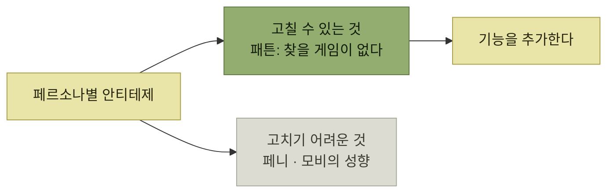

# 타깃 오디언스 기반 기능 선택

> [타깃 오디언스 이해](./README.md)

## 빠른 복습
- 앱 센터의 초기 기능은 둘이었다 — **에디터가 좋다고 판단한 새 게임을 피처**하고, **품질·친구의 활동·그가 즐기는 다른 게임과의 유사성을 조합해 사용자별 맞춤 랭킹**을 제공한다.
- **1차로 보면 세 페르소나 모두 이 속성을 마음에 들어 할** 것이다. **다들 친구와 함께 플레이하고, 누구나 어느 정도는 좋은 게임을 좋아하니까.**
- 그래서 **페르소나마다 안티테제를 써서 검증**한다.
- **고객을 얻고 싶다면, 그 고객의 문제를 완전하게 풀어** 주라. **두 페르소나에 어정쩡하게 걸치는 건, 2XL 셔츠에 S 사이즈 소매를 다는 설계와 같다.**
- **보완적인 기능을 함께 개발하는 것은 단순한 전략처럼 보이지만, 실제 개발 과정에서 그 방향을 일관되게 유지하기는 쉽지 않다.**

> [!IMPORTANT]
> **한 고객의 문제를 온전히 해결하세요**
>
> 서로 다른 페르소나를 어정쩡하게 만족시키는 기능 묶음보다 선택한 오디언스의 안티테제를 해소하는 조합에 집중한다.

## 페르소나별 안티테제

| 페르소나 | 안티테제 |
| --- | --- |
| **페니** | **강도가 낮은 캐주얼 게이머라 앱 센터에 자발적으로 들어올 만큼 능동적이지 않을 수** 있다. **친구의 직접 초대에 반응하는 쪽이 더 가깝다** |
| **모비** | **페니보다 앱 센터에 더 자주 올 가능성은 높지만, 딱히 탐험가 스타일은 아니다.** **이미 많이 투자해 둔 기존 선호 게임을 고수할 가능성**이 크다 |
| **패튼** | **자기 취향을 끄는 게임을 충분히 찾지 못하면, 앱 센터가 자리 잡기도 전에 가혹한 평가**를 내릴 수 있다 |

표를 읽는 법. **앞의 두 안티테제는 "그 사람의 성향"** 에서 나와서 우리가 손댈 수 없고, **패튼의 안티테제는 "우리 카탈로그가 빈약하다"** 에서 나와서 손댈 수 있다.

> 제 눈에는 **페니와 모비 안티테제가 더 설득력** 있어 보입니다. **일부는 앱 센터를 사용할 것이라 생각하지만, 크게 호응할 것 같지는 않습니다.** 그런데 **패튼 안티테제는 고칠 수 있어 보여요.**

*안티테제를 페르소나별로 쓰면 "고칠 수 있는 반대"와 "받아들일 반대"가 갈린다*

**패튼이 중요하게 여기는 것**은 **몰입감, 합리적인 가격, 친구들과 함께 즐기는 경험, 게임의 완성도**이며, **마음에 드는 게임이라면 기꺼이 비용을 지불할 의향**이 있다. 그래서 나온 기능이다.

- **사용자가 장르별로 게임을 필터링**할 수 있도록 해서 **패튼이 전략 게임만 찾아볼 수** 있게 한다.
- **앱 센터 출시와 함께 신규 게임을 몇 개 확보**해, **처음부터 즐길 만한 게임을 제공**한다.

**둘째 항목이 기능이 아니라 콘텐츠 조달**이라는 점이 눈에 띈다. 안티테제가 **"찾을 게임이 없다"** 였으므로, **필터를 아무리 잘 만들어도 걸릴 게임이 없으면 소용없다.**

## 초점 유지

> **고객을 얻고 싶다면, 그 고객의 문제를 완전하게 풀어 주세요.** **두 페르소나에 어정쩡하게 걸치는 건, 2XL 셔츠에 S 사이즈 소매를 다는 설계와 같습니다.** **기술적으로는 S 페르소나가 입을 수 있지만, 아무도 그걸 원하지 않죠.**

원서가 든 **보완적이지 않은 조합**의 예다.

| 조합 | 왜 안 맞나 |
| --- | --- |
| **게임이 선불 결제를 유도할 수 있게 해 주는 스토어** + **"내 농장에 와서 도와 줘" 같은 친구 게임 초대** | **각각은 나쁘지 않은 기능**이지만 **페이월이 있는 게임에 대한 초대는 전환율이 높지 않을 가능성**이 크다. **페르소나가 서로 다르기 때문**이다. **시간이 흐르면 괜찮지만, 초기 릴리스에서 집중력을 갖기엔 부족**하다 |

표를 읽는 법. **두 기능이 각각 다른 페르소나를 겨냥**하면, 함께 놓았을 때 **서로의 효과를 깎는다.** 초대는 **문턱이 낮아야** 하고 선불 결제는 **문턱을 높인다.**

방향을 유지하기 어려운 이유도 솔직히 적혀 있다.

- **앞서 제안한 세 가지 기능이 가장 쉽고 빠르게 구현할 수 있는 과제는 아닐** 것이다.
- **캐주얼 게임을 만드는 스튜디오는 새 기능을 강하게 요청할 가능성**이 크다. **우리가 미드코어 시장에 집중하느라 개발을 멈추면 그들이 조바심** 낼 수 있다.
- **사용자도 기능을 요청**할 것이다.

> 그래서 **넓게 소통하고 타깃 오디언스에 대해 모두의 합을 맞추는 일이 그렇게 중요한 것**입니다.

**요청은 계속 들어오고 대부분 합리적**이라는 것이 문제의 핵심이다. 거절의 근거가 **팀 공유 문서에 적힌 타깃 오디언스**밖에 없으므로, [앞 절의 공유 작업](./6-타깃-오디언스-선택과-공유.md)이 여기서 값을 한다.

## 함께 읽기
- [다음 절 — 결국 여러 페르소나를 타깃하게 된다](./9-다중-페르소나-제품.md)
- 7장 — 우선순위 결정은 그 장에서 더 다룬다
