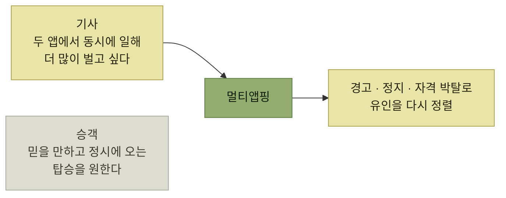

# 다중 페르소나 제품

> [타깃 오디언스 이해](./README.md)

## 빠른 복습
- **성공한 제품은 대부분 결국 여러 페르소나를 타깃**하게 된다. **다양한 페르소나에 서비스하는 일은 제품이 규모로 가는 주요 경로 중 하나**다.
- **가장 흔한 이분법은 파워 유저와 일반 사용자** 사이의 구분이다(자세히는 8장). **다른 경우엔 페르소나가 다른 범주를 대표**한다 — **패튼과 모비는 둘 다 열성 게이머이지만 디테일에서 차이가 크다.**
- **각 페르소나는 인터뷰, 우선순위 지정, 테스트, 마케팅, 샘플, 문서화에 이르기까지 제품 사이클의 단계마다 각별한 주의**가 필요하다.
- **때로 페르소나의 니즈가 잠재적으로 부딪힌다.** **상반되는 페르소나의 서로 다른 유인을 잘 다루는 일은 가장 어렵고도 가장 가치 있는 제품 문제 중 하나**다.
- **각 고객은 생태계에 가치를 가져온다.** 그 가치를 이해하고 **그 사용자를 더 많이 키우려고 공들여야** 한다.

> [!WARNING]
> **페르소나 사이의 유인 충돌을 방치하지 마세요**
>
> 다면 제품에서는 한 집단의 합리적인 행동이 다른 집단의 경험을 해칠 수 있으므로 기능보다 유인 구조를 함께 설계한다.

## 페르소나 간 충돌

| 제품 | 충돌 |
| --- | --- |
| **승차 공유** | **기사는 더 많이 벌고 싶고, 사용자는 안전하고 저렴하고 정시에 오는 탑승**을 원한다 |
| **블로그 플랫폼** | **작가는 많은 오디언스와 닿을 길**을 원하고, **독자는 좋은 읽을거리와 스팸 없는 받은편지함**을 원한다 |
| **페이스북 게임** | **개발자는 게임을 바이럴하게 퍼뜨리려고 친구 목록 같은 사용자 데이터에 접근**하고 싶어 하고, **사용자는 프라이버시를 지키고** 싶다 |

표를 읽는 법. 세 줄 모두 **한쪽의 이득이 다른 쪽의 손해**로 직결된다. 그래서 이 문제는 **기능으로 풀리지 않고 유인 설계로** 풀어야 한다.

### 멀티앱핑

저자가 직접 겪은 장면이다. **리프트를 불렀는데 지도 위의 기사 점이 점점 멀어졌다.** 결국 취소했더니 **앱이 띄운 취소 사유 다이얼로그에 '기사가 멀어지고 있음'이라는 옵션**이 있었다.

> 여기서 호기심이 발동했습니다. **왜 기사가 저런 행동을 할까? 전용 옵션이 있을 만큼 왜 이런 현상이 흔하게 발생할까?**

> 그날 오후 다시 리프트를 불렀어요. **기사가 대시보드에 휴대폰을 두 대나 붙여** 두고 있었습니다. **몇 분 뒤 저를 내려 주기 전에, 기사는 다른 승차 공유 앱을 켜더군요. 우버가 그를 다른 승객과 연결하는 걸 제 눈으로 봤습니다. 저를 내려 주기 전에요.**

*유인이 어긋난 전형적인 사례 — 기사의 합리적 행동이 승객의 경험을 망친다*

> **알아본 바로는, 리프트와 우버는 위반이 감지되면 기사에게 경고하고, 정지시키고, 자격을 박탈하기도 합니다. 유인을 다시 정렬하려는 거죠.**

### 별점 조작을 막은 설계

반대로 **저자가 뿌듯하게 여기는 예시**다. 앱 센터의 별점을 도입할 때 **게임 개발자가 별점 시스템을 악용하지 않고, 더 많은 사용자가 즐기고 싶어 하는 좋은 게임을 만드는 데 집중하도록** 하고 싶었다.

> **우리는 개발자가 사용자의 평가 시점과 평가 대상자를 통제하지 못하게** 했습니다. **그래서 홈페이지 첫 화면의 뉴스피드와 사이드바에 노출하는 방식으로 타이밍과 표본을 우리 쪽에서 통제**했습니다. **편향 없는 무작위 표본 기법 덕분에, 게임을 즐긴 사용자와 그렇지 않은 사용자 모두의 평점이 섞여** 들어왔습니다. **대개 3에서 4.5 사이의 넓은 별점 분포**가 나왔습니다.

| | 누가 타이밍과 표본을 정하나 | 결과 |
| --- | --- | --- |
| **앱 센터** | **플랫폼** | **3~4.5의 넓은 분포.** 평점이 **의미 있어 보였다** |
| **애플 앱스토어** | **개발자** — **"이 앱이 마음에 드시나요?"에 "예"라고 답한 사용자에게만 평가를 요청** | **예전엔 평점이 낮은 유명 앱들이 있었지만, 지금은 정치적 논란이나 대형 결함이 아니라면 거의 모두 4.5 이상.** **평점은 사실상 무의미해졌다** |

표를 읽는 법. **같은 기능(별점)이 표본 통제권을 누가 갖느냐에 따라 정반대 결과**를 낸다. **개발자에게 유도할 자유를 주면 그것을 쓰지 않는 개발자가 손해**를 보므로, 결국 모두가 유도하게 되고 **지표는 붕괴**한다.

## 고객의 가치 이해

> **각 고객은 생태계에 가치를 가져옵니다.** **콘텐츠를 쓰거나, 버그 리포트를 보내거나, 재화와 서비스를 제공하거나, 돈을 내서 제품 개선에 쓰일 자금**을 만들어 줄 수 있어요.

- **위키피디아 편집자는 전체 독자에 비하면 수가 적다.** 그래도 **그들이 없다면 사이트가 무너진다는 점에서 임팩트는 막강**하다.
- **페이스북 게임에서 페니는 매출에 기여하지 않았지만, 생태계에 가치를 가져오지 않은 건 아니다.** **페니는 게임이 임계 질량을 얻도록 도와서, 모비처럼 기꺼이 돈을 쓰는 다른 페르소나를 끌어들였다.** **지금은 이 논리가 분명해 보이지만, 프리투플레이 게임이 큰돈을 벌기 시작했을 때 세계는 놀랐다.**
- **가치는 시장 요인에 따라 역동적으로 바뀐다.** **승차 공유에서 기사의 가치는 기사가 귀할 때 더 높고**, **이때 기사 보수를 높이면 더 많은 기사가 운전대를 잡는다.**

**"돈을 안 내는 사용자의 가치"** 를 계산하는 사고가 이 절의 핵심이다. [앞 절](./8-타깃-오디언스-기반-기능-선택.md)에서 페니의 안티테제가 설득력 있었음에도 페니를 논페르소나로 내치지 않은 이유이기도 하다.

## 페르소나 간 우선순위 결정

> **플랫폼에 콘텐츠 생산자와 독자가 있다면, 둘 다 꾸준히 키워야** 합니다. 그래도 **어느 한쪽이 더 즉각적인 관심을 필요로 하는 시기가 반드시** 옵니다.

원서의 현재형 사례는 **스택 오버플로**다.

> 과거에 이들은 **피드백, 평판 시스템, 특별 메시지 보드, 업적 같은 유인으로 '답변자' 페르소나에 깊이 집중**했습니다. **업보트를 받고 자기가 도움이 된다고 느끼는 건 기분 좋은 일**이었습니다.

> 그러나 **AI 어시스턴트 때문에 방문자는 줄어들었고, 답변자들이 받는 보상도 줄어들었습니다.** **이들의 기여는 여전히 중요했고, 어쩌면 예전보다 더 중요해졌다고도 볼 수** 있습니다. **AI가 그 답변들을 읽고 활용하고** 있었으니까요. **하지만 내 답변을 AI가 실제로 썼는지 어떻게 알 수 있을까요?** **기여가 줄어들면 미답변 질문이 쌓이면서, 결국 AI가 내놓는 답변의 품질도 함께 떨어질 수** 있습니다.

**보상 경로가 끊긴 페르소나**의 사례다. 기여의 가치는 그대로인데 **그 기여가 누구에게 닿았는지 보이지 않게** 되면서 유인이 사라졌다.

> 소프트웨어 엔지니어링 커뮤니티는 **이 유인을 다시 균형** 잡아야 합니다. **질문에 답하는 사람들에게 애정을 보여 주고, 동시에 그 답변이 실제로 필요로 하는 사용자에게 잘 전달되도록** 해야 합니다.

## 함께 읽기
- [다음 절 — 요약과 지도 앱 연습](./10-요약과-예제.md)
- [2장 다중 페르소나](../02-제품-내-사용자-안내/4-발견-시나리오-점진적-공개와-다중-페르소나.md) — 한 UI 안에서 여러 페르소나를 다루는 방법
