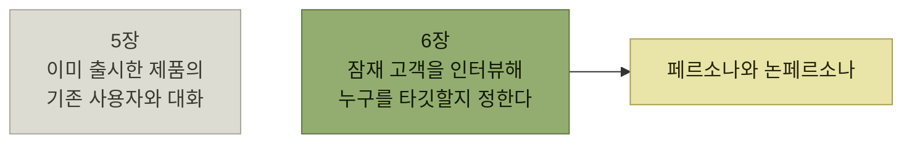

# 타깃 오디언스 이해

> [AI 시대의 엔지니어링 전략](../README.md)

## 두루뭉술한 누군가가 아니라 특정한 누군가

> **고객에게 무엇이 필요하고 무엇을 원하는지 그냥 물어볼 수는 없습니다. 인지 편향이 끼어들어 답을 흐리거든요.** 그래서 우리는 **구체적인 이야기 안으로 들어가, 그 사람의 요구와 고충, 바람에 귀를 기울여야** 합니다.
> — 테레사 토레스, 『Continuous Discovery Habits』 저자

> AI 시대 엔지니어의 **관점이 결정적으로 바뀌는 지점**은 여기입니다. **두루뭉술한 누군가가 아니라, 특정한 누군가를 위해 만들기 시작할 때**죠.

> **누군가를 위해 만들어 보세요.**

> **말은 간단합니다.** 그런데 **주의를 끄는 일이 너무 많아서, 실제로는 꾸준히 의식해야 지킬 수** 있습니다. **해달이 먹이를 찾아 잠수했다가도 숨 쉬러 수면 위로 올라오듯이요.**

> [!IMPORTANT]
> **특정한 누군가를 위해 만드세요**
>
> 두루뭉술한 사용자가 아니라 관찰하고 인터뷰한 실제 사람의 문제와 동기를 기준으로 결정한다.

## 5장과 무엇이 다른가

*[5장](../05-지속적인-사용자-이해/README.md)은 이미 만든 것을 다듬으려 기존 사용자와 대화했다. 이 장은 첫 만남이다*

> 이렇게 모은 정보로 **페르소나와 논페르소나non-persona를 만듭니다.** 이 페르소나가 **팀의 손과 발을 끌어** 줍니다. **비전을 단단히 세우고, 큰 의사 결정을 흔들림 없이 내리게** 도와줄 것입니다.

## PART 3이 하는 일

**시나리오는 페르소나와 시뮬레이션이라는 두 요소로 이뤄지므로, 이 파트도 두 개의 장으로** 나뉜다.

| 장 | 무엇을 |
| --- | --- |
| **6장** | **고객을 인터뷰하며 상대할 페르소나의 모습을 구체적으로** 그린다 |
| **7장** | **사용자가 하고 싶어 하는 일을 둘러싼 온전한 이야기를 만들어 내고, 그 이야기를 우선순위가 매겨진 요구 사항으로** 옮긴다 |

표를 읽는 법. [1장](../01-프로덕트-사고의-기본/README.md)이 정의한 **시나리오 = 캐릭터 + 시뮬레이션**이라는 구조가 그대로 PART 3의 목차가 된다.

## 목차

- [가상이 아닌 실제 사용자](./1-가상이-아닌-실제-사용자.md)
- [제품 테제와 안티테제](./2-제품-테제와-안티테제.md)
- [고객 발견 인터뷰](./3-고객-발견-인터뷰.md)
- [질문 스크립트와 응답 분석](./4-질문-스크립트와-응답-분석.md)
- [세일즈 콜과 서베이, 그리고 네트워킹](./5-세일즈-콜과-서베이-그리고-네트워킹.md)
- [타깃 오디언스 선택과 공유](./6-타깃-오디언스-선택과-공유.md)
- [앱 센터의 페르소나와 논페르소나](./7-앱-센터의-페르소나와-논페르소나.md)
- [타깃 오디언스 기반 기능 선택](./8-타깃-오디언스-기반-기능-선택.md)
- [다중 페르소나 제품](./9-다중-페르소나-제품.md)
- [요약과 예제](./10-요약과-예제.md)

## 이 장의 사례 — 페이스북 앱 센터

> **2010년대 초, 저는 페이스북에서 앱 센터App Center의 설계와 출시를 맡았습니다.** 앱 센터는 **사용자가 소셜 앱, 주로 게임을 발견하게 도와주는 포털**이었어요. **추천 앱과 랭킹을 갖춘 오늘날의 앱 스토어와 비슷한 개념**이었죠.

> 이 프로젝트를 고른 이유가 있습니다. **사용자 페르소나와 개발자 페르소나의 조합이 어떻게 전략적 의사 결정을 이끌었는지 흥미롭게 보여** 주거든요. **앱 센터가 임팩트를 낼 수 있었던 건, 팀의 엔지니어와 PM, 디자이너가 우리 타깃 오디언스를 함께 이해했기 때문**입니다. **페이스북의 게이밍 지표를 끌어올렸고, 개발자들의 매출도 함께** 올랐습니다. **그 성공은 몇 해 이어졌고, 모바일 게이밍이라는 거대한 파도가 모든 걸 쓸어 가면서 막을 내렸습니다.**

## 함께 읽기

- [1.6 페르소나](../01-프로덕트-사고의-기본/6-시나리오의-구성-페르소나.md) — 이 장은 그 구성 요소를 **실제 인터뷰로 채우는 방법**이다.
- [2장 다중 페르소나](../02-제품-내-사용자-안내/4-발견-시나리오-점진적-공개와-다중-페르소나.md) — 여러 페르소나를 **한 제품 안에서 어떻게 다룰지**는 그 장에서 먼저 나온다.
- [5.3 사용자 피드백 수집](../05-지속적인-사용자-이해/5-사용자-피드백-수집.md) — 출시 후 대화. 이 장의 인터뷰는 **출시 전** 대화다.
