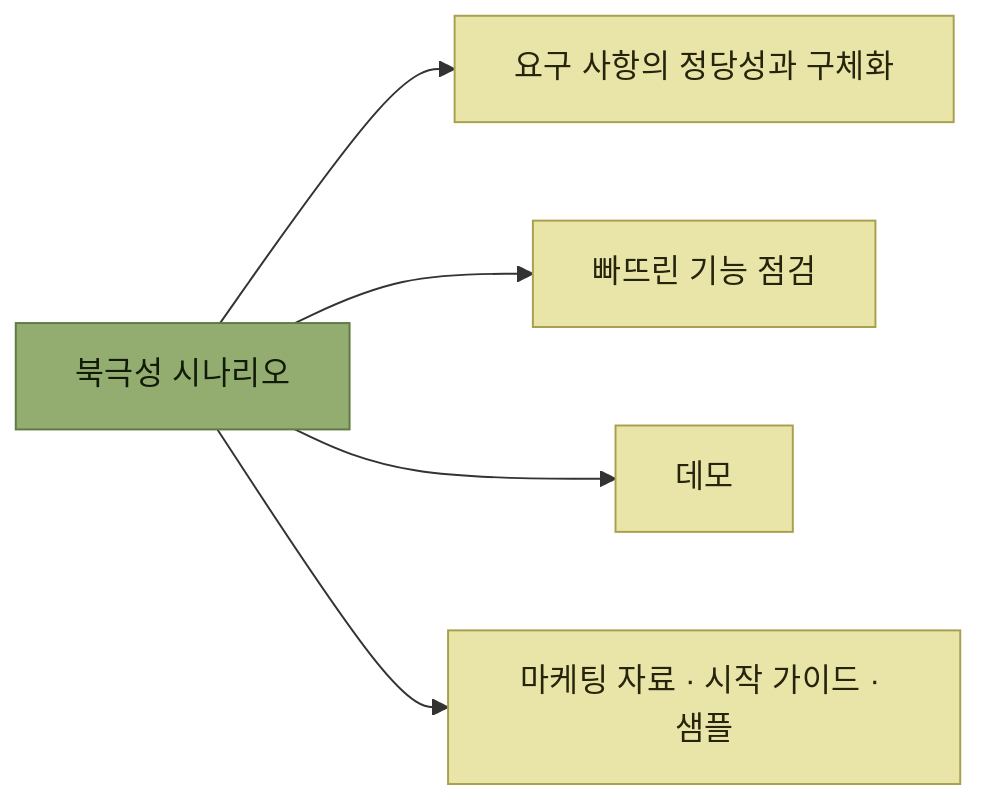
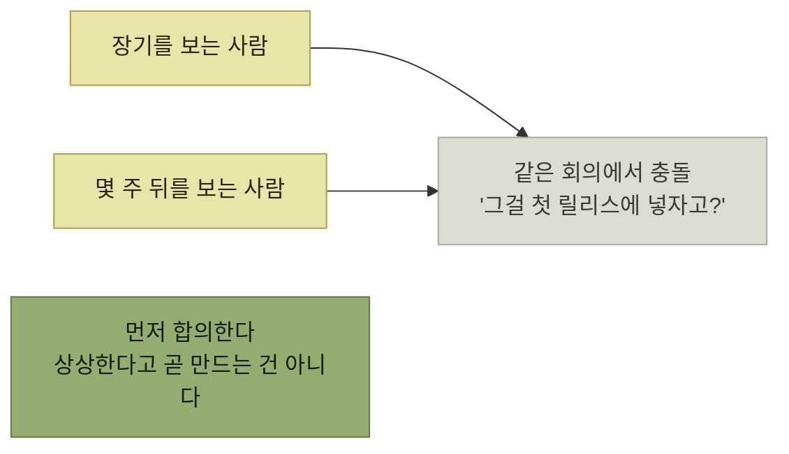

# 북극성 시나리오와 SDD

> [시뮬레이션을 통한 제품 탐색](./README.md)

## 빠른 복습
- **SDD(시나리오 주도 발견)는 발견 프로세스 전반에서 시나리오를 사용하는 실천법**이다. **용어는 저자가 만들었지만 실천 자체는 새로운 것이 아니며**, 가장 가까운 개념은 **시나리오 기반 설계**다.
- 같은 것이 문서마다 다른 이름으로 불린다 — **PRD에서는 미세한 단위의 '요구 사항'**(애자일에서는 **'스토리'**), **제품 명세에서는 '사용자 흐름'이나 '스토리보드'**.
- 브레인스토밍에서 자주 어긋나는 이유는 **사람마다 종종 무의식 중에 발견 작업의 시간 범위를 다르게 잡고** 있기 때문이다.

> [!NOTE]
> **북극성 시나리오는 제품의 핵심 사례입니다**
>
> 제품 라이프 사이클 전체에서 계속 염두에 두고, 누군가 작업 내용을 물으면 이 이야기로 설명한다.

## 왜 시나리오에 기대는가

| 이유 | 내용 |
| --- | --- |
| **왜(why)를 명확하게** | **캐릭터의 필요성을 부각**함으로써 **요구 사항과 원래 의도 사이의 정렬**을 지켜 준다 |
| **빈틈을 드러낸다** | **포괄적인 이야기를 비춰 주므로 중요한 기능이나 엣지 케이스를 발견할 가능성**이 높아진다 |
| **오해가 적다** | **이야기는 추상적인 요구 사항 목록보다 오해의 소지가 적다.** **모두가 공유하는 일련의 이야기는 팀원들 간의 의견 일치**에 도움이 된다 |
| **디버깅하기 쉽다** | **요구 사항 목록을 디버깅하기보다 시나리오에서 줄거리의 빈틈을 찾는 편이 더 쉽다** |

표를 읽는 법. 넷째 줄이 가장 실용적이다. **"요구 사항 12번이 빠졌다"는 눈에 안 띄지만 "그다음에 사용자는 어떻게 하지?"에 답이 없으면 바로 보인다.**

## 북극성 시나리오의 쓰임

> **북극성 시나리오는 제품 요구 사항에 정당성을 부여하고 구체화하는 데 기여**합니다. **나중에는 이 이야기를 기준으로 빠뜨린 기능이 없는지 점검하고 데모를 만들게** 됩니다. **제품에 따라 마케팅 자료, 시작 가이드, 샘플로도 이어질 수** 있어요.

*하나의 이야기가 요구 사항·점검·데모·문서로 계속 재사용된다*

**[4장의 시작 가이드·샘플](../04-자사-제품-체험/4-문서-주도-개발-문서의-종류.md)이 여기서 미리 예고**된다. 발견 단계에서 쓴 이야기가 **출시 때 마케팅 문구가 되는** 경로다.

## 팀으로 시나리오를 브레인스토밍하기

> **모든 엔지니어가 완성된 유저 스토리를 작성하는 것을 좋아하는 것은 아닙니다.** **낯설다는 이유로 어려워하는 사람도 있고, 이야기를 처음부터 짓기보다 비판하는 데 더 익숙한 사람도** 있습니다.

> 이러한 차이를 극복하는 한 가지 방법은 **함께 작업하는 것**입니다. **한 시나리오에서 한 명이 뼈대를 쓰고, 다른 한 명이 살을 붙이는 방식**이 가능해요. **모두가 공동 주인의식과 장인정신을 공유하며 자리를 떠납니다.**

**"비판하는 데 더 익숙한 사람"을 결함이 아니라 역할로 본다**는 점이 좋다. [다음 절](./3-북극성-시나리오-쓰기.md)에서 **이야기를 디버깅하는 일도 못지않게 값지다**고 다시 못박는다.

### 시간 범위를 먼저 맞춘다

> 수년간 배운 교훈 하나는, **사람마다 종종 무의식 중에 발견 작업의 시간 범위를 다르게 잡고 있다**는 점입니다. **어떤 사람은 장기를 보고, 어떤 사람은 몇 주 뒤를** 봅니다.

*"지금 상상하는 것이 곧 만들 것은 아니다"를 미리 합의해 둔다*

> **브레인스토밍을 할 때는 사람들이 미래를 자유롭게 상상할 수 있도록** 해야 합니다. **누군가 한 이야기에 예산이 많이 들어가는 기능을 얹고 싶어 한다고 해서 그게 곧 만들어진다는 뜻은 아닙니다.** **이 점을 팀과 미리 합의**해 둡니다. 그러면 **모든 기능을 첫 번째 릴리스에 억지로 넣으려 한다고 생각하는 사람들과의 불필요한 갈등**을 줄일 수 있습니다.

목표는 둘이다 — **최고의 아이디어를 놓치지 않게 많은 아이디어를 확보하는 것**, 그리고 **각 마일스톤이 더 긴 비전을 향해 움직이도록 앞을 내다보는 로드맵을 만드는 것.**

> **브레인스토밍은 즐거워야** 합니다. 애자일에서는 흔히 **'포스트잇' 활동**을 활용합니다. **작은 스토리를 색색의 포스트잇에 작성한 뒤 주제별로 분류하고 좋은 아이디어를 선택**하는 방식입니다. 팀에 맞는 방법을 쓰되, **최종적으로는 몇 개의 북극성 시나리오를 정리한 공유 문서로 마무리**하는 것이 좋습니다.

## 함께 읽기
- [다음 절 — 헬피의 북극성 시나리오들](./3-북극성-시나리오-쓰기.md)
- [1.4 시나리오의 여섯 가지 용도](../01-프로덕트-사고의-기본/4-시나리오의-여섯-가지-용도.md)
