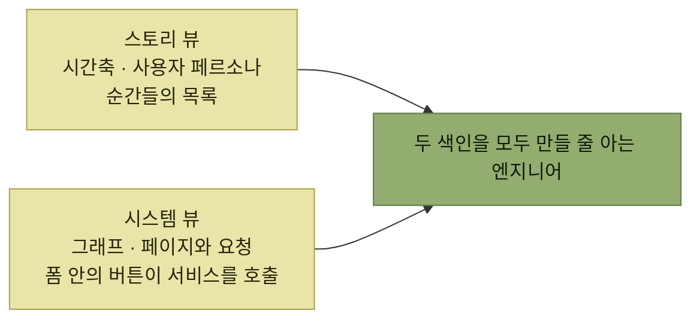

# 요구 사항으로 옮기기 - 대대적인 재색인

> [시뮬레이션을 통한 제품 탐색](./README.md)

## 빠른 복습
- **유저 스토리를 데이터베이스 테이블에 넣는다고 상상**해 보라. **사용자 페르소나에 연결된 순간들의 목록이 시간 순서**로 담긴다. **제품을 지나는 사용자 여정을 생각하는 방식으로는 훌륭**하다.
- **그런데 시스템 설계를 표현하는 데는 덜 유용**하다. **시스템은 그래프 데이터베이스에 더 가깝다** — **페이지 안에 폼이 있고, 폼 안에 버튼이 있고, 그 버튼을 누르면 API 게이트웨이가 스토리지 시스템과 통신하는 서비스를 호출**하는 식이다.
- 그래서 **발견에서 디자인으로 넘어가는 과정은 시간·이야기 기반 표현에서 그래프·시스템 기반 표현으로의 엄청난 재색인reindexing**이다.
- **가장 다재다능한 엔지니어는 머릿속에 두 색인을 다 만들 줄** 안다.
- **이 재색인은 대개 고수준의 요구 사항과 설계 원칙에서 시작**된다.

> [!IMPORTANT]
> **이야기와 시스템의 두 색인을 함께 유지하세요**
>
> 사용자 여정의 시간축을 시스템 구성 요소의 그래프로 옮기되 원래 동기와 가치가 사라지지 않게 연결한다.

## 두 개의 색인

*[그림 7-2]와 [그림 7-3]은 같은 제품(로그인 화면)의 두 가지 대안 표현이다*

| 색인 하나만 만들 수 있으면 | 원서의 진단 |
| --- | --- |
| **첫 번째(스토리)만** | **프로덕트 매니저에 가깝습니다** |
| **두 번째(시스템)만** | **한 사람에게 의존해야 하고, 그 사람과 의사소통하는 데 애를 먹을 것입니다** |

표를 읽는 법. 둘째 줄이 엔지니어에게 하는 말이다. **시스템 색인만 있으면 남이 번역해 줘야** 하고, **번역 과정에서 의도가 새어 나간다.**

> **이 두 관점 간의 전환은 특히 중요하며 PM과 엔지니어가 서로의 표현을 제대로 이해하지 못할 때 오해가 빈번하게 발생**하기도 합니다.

## 고수준 요구 사항과 설계 원칙

> **고수준 요구 사항과 설계 원칙은 우리가 디자인을 통해 '달성하고자 하는 목표'를 명확히 하는 요약집**입니다. **어떤 페르소나를 우선할 것인가? 수익 창출을 목표로 하는가, 아니면 사용 편의성을 중시하는가?** 이러한 기준은 **모든 세부 유스 케이스를 살펴볼 수 없는 사람들과도 원활하게 소통하고 신뢰를 쌓는 기반**이 됩니다.

케이블타운의 예다.

- **프로덕트 브리프에 따라, 수익은 중립을 유지하면서 사용자 만족을 높이고 지원 부담을 낮추려** 한다.
- **첫 마일스톤에서는 기술 지원 상호작용에 초점**을 맞춘다.
- **느린 인터넷 진단처럼 가장 빈도 높은 작업을 먼저** 노린다. **헬피가 자신의 전문 영역을 벗어난 걸 감지하면, 돕기보다 사람 상담원에게 위임**한다.
- **초기에 안전에 집중해서, 때로는 가능한 만큼 돕지 못하더라도 헬피를 명확한 안전 범위 안에** 둔다.

> **서로 다른 두 원칙 사이에서 절충하는 지점을 제가 일부러 드러내고 있다는 점**을 눈치채셨을 겁니다. **이걸 드러내면 흥미롭고 논쟁적인 지점이 되어 좋은 토론을 끌어냅니다.**

**"돕는 것"과 "안전한 것"이 충돌한다는 사실을 숨기지 않고 원칙에 적어 둔 것**이 요령이다. 감춰 두면 그 충돌은 **구현 단계에서 개별 엔지니어의 즉흥적 판단**으로 해결된다.

> 이걸 **PRD 맨 앞에 배치**하면, **독자들은 이후 내용을 훨씬 쉽게 이해**할 수 있습니다.

## PRD

> **PRD가 뜻하는 바는 회사마다 조금씩 다릅니다.** 어떤 팀은 **이 안에 제품 명세까지 포함**하기도 합니다. **PRD에 설계를 어디까지 담을지는 모호한 영역**입니다. **특히 큰 프로젝트에서는 팀과 명확히 맞춰 두는 게** 좋습니다.

| | 목적 |
| --- | --- |
| **PRD** | **엔지니어와 UI 디자이너가 세부 설계 작업에 들어갈 수 있도록 지원** |
| **제품 명세** | **구현 과정을 원활하게** |

표를 읽는 법. 이 구분 때문에 **PRD는 '무엇을'에 비중을 두고 '어떻게'는 가볍게** 다룬다. PRD가 담는 것은 넷이다.

- **고수준 제품 요구 사항과 설계 원칙**
- **미세한 단위의 제품 요구 사항** — **사용자가 원하는 구체적 상호작용을 모두 기록한 유스 케이스 요약집 또는 스토리 요약집**
- **첫 릴리스에 어떤 기능을 넣을지 고르는 마일스톤 정의**
- **적절한 팀과 이해관계자 소집**(이 책의 범위 밖)

## 함께 읽기
- [다음 절 — 요구 사항을 어떻게 쓰나](./5-유스-케이스-요약집.md)
- [『아키텍트 첫걸음』 3.2 아키텍처 드라이버](../../아키텍트-첫걸음/3-아키텍처-설계/2-아키텍처-드라이버의-핵심-사항.md) — 요구 사항을 설계 입력으로 정리하는 다른 어휘
