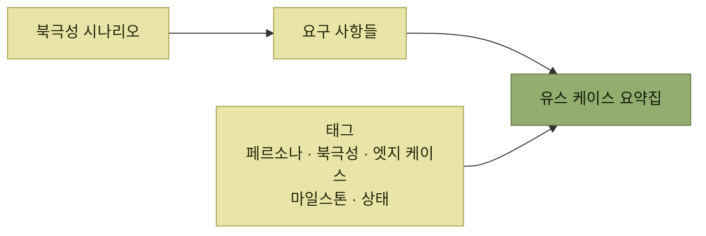

# 유스 케이스 요약집

> [시뮬레이션을 통한 제품 탐색](./README.md)

## 빠른 복습
- **각 요구 사항을 사용자 관점에서 쓰기 때문에 유스 케이스 요약집**이라 부른다. 흔한 템플릿은 둘이다.
	- **[사용자]가 [행동]을 할 수 있으며, 이로써 [동기]를 이룬다.**
	- **[제품]이 [기능]을 제공해 [사용자]가 [가치를 얻는다].**
- **요구 사항 작성의 기술은 무엇이 일어나야 하는지 말하면서도 어떻게를 지나치게 규정하지 않는 데** 있다.
- **모든 요구 사항을 앞에서 한 번에 다 찾아내는 게 이상적이긴 하지만, 실제로는 반복하면서 더 많은 요구 사항이 추가**된다. 그래서 **유스 케이스 요약집은 프로젝트 운영에서 핵심적인 역할을 하는 문서**가 된다.
- **규모가 있는 프로젝트라면 체계적으로 정리하고 태그를 달아 두는 게 유리**하다.

> [!CAUTION]
> **무엇을 적되 어떻게를 고정하지 마세요**
>
> 유스 케이스는 사용자가 얻을 가치와 필요한 동작을 명확히 하면서 구현 선택의 여지를 남긴다.

## 요구 사항 하나를 뜯어보기

첫 요구 사항은 이것이다 — **새드 리사는 기술 지원을 찾을 때 로그인하지 않고도 홈페이지에서 헬피를 쉽게 찾을 수 있습니다.**

| 원칙 | 이 문장에서 |
| --- | --- |
| **명확하고 모호하지 않게 전달할 만큼 구체적** | **"헬피는 발견 가능하다"가 아니라, 로그인 없이 홈페이지에 특정하게 있다**고 썼다 |
| **의도를 드러낸다** | **헬피가 홈페이지에 있다는 정도가 아니라, 이게 발견 가능성에 관한 것임을 분명히** 한다. **홈페이지에 두는 게 까다롭다면 엔지니어가 되돌아와서 대안을 찾을 수** 있다 |
| **설계의 여지를 남긴다** | **홈페이지의 어느 위치나 메뉴에 놓이는지 지정하지 않고, 발견 가능하고 로그인 전이어야 한다고만** 말한다 |

표를 읽는 법. 둘째 줄이 핵심이다. **의도가 적혀 있어야 나중에 그 요구 사항을 다르게 만족시킬 수** 있다. 의도 없이 결과만 적으면 **그 결과가 불가능해질 때 요구 사항 자체가 버려진다.**

> 때로는 **지시적인 어조를 피하면서 명확하게 설명하기가 어려울 때**가 있어요. 이럴 때는 **"홈페이지에 둔다(예: 우측 하단에 떠 있는 채팅봇 버튼)"** 처럼 **예시를 덧붙**입니다.

## 나머지 요구 사항들

'고객 하드웨어 문제' 북극성에서 뽑아낸 것들이다.

- **헬피는 소프트웨어부터 하드웨어, 서비스 중단 등 다양한 원인으로 인한 인터넷 속도 저하 문제를 진단하는 과정에서 리사를 효율적으로 안내**할 수 있다.
- **헬피가 지원 데이터베이스에서 배운 가장 성공적인 조치를 리사에게 제안**해야 한다.
- **헬피가 리사에게 무엇이 효과가 있었는지 묻고, 기술 변화에 맞춰 계속 학습**해야 한다.
- **결정적인 조치가 나오지 않았을 때, 리사가 포기하지 않도록 채팅 종료 전에 후속 조치를 제안**할 수 있어야 한다.
- **리사에게 만족도 설문을 제시해 결과를 추적**할 수 있어야 한다.
- **헬피가 만족도 설문으로 학습해 시간이 갈수록 더 효과적**이 될 수 있어야 한다.

**책임 위임과 관련된 요구 사항**도 몇 개 더 있다.

- **지원 관련 요청인지, 세일즈 관련 요청인지 헬피가 95% 정확도로 판별**할 수 있어야 한다.
- **헬피가 사용자의 좌절을 사람 상담원만큼 최소 90% 정확도로 감지하고 사람에게 위임**할 수 있어야 한다.
- **사람 상담원이 대화를 이어받을 때 헬피와 상의함으로써, 상담원이 제공하는 지원 품질이 최소한 헬피 수준만큼 우수하도록 보장**할 수 있어야 한다.

> 여기서 **고른 수치는 다소 임의적이고, 정확히 뭐가 달성 가능한지도 아직 모를 수** 있습니다. **대략적인 목표치를 잡은 것**입니다. **에이전트 품질 평가, 이른바 평가로 책임을 지울** 거예요. **이 수치 근처에도 못 가면 접근을 재고**합니다.

**숫자가 임의적임을 인정하면서도 적어 두는 이유**가 마지막 문장에 있다 — **재고할 기준선**이 필요하기 때문이다. 숫자가 없으면 **"그럭저럭 되는 것 같다"** 로 흘러간다.

마지막 요구 사항 하나는 뒤에서 다시 나온다 — **새드 리사가 집 인터넷이 아닌 모바일 기기에서 헬피를 사용할 수 있어, 장애 중에도 지원을 받을 수 있어야 한다.**

## 요약집을 정리하는 법

**계획 시스템의 티켓으로 만들 수도** 있고(**지라의 스토리 티켓 타입**), **스프레드시트나 노션처럼 데이터베이스 테이블이 내장된 앱**으로 관리할 수도 있다. 태그는 이렇게 붙인다.

| 태그 | 쓰임 |
| --- | --- |
| **페르소나** | **새드 리사용 지원 요구 사항 섹션, 팅커 티아용 영업 요구 사항 섹션으로 나누면 초점**을 맞추기 쉽고 **페르소나 기반으로 우선순위**를 정할 수도 있다 |
| **북극성 시나리오** | **특정 시나리오의 약속을 완성하는 데 필요한 모든 요구 사항을 조회** |
| **엣지 케이스** | **중요하지만 읽고 이해할 필요가 있는 사람은 더 적다.** **필터로 숨길 수 있게** |
| **마일스톤** | **우선순위를 정하고 로드맵을 짤 때** |
| **상태** | **프로젝트 추적용** |
| **코멘터리** | 필요한 추가 정보 |

표를 읽는 법. **북극성 태그가 이 표의 심장**이다. 그 태그가 있어야 **"이 시나리오를 완성하려면 무엇이 더 필요한가"** 를 한 번에 조회할 수 있고, [하나의 북극성에 집중하는 우선순위 전략](./7-첫-마일스톤-정하기.md)이 가능해진다.

*이야기 하나가 여러 요구 사항으로 쪼개지고, 태그가 그것을 다시 묶는다*

원서의 [표 7-1]은 **요구 사항 · 마일스톤 · 페르소나 · 북극성** 네 열을 갖는데, **마일스톤 열은 아직 비어** 있다.

> **요구 사항뿐 아니라 머릿속까지 재색인하는 길에 꽤 와 있습니다.** **시스템 구성 요소가 이 요구 사항들에 어떻게 붙을지 보이기 시작하면서도, 우리가 왜 이걸 추적하고 있는지 원래 이유는 놓치지 않았습니다.**

> 다만 **상세 설계를 시작하기 전에, 저 비어 있는 우선순위 열을 채워야** 합니다.

## 함께 읽기
- [다음 절 — 무엇을 기준으로 우선순위를 매기나](./6-우선순위의-기준과-네-가지-잔혹한-진실.md)
- [앞 절 — 이 요구 사항들이 나온 이야기](./3-북극성-시나리오-쓰기.md)
