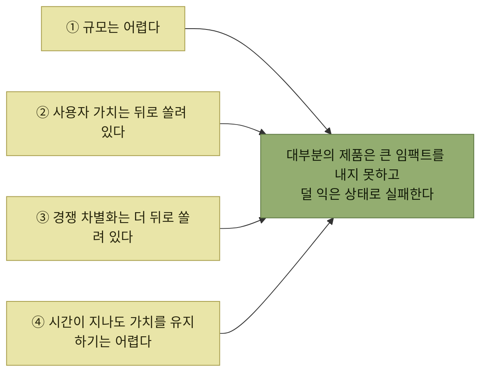

# 우선순위의 기준과 네 가지 잔혹한 진실

> [시뮬레이션을 통한 제품 탐색](./README.md)

## 빠른 복습
- **우선순위화는 우리 일에서 가장 어렵고 영향력 있는 부분 중 하나**다. **뭐가 중요한지에 대해 모두가 자기 시각이 있고, 주의가 쉽게 흐트러진다.**
- 근본 기준은 둘 — **사용자에게 미치는 영향**과 **소요되는 노력**. **가성비bang-for-the-buck를 최적화**한다.
- **너무 단순해서 굳이 말할 필요도 없어 보일 수** 있지만, **실제로는 초점을 유지하는 게 미로를 빠져나가는 것과 비슷**하다.
- **사용자에게 가치 있는 무언가를 만드는 일이 얼마나 어려운지 보여 주는 네 가지 '잔혹한 진실'** 이 있다.

> [!NOTE]
> **사용자 임팩트 = 사용자 가치 × 규모 × 시간**
>
> 우선순위는 기능 수가 아니라 얼마나 큰 가치를 몇 명에게 얼마나 오래 전달하는지를 기준으로 판단한다.

## 뱅과 벅

> **냉정해진다는 건 사용자가 투입한 노력 대비 얻을 수 있는 가치에 계속 집중하는 것**입니다.

**초점을 흐리는 것들**을 원서가 나열한다 — **인간관계의 갈등과 조직 이슈, 자존심, 특정 고객과의 약속, 직원마다 다른 인센티브.**

| 치우침 | 모습 |
| --- | --- |
| **벅(비용)에 치우침** | **더 빨리 내놓으려 코드를 덜 쓰고 코드베이스를 단순하고 유지 보수하기 좋게 지키는 쪽**을 좋아한다. **사용자가 쓰기 어려워지거나 도입률이 떨어져도** |
| **뱅(성과)에 치우침** | **완벽한 제품을 원해서 그 밑바닥에서 무슨 일이든 마다하지 않는다** |

> **지혜란 이 둘의 균형을 제대로 맞추는 일입니다.**

### 전체 비용을 본다

> 팀이 **1000시간을 들여 인류에게 500시간의 가치를 돌려주는 데 그친다면, 세상은 더 좋아지지 않았을 가능성**이 큽니다.

**엔지니어링 비용만이 아니라 전체 비용all-up cost**을 생각해야 하며, 이 원칙은 **양쪽으로 다 작동**한다.

| 방향 | 놓치기 쉬운 것 |
| --- | --- |
| **만들 때의 비용** | **주니어 엔지니어는 해피 패스의 프로덕션 코드 분량만 떠올리기 쉽다.** **엣지 케이스 방어적 코딩, 시나리오 테스트, 문서화, 도그푸딩, 배포, A/B 테스트, 마케팅** 같은 비코딩 작업은? |
| **만들지 않았을 때의 비용** | **헬피가 해서는 안 되는 말을 하지 못하도록 프로그래밍 차원의 안전장치를 하나도 넣지 않기로 했다면**, 선을 넘었을 때 **사용자 지원 팀, 홍보 팀, 법무 팀에 압박**이 몰린다 |

표를 읽는 법. 윗줄은 **범위가 야금야금 늘어나는 현상**을 막아 준다 — **"이건 금방 추가하면 돼"라는 생각이 들거든, 옆자리의 친근한 PM에게 물어보라.** 아랫줄은 반대로 **안 만들기로 한 결정에도 청구서가 따라온다**는 것을 상기시킨다.

## 사용자 임팩트와 효용 함수

> **사용자 임팩트는 규모reach와 사용자 1인당 가치를 곱한 값**입니다. **정해 놓은 기간 동안 계산**되죠.

**사용자 임팩트는 효용 함수utility function로 추정**할 수 있다. **어떤 기능이 포함됐을 때 사용자가 얻는 가치가 얼마인지를 그래프로** 보여 준다.

> 아쉽게도, **일반적인 효용 함수의 수학은 상당히 가혹**합니다. **큰 임팩트를 내기 전에 많은 일을 해야 한다**는 뜻입니다.

## 네 가지 잔혹한 진실

*네 가지가 함께 작동해 "쓸 만한 것"의 문턱을 높인다*

### ① 규모는 어렵다

> **몇 명에게만 크게 쓸모 있는 걸 만드는 건 그리 어렵지 않아요.** 하지만 **많은 사람에게 통하려면 발견 가능하고, 유용하고, 쓰기 쉽고, 마케팅이 잘 되고, 규모에 견디고 견고**해야 합니다. 뒤집어 말하면, **홈페이지의 글꼴은 쉽게 바꿀 수 있고 도달 범위는 크지만 별로 도움은 안 됩니다.**

**규모와 깊이가 서로를 밀어낸다**는 관찰이다. 글꼴 변경은 규모는 최대인데 1인당 가치가 0에 가깝고, 그 반대도 마찬가지다.

### ② 사용자 가치는 뒤로 쏠려 있다

> **제품이 기능을 쌓아 갈 때 효용 함수는 선형이 아닙니다. 기능이 임계 질량에 도달하기 전까지는 쓸모가 없거든요.**

**자전거**가 예시다. **바퀴가 두 개이고, 브레이크가 있고, 핸들바로 방향을 틀 수 있고, 언덕을 오를 때 기어를 바꿀 수 있어야 비로소 쓸 만하다.**

*[그림 7-4] 자전거의 효용 함수 — 가치는 오른쪽 끝에서야 치솟는다*

> **처음 몇 개 기능은 '체크박스' 기능일 수 있어서 훌륭하지 않아도 됩니다. 다만 있어야 합니다.** **죽고 싶은 게 아니라면 브레이크가 필요**합니다. **외바퀴 균형 훈련을 전문으로 하는 게 아니라면 바퀴가 하나 더** 있어야 합니다.

**"훌륭하지 않아도 되지만 없으면 안 되는 기능"** 이라는 범주가 유용하다. 여기에 공을 들이는 것은 낭비이고, 빼는 것은 치명적이다.

### ③ 경쟁 차별화는 더 뒤로 쏠려 있다

> **완전히 새로운 걸 발명하는 게 아니라면, 어떤 시장에 진입할 때 누군가가 여러분을 진지하게 봐 주기 전에 일정한 임계 기능 수준을 갖춰야** 하는 경우가 많아요. **그리고 그 위에 또 하나, 새 기능이든 낮춰진 비용이든 뭔가를 더 얹어야** 합니다. **때로는 제품을 다시 짜서 이전 버전과 경쟁해야** 할 때도 있습니다.

저자는 이것을 **대체 제품 대비 가치Value over Replacement Product(VORP)** 라 부른다(**야구 통계학 세이버메트릭스에서 빌려 온 용어**로, 원래 P는 **선수Player**를 뜻한다). **VORP를 계산하려면 시장에 이미 나와 있는 제품이나 이전 버전이 가진 가치를 효용 함수에서 빼면** 된다.

> 보시다시피, **VORP는 단순한 사용자 가치보다 훨씬 늦게 양수로** 바뀝니다. **단지 유용한 걸 넘어 특별한 걸 만들어야 한다는 요구**예요.

**헬피는 기존의 자동화 시스템만이 아니라 실제 사람이 하는 지원 상담원과도 경쟁**한다. **정말 높은 기준**이며, **AI 기술이 무르익으면서 어시스턴트 성능에 대한 시장의 기대도 꾸준히 올라갈** 것이다.

### ④ 시간이 지나도 가치를 유지하기는 어렵다

> **일시적 승리보다 오래가는 사용자 가치를 제공하기가 더 어렵습니다.** **잘 부서지는 싸구려 자전거나, 반복해서 타고 싶을 만큼 편하지 않은 자전거를 만드는 일이, 사용자가 여러 해 동안 계속 타는 자전거를 만드는 일보다 쉽습니다.**

**헬피도 최신 지원 데이터로 계속 먹여야 하고, 도움이 되는 상태를 유지하려면 성능 퇴행이 없는지 모니터링**해야 한다 — [5장의 디지털 트윈](../05-지속적인-사용자-이해/1-디지털-트윈-관리자.md)이 그 일을 맡는다.

## 과소 엔지니어링과 과잉 엔지니어링

> 이 네 가지 잔혹한 진실 때문에, **대부분의 제품과 기능은 큰 임팩트를 내지 못하고 덜 익은 상태로 실패**합니다.

그러나 반대편도 있다.

> **잔혹한 진실은 과소 엔지니어링에 대한 경고이기도 하지만, 과잉 엔지니어링은 어떨까요?** **너무 많이 매만져서 광을 내려 하고, 한 번에 너무 많은 목표를 이루려 하고, 덜 중요한 목표를 고르고, 출시가 너무 늦어지고, 돈이 바닥나고, 사용자 피드백을 얻지 못하게 굶는 쪽도 피해야** 합니다.

두 갈래의 답이 제시된다.

- [6장](../06-타깃-오디언스-이해/6-타깃-오디언스-선택과-공유.md)에서 말한 대로 **기존 솔루션으로 제대로 된 서비스를 받지 못하고, 자신을 위한 특별함을 위해서라면 빠진 기능도 감수할 타깃 오디언스**를 찾는다.
- [5장](../05-지속적인-사용자-이해/README.md)에서 논의한 것처럼 **제품을 반복적으로 개선**한다. **이런 개선 과정을 거치는 동안에는 잔혹한 진실 한두 개를 잠시 무시하지만, 그 과정에서도 계속 배운다.**

## MVP와 MLP

| 용어 | 정의 | 어느 진실을 겨냥하나 |
| --- | --- | --- |
| **MVP**(최소 기능 제품) | **잠재적으로 타깃 오디언스가 적을지라도 효용 함수상에서 가치가 상당히 긍정적인 수준으로 전환되는 지점.** **당분간 잔혹한 진실 1번(규모)을 무시**한다 | **2번(사용자 가치)** |
| **MLP**(최소 사랑 제품) | **MVP가 너무 거칠어지기 쉽다는 반작용으로 인기**를 얻은 용어. 경쟁 상황이라면 **VORP가 상당히 양수가 되는 지점** | **3번(차별화된 가치)** |

표를 읽는 법. **MLP가 VORP와 이어지는 이유**를 원서가 밝힌다 — **사람들은 VORP가 높은 제품에만 정을 붙이고 거기서 더 자라기** 때문이다. **첫 자전거가 아닌 이상, 그저 필수 기능만 갖춘 자전거에 반하지는 않는다.**

## 함께 읽기
- [다음 절 — 하나의 북극성에 집중한다](./7-첫-마일스톤-정하기.md)
- [5.4 가치 지표](../05-지속적인-사용자-이해/9-가치-지표와-kpi.md) — 임팩트를 사후에 측정하는 쪽
