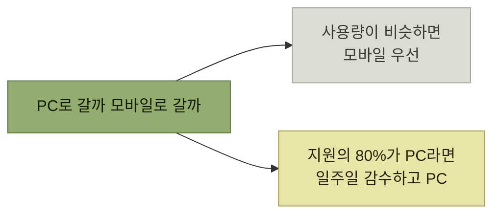

# 첫 마일스톤 정하기

> [시뮬레이션을 통한 제품 탐색](./README.md)

## 빠른 복습
- **SDD를 사용할 때는 하나의 북극성 시나리오, 또는 하나로 부족할 경우 최소한의 시나리오 집합에 대한 요구 사항을 우선순위화해서 MVP 혹은 MLP를 정의**한다.
- **초기 타깃 오디언스를 좁힐 수도** 있다. **가장 흔한 방법은 첫 릴리스를 도그푸딩할 수 있는 직원이나, 화이트글러브 지원을 받는 대신 초기 버전을 감내해 줄 설계 파트너로** 한정하는 것이다.
- **첫 마일스톤에만 집중하는 편이 훨씬 효율적**이다. **MLP에 포함되지 않는 항목이 P2인지 P3인지를 두고 기나긴 논쟁을 벌이는 건 한 시간을 버리는 좋은 방법**이다.
- **매 단계에서 가치에 집중**한다. **로드맵을 끝까지 돌 수 있다고 가정하고 싶지 않기** 때문이다.

> [!TIP]
> **첫 마일스톤 하나에 집중하세요**
>
> 하나의 북극성 시나리오가 완결된 가치를 전달하도록 범위를 좁히고 이후 우선순위 논쟁은 미룬다.

## 북극성 하나에 집중하면 좋은 점

| 이유 | 내용 |
| --- | --- |
| **완결된 이야기** | **북극성은 완결된 이야기이므로 양의 효용을 전달**하게 된다 |
| **최선의 비전** | **북극성은 최선의 프로덕트 비전을 담고 있으므로, 누군가에게 양의 VORP를 내는 무언가를 출시**하게 된다 |
| **범위가 좁다** | **하나의 페르소나와 이야기에만 집중하므로, 부차적인 기능을 뺄 수 있고 일반화는 나중으로 미룰 수** 있다 |

표를 읽는 법. 앞의 둘이 [잔혹한 진실 2·3번](./6-우선순위의-기준과-네-가지-잔혹한-진실.md)에 정확히 대응한다. **"완결된 이야기 하나"가 곧 "효용 함수가 치솟는 지점"** 이라는 것이 SDD가 우선순위 도구가 되는 이유다.

## 오디언스를 좁히는 방법

- **첫 릴리스를 도그푸딩할 수 있는 직원**([4장](../04-자사-제품-체험/README.md))
- **제품에 영향을 주고 화이트글러브 지원을 받는 대신 초기 버전을 감내해 줄 설계 파트너**
- **한 플랫폼 사용자**(안드로이드 대 iOS 중 하나)
- **설명이 많이 필요 없는 파워 유저**

> 이렇게 좁혀 놓으면, **북극성 시나리오의 일부 조각 없이도 처음에는 넘어갈 수** 있어요. 예를 들어 **직원을 겨냥한다면**, 이야기에 **사용자가 기능을 발견하는 발견 단계**가 들어 있어도 그 단계를 **동료에게 이메일을 보내 확인해 달라고 부탁하는 식으로 대체**할 수 있습니다.

**오디언스를 좁히면 요구 사항도 함께 줄어든다**는 점이 요령이다. 발견 가능성은 **모르는 사람에게만 필요한 요구**이므로, 첫 사용자가 직원이면 **그 요구가 잠시 사라진다.**

## 우선순위 표기

| 표기 | 뜻 |
| --- | --- |
| **P0** | **MVP에 포함.** **이게 없으면 출시도, 사용자 피드백 수집도 불가능** |
| **P1** | **MLP에 포함.** **아주 매력적인 스트레치 목표**이고 **출시 시점에 가까워졌을 때 구현.** **일정이 밀려 정해진 날짜까지 끝내야 한다면 마음은 불편하겠지만, 그래도 쓸 만한 무언가는 출시**된다 |
| **공백** | **그 밖의 모든 것.** **다음 마일스톤을 계획할 때 우선순위를** 매긴다 |

마일스톤 단위로 일한다면 **재사용하기 편한 형식**도 있다 — **0**(마일스톤 0에 포함), **0.5**(마일스톤 0의 스트레치), 나머지는 공백. **다음 마일스톤을 계획할 때 각각 1과 1.5를 더해 마일스톤 1로** 표시한다.

> **찾기 쉬운 하나의 문서 안에서 프로덕트 로드맵을 늘 최신 상태로 유지하는 데 도움**이 되거든요.

## 케이블타운의 첫 마일스톤

> **대부분의 직원이 집에서 케이블타운을 쓰고 있으니, 첫 마일스톤은 케이블타운 직원으로 한정**하겠습니다. **그들은 너그럽게 받아 주고 더 사려 깊은 피드백을 줄** 겁니다. **직원용 릴리스는 MLP가 아닌 MVP가** 됩니다.

시나리오 선택 근거는 셋이다.

- **MVP는 지원 시나리오 하나 또는 세일즈 시나리오 하나로 한정**해야 한다. **그러면 AI에 학습 데이터를 먹이고 테스트하는 일이 많이 줄어든다.**
- **흔하거나 임팩트가 큰 시나리오를 고르면 효용 함수가 가장 가파르게 튀어 오른다.** **기존 상호작용의 대부분이 기술 지원이고, 그중에서도 인터넷이 안 되거나 느리다고 여길 때가 가장 많다.**
- **기술 지원 물량의 대부분이 모바일 기기보다는 데스크톱과 노트북에서 온다**고 데이터가 말해 준다고 가정한다.

그래서 **'고객 하드웨어 문제' 시나리오**가 선택되고, 타깃 페르소나는 **'PC를 쓰는 케이블타운 직원, 새드 리사'** 가 된다.

### 일주일의 추가 작업을 감수할 것인가

> 아쉽게도, **케이블타운에서는 웹사이트 프레임워크 리팩터링이 진행 중**이라, **그쪽부터 시작하면 추가 작업 일주일**을 떠안아야 합니다. **방향을 틀어서 모바일로 갈까요?**

*같은 비용도 임팩트 차이에 따라 감수할 만하거나 아니거나가 된다*

> **전체 비용을 고려했을 때, 케이블타운만큼 관료주의가 큰 회사에서 엔지니어링 일주일은 아마 별일이 아닙니다. 출시에 드는 전체 공수에서 그 일주일은 비교적 작은 부분**이겠죠.

[앞 절의 "전체 비용"](./6-우선순위의-기준과-네-가지-잔혹한-진실.md) 개념이 실제 판단에 쓰이는 장면이다. **엔지니어에게는 일주일이 커 보이지만, 출시 전체 공수에 견주면 작다.**

## 우선순위가 매겨진 요약집

| 요구 사항 | 마일스톤 | 페르소나 |
| --- | --- | --- |
| **느린 인터넷 진단을 효율적으로 안내** | **0** | 새드 리사 |
| **지원 데이터베이스에서 학습한 가장 효과적인 개입을 추천** | **0** | 새드 리사 |
| **만족도 설문 발송** | **0** ᵃ | 모두 |
| **로그인 없이 홈페이지에서 헬피 호출** | **0** ᵇ | 누구나 |
| **결정적이지 않을 때 후속 조치 제안** | **0.5** | 새드 리사 |
| **모바일 기기에서 헬피 사용** | (공백) | 누구나 |
| **설문으로 학습해 더 효과적이 됨** | (공백) | 모두 |
| **지원인지 세일즈인지 95% 정확도 판별** | (공백) ᶜ | 모두 |
| **좌절 감지 후 사람에게 위임** | (공백) ᵈ | 모두 |
| **상담원이 넘겨받을 때 헬피와 상의** | (공백) ᵉ | 모두 |

*원서 [표 7-2] 헬피를 위한 우선순위 유스 케이스 요약집*

각주가 이 표의 알맹이다.

| 각주 | 이유 |
| --- | --- |
| **ᵃ 설문** | **단기적으로 사용자에게 결정적인 기능은 아니지만, 사용자 피드백은 로드맵 초기 단계에서 가장 중요한 기반** |
| **ᵇ 로그인 전 노출** | **현재는 로그인 뒤에 숨어 있다.** **사람들이 매일 지원을 이용하는 것은 아니라 조기 도그푸딩을 위해 밖으로 꺼내고자** 하며, **인터넷이 느린 상황에서 로그인하도록 하는 것은 불편** |
| **ᶜ 지원/세일즈 판별** | **M1 단계에서는 헬피가 먼저 어떤 요청인지 확인한 뒤, 세일즈 관련 요청이라면 기존 봇과 담당자에게 연결하면 됨** |
| **ᵈ 좌절 감지** | **직원 도그푸더들은 더 너그럽게 받아들일 것** |
| **ᵉ 상담원 인수인계** | **규모와 품질 측면에서는 중요하지만, 제한된 테스트 단계에서는 우선순위가 높지 않음** |

표를 읽는 법. **ᵃ는 사용자 가치가 아니라 학습 가치로 P0**가 되었고, **ᵈ와 ᵉ는 오디언스를 직원으로 좁혔기 때문에 내려갔다.** **누구를 첫 사용자로 삼느냐가 우선순위를 직접 바꾼다**는 것을 보여 준다.

## 이야기는 살아남았는가

우선순위화 뒤 북극성 시나리오를 다시 읽으면 **후속 조치 안내(0.5로 내려감)** 부분만 흔들린다.

> **나쁘지 않습니다. 수정은 소소하고, 바뀐 이야기도 여전히 설득력 있어 보입니다.**

**우선순위를 매긴 뒤 원래 이야기를 다시 읽어 보는 습관**이 이 절의 마지막 장치다. **잘라낸 것들을 합쳐 놓고 보면 이야기가 무너져 있을 수도** 있기 때문이다.

## 함께 읽기
- [다음 절 — 발견의 마지막 단계](./8-상세-사용자-흐름과-검증.md)
- [4장 도그푸딩](../04-자사-제품-체험/README.md) — 직원을 첫 사용자로 삼는 전략
