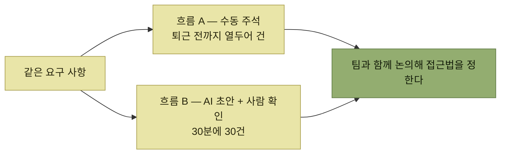

# 상세 사용자 흐름과 검증

> [시뮬레이션을 통한 제품 탐색](./README.md)

## 빠른 복습
- **앞서 작성한 스토리는 상당히 높은 수준의 내용으로, 많은 세부 사항을 생략**했다. **이 때문에 중요한 부분을 놓치고 있을 수도** 있다.
- **이야기가 '어떻게'보다 '무엇'에 가깝게 쓰이도록 신경 썼으므로, 사용자가 이야기를 이뤄내는 여러 방법을 따로 오디션**해야 한다.
- **UI 설계 경험이 있다면 '스토리보드'** 로 익숙할 것이다. **인터페이스가 UI 대신 코드라면, 흐름은 코드 리스트와 커맨드 라인의 조합에 해설이 섞인 형태**가 된다.
- 검증 방법은 둘 — **RFC**와 **사용성 조사**.

> [!NOTE]
> **사용자 흐름은 요구 사항을 실행 가능한 순서로 펼칩니다**
>
> 사용자가 목표를 이루는 단계와 시뮬레이션에 필요한 전제 조건을 함께 적고 RFC와 사용성 조사로 검증한다.

## 흐름을 쓸 때의 조언

- **중요한 인터페이스 문제(8장)를 놓고 논쟁할 수 있고, 명확한 시스템 명세(9장)를 뽑아낼 수 있을 만큼의 디테일**이 담겨야 한다.
- **북극성을 고를 때처럼 여러 선택지를 저울질**한다. **대안 사용자 흐름을 브레인스토밍하거나 팀에 제시해 함께 고르도록** 하면 **다양한 의견을 모으는 좋은 방법**이고 **특정 접근에 매여 있지 않다는 신호**를 준다.
- **첫 마일스톤에 집중하되, 전체적인 디자인을 짜려면 일찍 이해해 둘 필요가 있다고 생각되는 우선순위 미지정 항목도 함께** 다룬다.
- **사용자 흐름은 사용자의 동기에서 시작해 어떻게 기능을 발견했는지까지 완결된 이야기**를 들려줘야 한다.

## 예 — 지원 담당자 샘의 주석 작업

대상 요구 사항은 **"헬피는 지원 데이터베이스에서 기술 지원 질문에 대한 가장 흔한 해결책이 무엇인지 배워 그걸 리사에게 추천할 수 있습니다"** 다. 그런데 문제가 있다.

> **헬피를 학습시킨 초기 결과는 아쉽게도 만족스럽지 못했습니다.** **레거시 시스템에서 지원 데이터베이스에 주석을 단 적이 없어서, 기술 지원 질문의 가장 흔한 해결책이 무엇인지 전혀 모릅니다.**

> 최선의 추정은 이렇습니다. **수천 건의 오래된 지원 요청을 훑어서 어떤 개입이 통했는지 혹은 결과가 결정적이지 않았는지 중 하나로 분류**해야 한다는 것이죠. 그리고 **지원 담당자의 판단 근거를 함께 기록해 헬피가 그 지혜를 배울 수 있게** 하고 싶습니다.

**여기서 새 페르소나 '지원 담당자 샘Sam'이 등장**한다. **사용자 흐름을 쓰다 보니 원래 없던 사용자가 생긴 것**이며, [다음 절의 되먹임](./9-요구-사항으로의-피드백-반영.md)이 이미 시작된 셈이다.

### 흐름 A — 수동 주석

1. **지원 담당자 샘은 다음 한 달 동안 과거 고객 채팅 50건에 주석을 달라는 상사의 이메일**을 받는다.
2. **꽤 바쁘지만 상사가 시켰으니**, 샘은 **과거 지원 스레드 하나를 여는 내부 도구**를 연다. **그 문제를 무엇으로 해결했는지 들여다보고 기억해 보라는 요청**을 받는다.
3. **'공유기 재설정', '악성코드 검사', '기기 재부팅' 같은 태그 드롭다운**이 제시된다. **적당한 것이 없으면 태그를 추가**할 수도 있고, **그렇게 추가된 태그는 다른 지원 담당자들이 분류할 때 보게** 된다.
4. **왜 그런 추천 순서를 골랐는지 해설을 덧붙이라는 요청**을 받는다. **"사용자 기기 두 대가 오프라인 상태여서 기기 한정 문제로 보이지 않아 공유기 재시작부터 시작했습니다"** 라고 적는다.
5. **제출하면 다음 채팅 스레드로 이동**한다.
6. **샘은 퇴근 전까지 열두어 건을 처리**한다. **며칠 뒤, 주석을 더 달라고 재촉하는 이메일을 받고 링크를 클릭해 몇 건을 더** 끝낸다.

### 흐름 B — AI가 도와주는 버전

1. **AI가 채팅 1000건을 훑어 각각의 조치와 판단 근거라고 생각되는 바를 추출**한다.
2. **샘이 상사에게 과거 채팅 50건에 대한 AI의 해석을 확인해 달라는 이메일**을 받는다.
3. **샘이 채팅을 열면 AI의 선택이 맞는지 바로 질문**을 받는다. **맞다고 클릭하거나, AI의 선택과 근거를 인라인으로 바로 수정**할 수 있다.
4. **제출하면 다음 채팅 스레드로 이동**한다.
5. **한편 새로운 선택은 AI에 다시 피드백**된다. **다음 날 밤, AI는 그 피드백을 바탕으로 재학습**한다.
6. **샘은 AI가 네 번 중 세 번은 맞는다는 감을 잡고, 30분 만에 30건을 수월하게** 훑는다.

*같은 요구 사항에서 두 개의 흐름을 만들어 나란히 놓는다*

**두 흐름의 차이가 처리량으로 드러난다**는 점(열두어 건 대 30건)이 이 비교의 값이다. **요구 사항 문장만으로는 이 차이가 보이지 않는다.**

> 접근에 확신이 들면, **함께 볼 스토리보드를 만들어 전달**할 수 있어요. 이 흐름을 **지원 인력 몇 명에게 돌려 의견을 모으는, 일종의 즉석 사용성 조사**를 할 수도 있습니다. **"이렇게 하시겠어요? 어떤 기능이 있으면 좋겠어요?"** 라고 묻는 거죠.

## 검증 ① RFC

> **실제 환경에서 기능이 올바른 일을 하는지를 주로 확인하고 싶다면, 잠재 사용자에게 스토리보드를 보여 주는 RFC 문서**를 만들 수 있습니다. **시나리오가 그들에게 쓸모 있겠는지 물으면서 피드백을 요청**하면 됩니다.

**비교적 적은 직원을 대상으로 하는 단기 내부 도구**를 설계 중이니 RFC가 맞다. **지원 상담원 몇 명에게 돌려 기능 공백을 짚어 주고, 혼란스러운 점을 드러내고, 우리가 놓쳤을 수 있는 평소 업무 흐름의 세부 내용을 짚어** 달라고 한다.

> 이들에게 **일찍 의견을 구하면, 새 업무를 맡아야 한다는 데 대해 어떻게 반응할지 걱정될 때도 도움**이 됩니다.

> **RFC에서는 우리가 답변을 먼저 제공했습니다. 그렇게 하지 않는다면 더 많은 통찰을 얻을 수** 있어요.

**마지막 문장이 RFC의 한계**를 짚는다 — 안을 먼저 보여줬으므로 [CDI 퍼널](../06-타깃-오디언스-이해/3-고객-발견-인터뷰.md)에서 경계하던 **유도 효과**가 이미 들어가 있다.

## 검증 ② 사용성 조사

> **사용성 조사는 작동하는 프로토타입을 기반으로 인터뷰 참여자에게 특정 작업을 수행하도록 요청**하는 방식입니다. 이를 통해 **기능을 찾기 어려운 문제, 사용성 문제, 기능 부족** 등을 발견할 수 있습니다.

**프로토타입은 그 과업에서 필요한 목표를 이룰 수 있는 것처럼 보여야** 하고, **다른 기능은 구현되지 않은 상태로 둬도** 된다.

| 인터뷰 시작할 때 | 내용 |
| --- | --- |
| **분위기** | **상대방이 편안해지도록 돕고, 진행 방식을 설명** |
| **요청** | **동작하는 프로토타입을 쓰면서 생각을 소리 내어 말해 달라고** 부탁 |
| **선긋기** | **질문을 해도 좋지만, 바로 답해 드리지 못할 수도 있다고** 알린다 |

표를 읽는 법. 셋째 줄이 사용성 조사의 성립 조건이다. **바로 답해 주면 그 사람은 더 이상 혼자 헤매지 않고**, 우리가 보려던 것(**어디서 막히는가**)이 사라진다.

> 그다음 **핵심 사용자 흐름의 동기 부여 단계에 해당하는 과제**를 부여합니다. **"문제의 유형과 그걸 해결한 조치로 과거 지원 스레드에 주석을 달아 달라는 요청을 받았습니다. 화면을 공유하시고, 이 클릭 가능한 프로토타입을 써서 그 과제를 해내 주시면 좋겠어요."**

> **유스 케이스만 소개할 뿐, 가능한 한 다른 안내는 하지 마세요.** **꼭 질문에 답해야 한다면, 나중에 디버깅할 수 있도록 그 내용을 적어** 두세요.

> 기회가 되면 **사용성 조사를 한 번쯤 진행해 보시길 강력히 권합니다.** 저의 첫 사용성 조사는 **MS에서 제가 만든 C# API를 대상으로** 한 것이었는데, **엄청나게 겸손해지는 경험**이었어요. **제가 쉬울 거라고 생각했던 걸 개발자들이 쩔쩔매며 쓰는 모습을 보고, API 디자인이라는 분야가 얼마나 어렵고 깊은지 눈이 뜨였습니다.**

## 사용자 흐름을 JTBD로

> **대대적인 재색인의 마지막 단계는, 만들어야 할 컴포넌트와 기능을 글로 옮겨 적는 일**입니다. 이는 **JTBD**로 불리기도 합니다.

**샘이 과거의 모든 지원 채팅 기록을 수동으로 태그하기로 한다면**(흐름 A) 만들어야 할 컴포넌트는 이렇다.

- **채팅 주석 작업용 내부 도구**
- **편집 가능한 태그 데이터베이스 테이블**
- **태그와 자유 서술로 주석을 저장하는 데이터베이스 테이블**
- **헬피가 주석을 채팅 이력과 함께 수집하는 데이터 파이프라인**
- **주석 50건 목표에 대한 직원별 진척 추적**

> **대대적인 재색인이 이제 끝났습니다.** 적어도 전반적인 수준에서는 **사용자/시간축 중심의 제품 관점을, 시스템/그래프 중심의 관점으로 성공적으로 옮겼습니다.**

**마지막 항목(진척 추적)이 흥미롭다** — 흐름 A의 6단계에 **"재촉하는 이메일"** 이 있었기 때문에 나온 컴포넌트다. **이야기의 사소한 한 문장이 시스템 요구가 된다.**

## 함께 읽기
- [다음 절 — 워터폴이 되지 않으려면](./9-요구-사항으로의-피드백-반영.md)
- [4.1 시나리오 테스트](../04-자사-제품-체험/3-시나리오-기능-e2e-사용자-수락-테스트.md) — 이 흐름이 나중에 테스트가 된다
