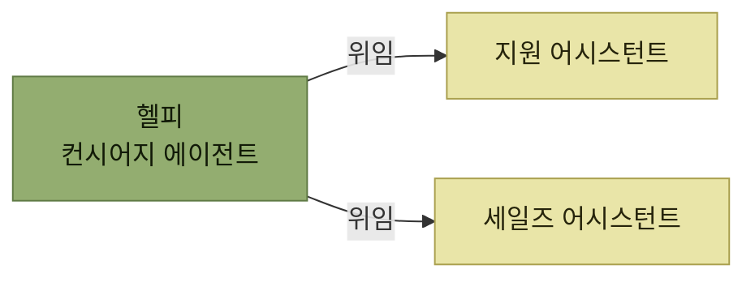
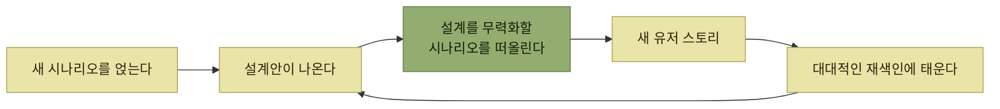

# 요구 사항으로의 피드백 반영

> [시뮬레이션을 통한 제품 탐색](./README.md)

## 빠른 복습
- **누구도 발견 단계에서 설계 단계까지 한 방향으로만 매끄럽게 이어지는 워터폴 방식을 기대해서는 안** 된다. **실제로는 밀물과 썰물이 오가고 서로 다른 물이 섞이는 작은 웅덩이에 더 가깝다.**
- **북극성 시나리오 목록과 유스 케이스 요약집은 계속 업데이트하는 '살아 있는 문서'** 여야 한다.
- **2025년 에이전트 설계의 현실 중 하나는, 복잡한 작업을 처리할 때 하나의 거대하고 똑똑한 에이전트보다 여러 전문 에이전트를 조합해 쓰는 쪽이 실수를 덜 저지른다**는 것이다.

> [!WARNING]
> **발견을 일방향 워터폴로 만들지 마세요**
>
> 설계와 검증에서 새로 배운 사실을 북극성 시나리오와 유스 케이스 요약집에 계속 되돌려 반영한다.

## 세일즈를 얹으니 설계가 흔들린다

**기술 지원 제품 위에 헬피의 세일즈 시나리오를 새로 얹을 때**가 왔다. **헬피에게 더 많은 지식과 새로운 도구에 대한 접근 권한을 줘야 하니 역량을 확장**해야 한다.

관련 요구 사항은 이것이었다 — **헬피는 요청이 지원용인지 세일즈용인지 95% 정확도로 판별할 수 있습니다.**

> 하지만 **우리가 이 문제를 충분히 깊이 생각해 봤을까요?**

*[그림 7-6] 전문 어시스턴트 둘과 하나의 에이전트가 조합된 모습*

> **기술 지원 어시스턴트와 세일즈 어시스턴트를 각각 생성한 다음, 헬피가 사용자와 소통하고 계획을 수립하며 어시스턴트들에게 업무를 위임하는 컨시어지 에이전트 역할**을 맡게 할 수 있습니다.

### 그리고 이 설계를 다시 깨뜨려 본다

> 이제 **이 설계를 면밀하게 들여다보고, 설계를 무력화할 수 있는 시나리오를 떠올려** 봐야 합니다. **사용자가 기술 지원 질문을 던졌는데 해법이 기기를 업그레이드하는 것이라면요?** **주어진 한 대화에서 헬피가 한 에이전트에게만 위임하는 게 아니라, 두 에이전트 모두와 상의해야 할 수도** 있습니다.

> 이걸 앞서 눈치채지 못했다면, **지금이 새로운 유저 스토리를 만들어 대대적인 재색인에 태워 보낼 때**입니다.

**"95% 정확도로 분류한다"는 요구 사항이 애초에 이분법을 전제**했다는 점이 드러난다. **고장 난 기기를 업그레이드로 해결하는 사례**는 **지원이면서 동시에 세일즈**이므로, 분류 정확도를 아무리 높여도 답이 없다. **설계를 깨뜨려 보는 시나리오가 요구 사항 자체의 결함을 찾아낸** 것이다.

*이야기 → 설계 → 이야기로 돌아오는 순환이 워터폴을 막는다*

**이 순환이 [이 장 도입부의 세 번째 원칙](./README.md)("앞 단계로 되돌아갈 수 있는 가능성을 열어 둔다")의 실물**이다.

## 함께 읽기
- [다음 절 — 요약과 VS 코드 예제](./10-요약과-예제.md)
- [5.2 변화를 위한 설계](../05-지속적인-사용자-이해/2-변화를-위한-설계-오큘러스-사례.md) — 되돌아갈 수 있게 만드는 기술적 토대
