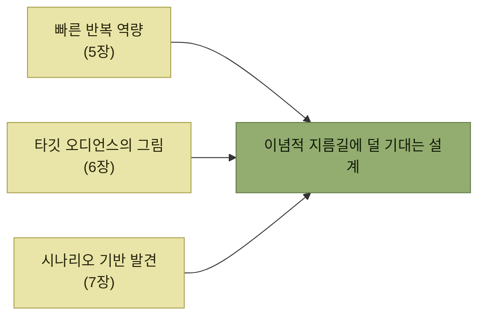

# 편향과 이념, 그리고 전제 조건

> [인터랙션 설계](./README.md)

## 빠른 복습
- **소프트웨어 엔지니어는 자기 일에 이념적 신념과 편향을 함께 들고** 온다.
- **이념은 힘과 목적의 원천이 될 수** 있지만 **소프트웨어를 설계할 때는 출발점일 뿐**이다. **가장 좋은 제품은 설계자의 신념보다 사용자와 그들의 니즈에서 먼저 정보를 얻는다.**
- **만약 우리가 이념만을 두고 논쟁하고 있다면, 고객과 고객의 유스 케이스를 충분히 이해하고 있는지 돌아봐야** 한다.
- 이 장의 설계 조언은 **시나리오와 페르소나, 때로는 반복 개발에 기댄다.** **이 전제 조건이 좋은 설계를 보장하지는 않지만 분명 도움이** 된다.

> [!WARNING]
> **이념보다 사용자 시나리오를 먼저 보세요**
>
> 설계 논쟁이 원칙의 대립에 머문다면, 실제 사용자와 유스 케이스를 충분히 이해했는지 먼저 점검해야 합니다.

## 세 가지 대표적 대립

| 축 | 한쪽 | 다른 쪽 |
| --- | --- | --- |
| **유연함 ↔ 의견 주도** | **유연하고 파워 유저 친화적인 제품** | **의견이 뚜렷하고 안전하며 쓰기 쉬운 제품** |
| **낙관 ↔ 비관** | **장점에 시선**을 둔다 | **기능과 제품의 단점, 부정적 영향을 먼저** 본다 |
| **오픈소스 ↔ 독점** | **투명성과 윤리, 보안에서 더 낫다** | **지적재산권과 혁신의 상업적 유인** |

### 유연함 대 의견 주도 — 수렴 진화

> **애플 iOS와 구글 안드로이드 설계자는 매우 다른 이념에서 출발**했습니다. **그러나 두 제품은 점점 닮아갔습니다.** **애플은 더 유연한 개발자 플랫폼을 열어왔고, 구글과 하드웨어 파트너들은 일부 자유를 줄이고 좀 더 의견이 뚜렷한 경험**을 내보였습니다.

> **비즈니스와 규제 이유도 있지만, 제품 설계 이유도** 있습니다. 이 **'수렴 진화'는 두 회사가 비슷한 시나리오를 가진 비슷한 사용자·파트너의 목소리를 듣고 있다는 신호**입니다.

**출발 이념이 정반대여도 같은 사용자를 보면 같은 곳으로 간다**는 관찰이다. 이념이 아니라 **사용자가 설계를 정한다**는 이 장의 주장을 뒷받침한다.

### 낙관 대 비관 — AI에서의 현재형

**새로운 기술이 등장할 때마다 사회적 영향에 대한 낙관론과 도덕적 공포가 함께** 나타나며, **지난 10년의 소셜 미디어 자리를 이제 AI가** 차지하고 있다. **더 나은 소프트웨어 설계는 이러한 문제를 해결하는 중요한 방법 중 하나**다.

| 흐름 | 내용 |
| --- | --- |
| **레드팀 훈련** | **연구자들이 적대적 시나리오를 짜서 AI에 들이댄다.** **생물학 무기나 신원 도용 같은 위협 정보가 새지 않도록 단단히** 만든다 |
| **튜터링 모드** | **LLM 제공자가 학습 모드**를 만들어 **학생에게 답을 떠먹이지 않고 비판적으로 사고하도록** 돕는다. **시간이 흐르면 다양한 시나리오와 페르소나에 맞춘 보호자 통제 같은 안전장치**도 나올 것이다 |

표를 읽는 법. 둘 다 **"기술을 막느냐 마느냐"가 아니라 "어떤 어포던스를 열고 닫느냐"** 로 문제를 옮겼다. [이 장의 두 선택](./README.md)이 사회적 논쟁에도 적용되는 셈이다.

### 오픈소스 대 독점 — 중간 지대

> **2000년대에는 대부분의 제품이 완전 독점이거나 완전 오픈소스**였습니다. **요즘 많은 회사는 그 사이 어디쯤의 모델**을 씁니다.

- **오픈 코어 모델**에서는 **대부분의 기능이 공개되어 있지만, 특정 기업 사용자의 시나리오는 독점 기능을 통해** 지원된다.
- **이중 라이선스 모델은 사용자 페르소나에 따라 라이선스 조항이 달라진다.** 예를 들어 **상업적 사용에 제한을 추가**하는 방식이다.

**둘 다 페르소나로 갈랐다**는 점이 눈에 띈다 — 이념 대립을 **사용자 구분 문제로 재정의**하면 중간 지대가 생긴다.

## 좋은 설계의 전제 조건

*앞 장들에서 쌓아 둔 것이 이 장의 재료가 된다*

| 전제 | 무엇을 가능하게 하나 |
| --- | --- |
| **피드백을 모으고 빠르게 반복하는 역량을 개발 프로세스에 심어 둔다**(5장) | **인터페이스가 너무 좁아도 나중에 넓힐 수 있다는 자신감** |
| **타깃 오디언스와 그들이 원하는 것의 그림을 그린다**(6장) | **모두가 같은 것을 원한다면 그것만 옵션으로** 두고, **원하는 것이 다르다면 유연성 포인트를** 끼워 넣는다 |
| **시나리오 기반 발견**(7장) | **고객이 제품을 어떻게 쓸지 세세히** 따져 보고, **안전성 공백이 보이면 일반성을 잃지 않고 메울 수 있는지** 살핀다 |

각 전제는 [5장](../05-지속적인-사용자-이해/README.md)·[6장](../06-타깃-오디언스-이해/README.md)·[7장](../07-시뮬레이션을-통한-제품-탐색/README.md)에서 각각 다뤘다.

표를 읽는 법. 첫 줄이 나머지를 가능하게 한다. **되돌릴 수 있어야 좁게 시작할 수** 있고, 좁게 시작할 수 있어야 ["확실하지 않다면 빼두라"](./6-어포던스-출시-타이밍.md) 는 조언이 성립한다.

> 이런 도구를 갖추면 **이념적 지름길에 기대는 일이 줄어듭니다. 가장 좋은 정보와 가장 큰 동기를 쥐고 결정을 내리게 되기** 때문입니다.

## 함께 읽기
- [다음 절 — 이 장을 관통할 사례](./2-사례-연구-entschema.md)
- [5.2 변화를 위한 설계](../05-지속적인-사용자-이해/2-변화를-위한-설계-오큘러스-사례.md) — 되돌릴 수 있게 만드는 토대
