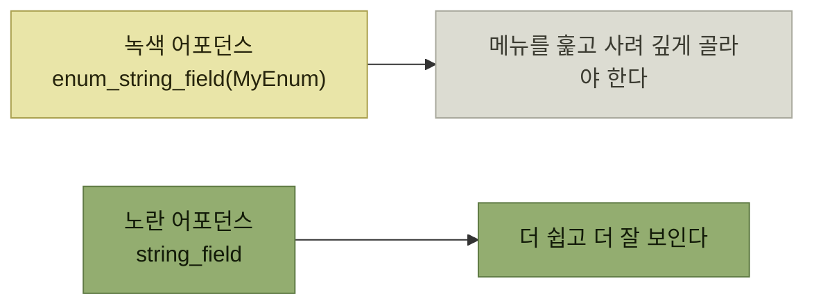

# 최소 저항 경로와 오작동 신호등

> [인터랙션 설계](./README.md)

## 빠른 복습
- **사용자는 제품을 쓸 때 모든 걸 미리 계획하지 않는다.** **대개 자연스럽게 최소 저항 경로를** 탄다.
- **오작동 신호등malfunctioning traffic light**은 **두 기능의 발견 가능성이나 사용 편의성의 우선순위가 뒤바뀐 상황**을 뜻한다.
- 이때는 **어포던스 사이의 상대적 쓰기 쉬움과 기표의 세기가, 제품 전체의 절대적 쓰기 쉬움이나 발견 가능성보다 더 중요**하다.
- EntSchema는 **만능 기본값으로 `string_field`를 추가**했다가 **가장 도움 안 되는 옵션이 가장 발견하기 쉬운 옵션**이 되는 상황을 겪었다.
- 해법은 둘 — **이름을 `custom_string_field`로 바꿔 도드라지게** 하고, **밸리데이터를 직접 추가하도록 약간의 마찰을 더했다.**

> [!WARNING]
> **오작동 신호등을 바로잡으세요**
>
> 덜 적합한 기능이 더 쉽고 잘 보인다면 이름과 마찰을 조정해 사용자의 최소 저항 경로를 안전한 선택으로 되돌려야 합니다.

## 오작동 신호등

> 신호등의 **불이 잘못 배치된 모습**을 떠올려 보세요. **가장 먼저 눈에 띄어야 할 신호보다 덜 중요한 신호가 더 눈에 띄는 것처럼, 사용자가 자연스럽게 선택해야 할 기능보다 덜 적합한 기능이 더 쉽게 발견되는 상태**입니다.

예를 들어 **페이스북에서 노란 어포던스인 '전체 공개 게시'를 기본으로 두고, 정작 녹색 어포던스인 '친구와 공유'는 안쪽에 숨겼다면** 그것이 오작동 신호등이다.



*신호등에서 녹색이 오른쪽, 노란색이 왼쪽에 달린 모양새*

**"상대적"이라는 단어가 이 절의 열쇠**다. 좋은 옵션이 아무리 잘 만들어져 있어도, **나쁜 옵션이 더 가까이 있으면 진다.**

## EntSchema의 실패담

**애플리케이션 수준 필드 타입을 설계할 때 이메일, 자연어 텍스트, 이넘, 전화번호 같은 문자열 서브타입**을 만들었고, 개발자들은 **`email_string_field`** 처럼 썼다. 문제는 여기서 시작됐다.

> **가능한 모든 문자열 유형을 미리 고려할 수는 없다는 점을 알고** 있었습니다. **사용자가 시간이 지나면서 새로운 유형을 추가할 수도 있었지만, 이는 번거로운 작업처럼 보였기 때문에 만능 기본값으로 `string_field`를 추가**했습니다.

> **안타깝게도, 가장 도움 안 되는 옵션이 가장 발견하기 쉬운 옵션이 됐습니다.** **많은 작성자가 `string_field`를 남용**하기 시작했습니다. **다른 시스템에서 익숙하게 보던 형태와 비슷했기 때문에 매력적인 표시처럼** 느껴졌습니다. **많은 개발자는 다른 옵션이 있다는 사실조차 눈치채지 못했을** 것입니다.

| 왜 나쁜 옵션이 이겼나 |
| --- |
| **다른 시스템에서 익숙하게 보던 형태**라 자연스러웠다 |
| **타이핑이 짧아서 지정하기도 더 쉬웠다.** **별생각이 필요 없었다** |
| **다른 타입들은 메뉴를 훑고 사려 깊게 골라야** 했다 |
| **알고 있었더라도 나중에 살펴보려고 미뤄 두었다가 잊어버렸을 수도** 있다 |

> **개별 선언은 쓰기 쉬웠지만, 상대적 사용성과 발견 가능성 때문에 시스템 전체로 보면 굴러가지 않았습니다.**

## 두 가지 처방

### ① 이름을 바꿔 출발선을 맞춘다

> **`string_field`를 없애고 더 도드라지는 이름인 `custom_string_field`로** 바꿨습니다. **다른 문자열 서브타입과 같은 출발선에 세웠고, 이게 주류 선택지가 아니라는 신호**도 줬습니다.

**이름 하나로 기표를 바꾼 것**이며, [2장의 `TAKE_DOWN_THE_SITE`](../02-제품-내-사용자-안내/7-사용-시나리오-위험을-이름에-드러내기.md)와 같은 수법이다 — 다만 여기서는 **경고가 아니라 "이건 특수한 경우다"** 라는 신호다.

### ② 마찰을 더한다

> **발견 가능성 역전은 풀었지만, 바쁜 개발자들은 여전히 남용할 수** 있습니다. **어디선가 복사·붙여넣기로 끌어오거나, 플레이스홀더처럼 넣어두고 잊어버릴 수** 있죠.

```python
'my_regex_field': custom_string_field().validator(lambda x: is_regex(x))
```

*커스텀 문자열을 쓰려면 밸리데이터를 직접 붙여야 한다*

> **물론 빈 밸리데이터를 추가할 수도 있었지만, 대부분의 개발자가 한 번 더 생각하도록 유도하기에는 충분한 장치**를 마련했다고 판단했습니다. **그렇지 않더라도 코드 리뷰어에게는 하나의 표시를 제공**할 수 있었습니다. **밸리데이터가 없는 경우 이를 발견하고 지적할 수** 있기 때문입니다.

**"완벽히 막지는 못하지만 리뷰어에게 걸리게 한다"** 는 목표 설정이 현실적이다. [3.7의 확인 요청](../03-에러와-경고/7-조기-진단-시프트-레프트.md)이 `--force`로 우회 가능하듯, 여기서도 **빈 밸리데이터로 우회할 수** 있지만 **그 흔적이 코드에 남는다.**

> **`custom_string_field`는 `string_field`보다 훨씬 덜 유혹적이었고, 스키마 정의의 정확도를 크게 끌어올렸습니다.**

## 함께 읽기
- [다음 절 — 결정의 주체와 시점](./5-누가-언제-결정할-것인가.md)
- [2.4 이름 짓기](../02-제품-내-사용자-안내/5-이해-시나리오-이름-짓기.md) — 이름이 기표로 작동하는 방식
