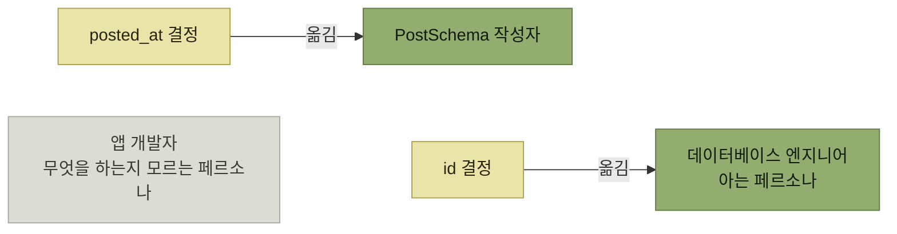

# 누가 언제 결정할 것인가

> [인터랙션 설계](./README.md)

## 빠른 복습
- **누구에게 어떤 시점에 선택권을 제공할지 신중하게 고민**해야 한다.
- `Post`를 만드는 코드에는 함정이 여럿이다 — **ID를 사용자가 직접 지정**하거나 **빼먹거나**, **`posted_at`을 빼먹거나 0으로 설정**(**1969년 12월 31일 타임스탬프**)하거나 **엉뚱한 정수로 설정**하는 것.
- 해법은 **스키마 작성자가 필드 명세에 더 많은 의미를 담는 것**이다. **엔지니어의 결정 횟수를 줄여 성공의 토대를 넓힌다.**
- 정확히 말하면 **결정을 옮긴 것**이다 — **모르는 페르소나에게서 아는 페르소나에게로.**
- **적절한 시점**도 중요하다. **사용자가 판단할 정보를 갖고 있고 그렇게 할 동기가 있는 시점**에 어포던스를 준다.
- 그다음 **그 결정을 검증**한다.

> [!IMPORTANT]
> **결정을 아는 사람과 아는 시점으로 옮기세요**
>
> 선택에 필요한 정보와 동기를 가진 페르소나에게 결정권을 주고, 그 결정을 가능한 이른 계층에서 검증해야 합니다.

## 함정투성이 호출부

```python
post = await (PostMutator()
              .set_id(rand())
              .set_posted_at(now())
              .set_text(some_user_input)
              .create())
```

*원서 예시 — 게시물을 만드는 개발자에게 어떤 일이 잘못될 수 있을까*

| 함정 | 내용 |
| --- | --- |
| **ID를 직접 지정** | **데이터베이스가 자기 ID 공간에서 할당해야 중복을 피하고 샤딩이 공정**해진다. **사용자가 직접 지정하게 두면 안 된다** |
| **`id`를 실수로 빼먹음** | |
| **`posted_at`을 빼먹거나 0으로** | **1969년 12월 31일이 타임스탬프로 찍힌 걸 본 적 있다면, 이 버그를 본 적 있는 것** |
| **`posted_at`이 엉뚱한 정수로** | **명백히 유효하지 않은 타임스탬프** |

표를 읽는 법. **네 함정 모두 호출자가 "쓸 수 있게 되어 있기 때문에" 생긴다.** `set_id`라는 어포던스가 존재하는 한, 누군가는 쓴다.

## 필드 명세에 의미를 담는다

```python
def fields(self) -> dict:
    return {
        "text": natural_language_string_field()
                .db_config(type='varchar(4096)'),
        "posted_at": timestamp_field().at_creation(),
        # ...
    }
```

*원서 예시 — 스키마 쪽에서 한 번 정하면 호출부의 실수가 사라진다*

- **`id`는 완전히 빠졌다.** **모든 스키마에서 생성 시점에 자동으로** 만든다.
- **`posted_at`은 타임스탬프로 지정돼 일정 범위 검사를 허용**한다. 또 **`at_creation`이라는 특수 타임스탬프로 표시돼 `PostMutator`가 입력 없이도 자동으로 설정**한다.

## 결정을 옮긴다



*같은 결정도 누가 내리느냐에 따라 실수율이 달라진다*

> **`id`에 대한 결정을, 무엇을 하는지 모르는 페르소나(앱 개발자)에게서, 아는 페르소나(데이터베이스 엔지니어)에게로** 옮겼습니다.
> **`posted_at`에 대한 결정은 `Post`를 만드는 사람에게서 `PostSchema`를 작성한 사람에게로** 옮겼습니다.

> **어떤 페르소나가 선택을 내려야 하는지 신중히 고민하세요.**

**결정 횟수의 총합이 줄어든다**는 점도 중요하다. `Post`를 만드는 호출부는 수백 곳이지만 **스키마는 하나**다.

### 다중 페르소나 온보딩 흐름

> **SaaS 사용자를 위한 구매 흐름은 여러 페르소나가 얽힌 경우가** 많습니다. **개인 개발자를 대상으로 제품을 개발하되 기업을 상대로 판매**하는 경우를 생각해 보세요. **제품 도입에 신난 개인 개발자가 결제 화면을 마주한 장면**을 그려 보세요. **그들에게는 회사의 자금 결정권이 없고, 권한이 있는 사람은 회사 신용카드 정보를 문자로 보내주지 않을** 겁니다.

> 이때는 **개인 사용자에게 구매자의 이메일을 묻는 쪽이 부담이 훨씬** 적습니다. **개인 사용자가 구매 담당자에게 이메일을 알려달라고 요청하고, 구매 담당자가 그 이메일을 클릭해 양식을 채우면** 끝나거든요.

**"막힌 화면"을 "다른 페르소나에게 넘기는 화면"으로 바꾼 것**이며, 앞의 `id` 사례와 같은 수법이다 — **결정을 할 수 있는 사람에게 보낸다.**

## 적절한 시점 — 초안 모드

> **EntSchema의 코로케이션** 이야기로 돌아가 봅시다. **스키마 작성자는 데이터베이스 레이아웃을 언제 결정해야 할까요? 미리 고민해야 할까요?**

핵심 시나리오 중 하나가 **'해커톤 시나리오'** 였다 — **사용자가 빠른 프로토타이핑을 하는 상황**으로, **제품 모델을 빠르게 스케치하고 UI에도 연결해 아이디어를 시연**하고 싶어 한다.

> 그래서 **프로토타이핑 사용자를 위해 초안 모드draft mode**를 만들었습니다. **사용자는 서비스를 정식 출시할 준비가 되면 이 모드를 풀 수** 있어요. **그 전까지는 코로케이션 선택 여부를 포함해 많은 출시 준비 검사가 비활성화**됩니다. 이를 통해 **사용자가 원하는 바를 더 명확히 파악할 때까지 결정을 미룰 수 있을 뿐만 아니라, 작성자가 서비스를 정식 출시할지 확실히 결정할 때까지 추가 작업을 미룰 수** 있습니다.

**["기본값 없음"으로 강제한 선택](./3-안전한-기본값과-기본값-없음.md)을 한 상태에서도, 그 선택을 물어보는 시점은 따로 고를 수 있다**는 것이 요점이다. **강제하되 미룬다.**

## 검증 수행

```python
"text": natural_language_string_field()
        .max_length(4096)
        .user_input(),
```

*`varchar(4096)` 선언을 스키마의 `max_length`로 끌어올렸다*

| 변경 | 효과 |
| --- | --- |
| **`max_length`로 끌어올림** | **입력 길이를 데이터베이스 계층이 아니라 API 계층에서 더 일찍 검증**할 수 있다 |
| **`user_input`으로 표시** | **내부 엔지니어가 고르는 값이 아니라 사용자 입력이라는 뜻.** **악성 URL이나 보안 취약점을 한곳에서 걸러낼 수** 있고 **게시물을 만드는 호출 지점 하나하나가 그 일을 직접 하지 않아도** 된다 |

표를 읽는 법. 첫 줄은 [3장의 시프트 레프트](../03-에러와-경고/7-조기-진단-시프트-레프트.md) 그대로다 — **더 일찍 검증하고 데이터베이스 부하를 줄였으며**, **인터페이스 계층에서 검증해 애플리케이션 수준의 더 명료한 에러**를 준다. 둘째 줄은 **보안 처리를 한 곳으로 모으는** 조치다.

## 함께 읽기
- [다음 절 — 기능을 아예 넣을지 말지](./6-어포던스-출시-타이밍.md)
- [3.5 인터페이스에서 에러 발생](../03-에러와-경고/5-인터페이스에서-에러-발생.md) — 검증을 어느 계층에서 할 것인가
