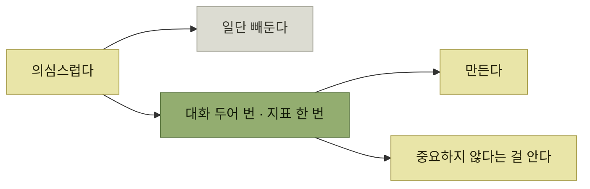

# 어포던스 출시 타이밍

> [인터랙션 설계](./README.md)

## 빠른 복습
- **가장 안전한 어포던스는 아예 존재하지 않는 어포던스**다. **사용자가 소셜 네트워크에서 자기 이름을 정할 수 있게 하는 얌전한 기능조차 욕설과 어뷰징 같은 공격 벡터**를 연다.
- **이상적인 세계, 즉 반복하고 사용자 말에 귀 기울이는 세계라면, 어떤 미래 기능을 둘러싼 질문은 "추가해야 하는가"가 아니라 "언제 추가해야 하는가"** 다.
- **확실하지 않다면 차라리 빼두라.**
- 그러나 **"의심스러울 때는 빼두라"의 또 다른 결론은 "의심 상태에 머물지 말라"** 이다.
- **기능을 잘 해낼 만큼 집중할 수 있을 때 만들라.**
- 격언 다섯 — **만들 가치가 있다면 검증할 가치도 있다**, **낙관론자도 비관론자도 되지 말라**, **3의 법칙을 적용하라**, **단계적으로 만들라**, **필요하다면 실험 버전부터 시작하라.**

> [!CAUTION]
> **확실하지 않다면 출시하지 말고 검증하세요**
>
> 기능을 보류하는 데서 멈추지 말고 사용자 시나리오를 조사해 만들 시점과 범위를 판단해야 합니다.

## 너무 일찍 출시하면

> **충분히 검토하지 않은 기능을 내보내는 건 도박과 마찬가지**입니다.

- **사용자 데이터가 충분하지 않다.** **이념적인 기본값에 기대서 잘못된 결정**을 내린다.
- **부실한 테스트가 부실한 결과**를 낳는다.
- **설계에 충분한 시간을 쓰지 못해 사람들이 쓰기 어려워한다.**
- **더 가치 있는 무언가를 만들 수도 있었다.**
- **유지 보수나 장기 운영 책임이 따를 수 있는데 이를 감당할 준비 시간이 충분하지 않을 수** 있다.
- **API처럼 안정적이어야 하는 소프트웨어라면, 사용자는 수정과 호환성 깨짐을 싫어한다.**

> **기능이 팀의 최우선 순위가 아닐 때 이런 지름길을 택할 가능성이 훨씬 높다**는 점을 기억하세요. **기능을 잘 해낼 만큼 집중할 수 있을 때 만드세요.**

**"우선순위가 낮은 기능일수록 대충 만든다"** 는 관찰이 날카롭다. 그러면 **그 기능은 유지 비용만 남기고 임팩트는 못 낸다** — 차라리 안 만드는 편이 낫다는 결론으로 이어진다.

## 의심 상태에 머물지 않는다

> 어떤 기능이 필요한지 **확신을 쌓는 데는 [6장](../06-타깃-오디언스-이해/README.md)에서 소개한 사용자와의 대화 두어 번이나 지표 한 번이면 충분할 때가** 많습니다. 그러면 **만들게 되거나, 생각만큼 중요하지 않다는 걸 알게** 됩니다. **둘 다 좋은 결과**예요.

> **엔지니어인 우리는 아이디어를 낸 사람이 되고 싶지만, 매니저는 우리가 가정을 검증하고 데이터에서 배우길 좋아합니다. 사용자는 그 결과를 좋아하고요.**



*빼두는 것은 임시 조치이고, 확인하는 것이 답이다*

## 현실의 오버헤드

> **실무에서는 기능 출시에 따라오는 오버헤드**가 있습니다. **코드 리뷰, 배포, 지식 이전, 관리, 문서화 비용** 같은 것들이죠. 그래서 **편의상 우선순위가 낮은, '있으면 좋은' 기능을 핵심 기능과 묶거나, 제품에 약간의 애정을 더 얹고 싶을 때가** 있어요.

> 다만 **우리의 메타 목표는 출시 오버헤드를 줄여 이런 트레이드오프를 최소화**하는 것입니다. **그러면 우리의 목표가 사용자 목표와 더 깔끔하게 맞물립니다.**

**"묶어서 내보내는" 관행이 왜 생기는지 인정한 뒤, 그 원인(오버헤드)을 줄이자**고 방향을 돌린다. [5장의 잦은 배포](../05-지속적인-사용자-이해/3-변화의-기술적-토대.md)가 여기서 설계 문제와 만난다.

## ① 만들 가치가 있다면, 검증할 가치도 있다

> **검증되지 않은 기능을 출시하지 마세요.** 많은 엔지니어가 **사용자가 원할까 싶어 어포던스를 슬쩍 끼워 넣기를** 좋아합니다. **좋아요. 그런데 테스트 하나 쓸 시간조차 없다면, 그건 불길한 신호일 수** 있습니다.

> **해피 패스만 테스트하지 마세요. 드러내고 있는 부정적 어포던스negative affordance를 찾아 그것도 테스트**하세요. **사용자가 잘못된 데이터를 넘기면 어떻게 될까요? 레이스 컨디션이 있다면 어떨까요?**

**"테스트 쓸 시간이 없다"를 우선순위 신호로 읽는 것**이 요령이다 — 그 기능이 정말 중요하다면 시간이 났을 것이다.

## ② 낙관론자도 비관론자도 되지 말라

| 성향 | 강점 | 설계에서의 약점 |
| --- | --- | --- |
| **낙관적 빌더** | **그 앞에 얼마나 많은 난관이 있을지 모르고도 회사를 시작**할 수 있다 | **해피 패스만 생각**한다 |
| **비관적 엔지니어** | **훌륭한 보안 엔지니어**가 된다 | **본능적으로 아이디어를 시험하고 단점을 찾으며 복잡성에 회의적** |

표를 읽는 법. **같은 성향이 강점이자 약점**이다. 그래서 답은 성향을 바꾸는 것이 아니라 **시나리오를 쓰는 것**이다.

> **모든 기능에는 단점이 있습니다. 인터페이스를 어지럽히는 수준부터 사용자에게 직접 해를 끼치는 수준까지요.** **설계자는 자기 아이디어를 깨뜨릴 적대적 시나리오**를 만들어야 합니다. **보안에서는 설계 단계의 이를 위협 모델링, 코드 작성 이후의 이를 레드팀 훈련**이라 부릅니다.

> 반대로 생각하면, **사용자를 대신해 어려운 일을 해결하는 것이야말로 제품이 세상에 가치를 더하는 방식**입니다. **만약 누구나 쉽게 할 수 있는 일이라면 다른 사람들도 쉽게 따라 할 수** 있습니다.

> **자신의 개인적인 편향과 관계없이 녹색 시나리오와 빨간색 시나리오를 모두 시뮬레이션**해 보세요. **심지어 이러한 문제에 대해 자신과 정반대의 관점을 가진 엔지니어와 함께 작업하는 것도** 좋습니다. **평소 이런 주제에서 의견 충돌이 잦은 사람일 수도** 있습니다.

**"평소 의견 충돌이 잦은 사람과 짝을 지으라"** 는 조언이 실용적이다. 각자 **자기가 잘 보는 쪽을 맡으면** 된다.

## ③ 3의 법칙

> **소비자 소프트웨어를 만들다 보면 파워 유저나 친구에게서 독특한 기능 요청**을 자주 받습니다. **비즈니스 소프트웨어도 비슷**해요. **큰 비용을 치르는 어떤 기업이 자신들의 특수한 니즈를 맞춰 달라고 압박**할 수 있습니다.

> **모든 것에 '예'라고 답하는 건 남는 장사가 아닙니다.** **수천 개 기능을 품질 있게 유지할 수 없고, 고객은 비대하고 미궁 같은 인터페이스를 원하지 않거든요.** **기능을 요청한 고객조차 자기 혼자만 쓰는 사용자가 되고 싶지는 않습니다. 우리 테스트 매트릭스에서 뒷전으로 밀리는 게 싫으니까요.**

> 다만 **서로 다른 세 고객에게서, 같은 기능 하나로 모두 풀리는 피드백 세 개를 받는다면 이야기가** 다릅니다. **시간이 지나면 그 기능을 쓸 사람이 훨씬 많을 가능성**이 큽니다.

**요청한 고객 본인도 "나만 쓰는 기능"을 원하지 않는다**는 지적이 특히 좋다 — 거절의 근거가 **우리 편의가 아니라 그 고객의 이익**이 된다.

### 시나리오 세 개로 정당화하기

**서술형 주석descriptive comment을 스키마의 일부로 넣을지** 결정할 때 쓴 방법이다.

```python
def fields(self) -> dict:
    return {
        "text": natural_language_string_field()
                .description("사용자가 일반 텍스트로 작성한 내용"),
        "posted_at": timestamp_field().at_object_creation()
                .description(
                    "사용자가 게시한 시점. 예약 게시물이면, " +
                    "이 시점에 공개되도록 예약된 때."),
        # ...
    }
```

*스키마 작성자에게는 추가 노동이다. 그만한 값을 하는가*

| 시나리오 |
| --- |
| **IDE에서 정의로 이동하는 사용자가 주석을 보도록, 코드 생성된 읽기 인터페이스에 주석을 심을 수** 있다 |
| **쓰기 인터페이스에도 똑같이** 적용된다 |
| **언젠가 웹 문서를 생성할 계획이 있었고 실제로 나중에** 했다 |
| **프로덕션 객체 인스펙터가 서술을 인라인이나 툴팁으로 보여줘, 사용자가 객체를 이해하고 디버깅하는 데** 도움을 준다 |
| **사람들이 서술을 추가하는지 검증해, 주석이 닿지 못하는 커버리지까지 확보**할 수 있다 |

> **3의 법칙을 가뿐히 통과했기에 추가합니다.**

> **어떤 기능에 대해 설득력 있는 시나리오 세 개를 떠올릴 수 있거나, 사용자 세 사람이 요청한다면, 강하게 검토해 보세요.**

**"인라인 주석으로 충분하지 않은가"** 라는 대안이 있었음에도 채택된 이유는 **다섯 시나리오 모두 주석으로는 불가능**하기 때문이다. 코드 생성기도, 문서 생성기도, 인스펙터도 **인라인 주석은 읽지 못한다.**

## 함께 읽기
- [다음 절 — 한 번에 완성할 수 없을 때](./7-단계적으로-만들기와-실험-버전.md)
- [7.5 잔혹한 진실](../07-시뮬레이션을-통한-제품-탐색/6-우선순위의-기준과-네-가지-잔혹한-진실.md) — 만들 가치를 재는 다른 축
